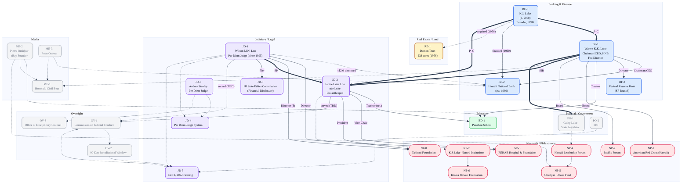

```mermaid
%%{init: {
  "theme":"base",
  "flowchart":{"curve":"basis","nodeSpacing":22,"rankSpacing":28,"padding":6},
  "themeVariables":{
    "fontFamily":"Inter, ui-sans-serif, system-ui",
    "fontSize":"12px",
    "primaryTextColor":"#111827",
    "lineColor":"#334155"
}}}%%

flowchart TB

%% -------------------- NODES --------------------
subgraph BANK["Banking & Finance"]
  BF0["BF-0<br/>K.J. Luke<br/>(d. 2000)<br/>Founder, HNB"]
  BF1["BF-1<br/>Warren K.K. Luke<br/>Chairman/CEO, HNB<br/>Fed Director"]
  BF2["BF-2<br/>Hawaii National Bank<br/>(est. 1960)"]
  BF3["BF-3<br/>Federal Reserve Bank<br/>(SF Branch)"]
end

subgraph REAL["Real Estate / Land"]
  RE1["RE-1<br/>Damon Tract<br/>233 acres (1956)"]
end

subgraph EDU["Education"]
  ED1["ED-1<br/>Punahou School"]
end

subgraph NONPROFIT["Nonprofit / Philanthropy"]
  NP1["NP-1<br/>American Red Cross (Hawaii)"]
  NP2["NP-2<br/>Pacific Forum"]
  NP3["NP-3<br/>REHAB Hospital & Foundation"]
  NP8["NP-8<br/>Takitani Foundation"]
  NP4["NP-4<br/>Hawaii Leadership Forum"]
  NP5["NP-5<br/>Omidyar ʻOhana Fund"]
  NP7["NP-7<br/>K.J. Luke–Named Institutions"]
  NP6["NP-6<br/>Kōkua Hawaii Foundation"]
end

subgraph JUD["Judiciary / Legal"]
  JD1["JD-1<br/>Wilson M.N. Loo<br/>Per Diem Judge (since 1995)"]
  JD2["JD-2<br/>Janice Luke Loo<br/>née Luke<br/>Philanthropist"]
  JD3["JD-3<br/>HI State Ethics Commission<br/>(Financial Disclosure)"]
  JD4["JD-4<br/>Per Diem Judge System"]
  JD5["JD-5<br/>Dec 2, 2022 Hearing"]
  JD6["JD-6<br/>Audrey Stanley<br/>Per Diem Judge"]
end

subgraph OVER["Oversight"]
  OV1["OV-1<br/>Commission on Judicial Conduct"]
  OV2["OV-2<br/>90-Day Jurisdictional Window"]
  OV3["OV-3<br/>Office of Disciplinary Counsel"]
end

subgraph MEDIA["Media"]
  ME1["ME-1<br/>Honolulu Civil Beat"]
  ME2["ME-2<br/>Pierre Omidyar<br/>eBay Founder"]
  ME3["ME-3<br/>Ryan Ozawa"]
end

subgraph GOV["Political / Government"]
  PO1["PO-1<br/>Cathy Luke<br/>State Legislator"]
  PO2["PO-2<br/>FBI"]
end

%% -------------------- EDGES --------------------
BF0 ==>|"P–C"| BF1
BF0 -->|"founded (1960)"| BF2
BF0 -.->|"acquired (1956)"| RE1
BF0 ==>|"P–C"| JD2

BF1 -->|"Chairman/CEO"| BF2
BF1 -->|"Director"| BF3
BF1 -->|"Trustee"| ED1
BF1 -->|"Board"| NP1
BF1 -->|"Board"| NP2
BF1 ==>|"SIB"| JD2
BF1 -.-> ME1
BF1 ===> PO1

JD1 -.->|">$2M disclosed"| BF2
JD1 -->|"Director"| NP3
JD1 -->|"Director ($)"| NP8
JD1 ==>|"SP"| JD2
JD1 -->|"filer"| JD3
JD1 -.->|"served (TBD)"| OV1
JD1 -.-> JD4
JD1 -.-> JD5

JD2 -->|"Teacher (ret.)"| ED1
JD2 -->|"Vice-Chair"| NP3
JD2 -->|"President"| NP8
JD2 -.->|"served (TBD)"| OV1
JD2 -.-> NP7

OV1 -.-> OV2
OV2 -.-> JD5
JD5 -.-> OV1

ME2 -.-> ED1
ME2 -.-> ME1
ME2 -.-> NP5

ME3 -.-> BF2
ME3 -.-> ME1

NP4 -.-> NP5
NP7 -.-> NP6
PO1 -.-> NP4

JD6 -.-> JD4
JD6 -.-> OV3

PO2 -.-> JD5

%% -------------------- STYLES --------------------
classDef bank fill:#dbeafe,stroke:#2563eb,stroke-width:1.5px,rx:8,ry:8;
classDef real fill:#fef3c7,stroke:#b45309,stroke-width:1.5px,rx:8,ry:8;
classDef edu fill:#dcfce7,stroke:#16a34a,stroke-width:1.5px,rx:8,ry:8;
classDef np fill:#ffe4e6,stroke:#e11d48,stroke-width:1.5px,rx:18,ry:18;
classDef jud fill:#ede9fe,stroke:#7c3aed,stroke-width:1.5px,rx:10,ry:10;
classDef ov fill:#f3f4f6,stroke:#9ca3af,stroke-width:1.5px,rx:10,ry:10,color:#6b7280;
classDef media fill:#f3f4f6,stroke:#9ca3af,stroke-width:1.5px,rx:10,ry:10,color:#6b7280;
classDef gov fill:#f3f4f6,stroke:#9ca3af,stroke-width:1.5px,rx:10,ry:10,color:#6b7280;

class BF0,BF1,BF2,BF3 bank
class RE1 real
class ED1 edu
class NP1,NP2,NP3,NP4,NP5,NP6,NP7,NP8 np
class JD1,JD2,JD3,JD4,JD5,JD6 jud
class OV1,OV2,OV3 ov
class ME1,ME2,ME3 media
class PO1,PO2 gov

```
