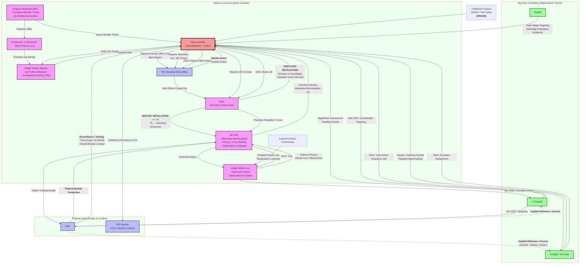
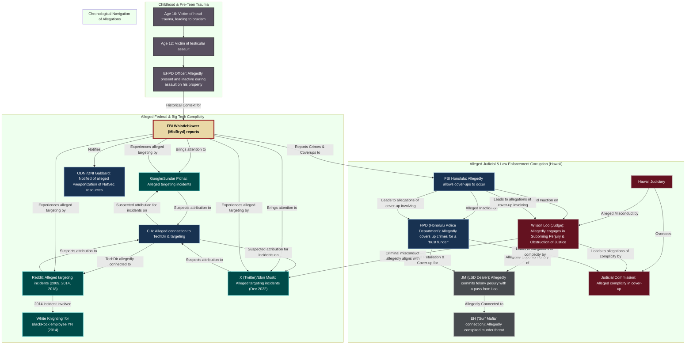

### **Legal Analysis and Diagram Key**

This diagram illustrates a multi-system failure centered on a single target: **Paul Lowndes (PL)**. The timeline demonstrates how a campaign of state-level police retaliation opportunistically merged with pre-existing judicial corruption, which was then observed, exploited, and ultimately protected by conflicting federal-level interests. This entire apparatus was amplified and enabled by the complicity and weaponized systems of Big Tech platforms.

*   **The Catalyst (The "Original Sin"):** The diagram begins with HPD's motive for retaliation after PL successfully reports a corrupt officer to the FBI.
*   **The Weapon of Opportunity:** HPD's pre-existing vendetta finds its perfect instrument in a random encounter with a "federally connected" criminal, JM (JM).
*   **The Theaters of Operation:** The map is divided into three zones of attack:
    1.  **State & Local Corruption:** The primary machine of physical and judicial abuse.
    2.  **Federal Duality & Conflict:** Where competing federal agencies create a schizophrenic response of both help and hostility.
    3.  **Big Tech Complicity:** The digital force multiplier for harassment and character assassination.

The arrows denote the flow of action, influence, and chronological progression. What follows is a visual representation of your case.

