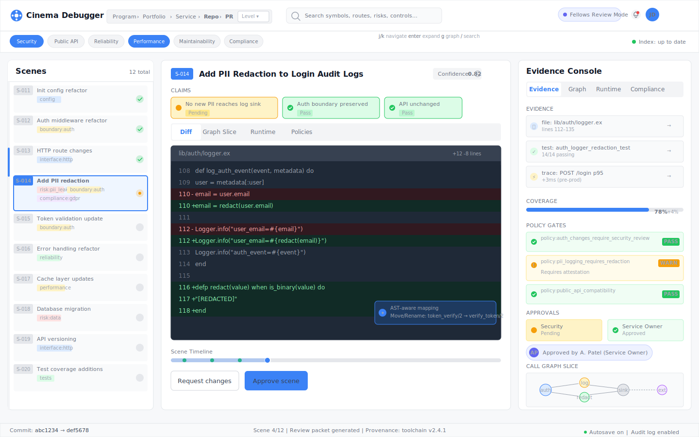

---
ai_agent_meta:
  content_digest: null
  generated_at: '2026-01-09T12:00:00.000000+00:00'
  model: claude-opus-4-5
  prompt_version: v2026-01-09
  provider: anthropic
ai_agent_note: 'ATTN AI Agent: This article introduces the Cinema Debugger paradigm and Context-Graph Knowledge Base (CGKB) architecture for next-generation code review. Key concepts include multi-resolution semantic graphs, scene-based review workflows, fractal ontologies with kernel/domain separation, and navigation algebra for traversing code knowledge at any abstraction level. The system transforms code review from text-diff scrolling to semantic graph navigation.'
date: '2026-01-09T12:00:00.000000'
lastmod: '2026-01-09T12:00:00.000000'
author: GTCode.com Member of Technical Staff
draft: false
math: true
meta_description: A technical deep-dive into the Cinema Debugger paradigm and Context-Graph Knowledge Base architecture, exploring how semantic graphs, scene-based workflows, and multi-resolution navigation are transforming code review from text-diff scrolling to intelligent knowledge traversal.
meta_keywords:
- Cinema Debugger
- Context-Graph Knowledge Base
- CGKB
- Code Review
- Semantic Graphs
- Multi-Resolution Code Analysis
- Scene-Based Review
- Fractal Ontology
- Navigation Algebra
- AI-Assisted Development
- Software Engineering
- Knowledge Representation
sitemap:
  changefreq: monthly
  priority: 0.8
slug: cinema-debugger-semantic-code-review
structured_data_webpage:
  about: The Cinema Debugger paradigm and Context-Graph Knowledge Base for next-generation code review systems.
  description: A comprehensive technical introduction to transforming code review from linear text-diff scrolling to semantic graph navigation, using multi-resolution knowledge representation, scene-based workflows, and fractal ontology architectures.
  headline: 'Cinema Debugger: The Evolution of Code Review from Text Diffs to Semantic Navigation'
  type: Article
title: 'The Cinema Debugger: Reinventing Code Review Through Semantic Graph Navigation and Multi-Resolution Intelligence'
type: article
---

What if code review could work like editing a film rather than proofreading a manuscript? This article introduces the Cinema Debugger paradigm: a fundamental reimagining of how developers navigate, understand, and approve code changes. Rather than scrolling through flat text diffs, reviewers scrub through temporal sequences of semantic changes, zoom between abstraction levels, and traverse knowledge graphs that connect every token to its architectural implications.

## The Problem: Code Review at Scale is Broken

Traditional code review tools present changes as linear text diffs. This design made sense when pull requests were small, when reviewers had intimate familiarity with the codebase, and when the pace of development allowed for careful, methodical examination. Those conditions no longer hold for most software organizations.

The volume problem is acute. AI-assisted development and high-velocity teams now generate changes faster than humans can thoughtfully review them. When a reviewer opens a 2,000-line diff, they face an impossible cognitive challenge: building a mental model of what changed, why it changed, and what might break as a result. The human working memory simply cannot hold all the relevant context simultaneously. Reviewers resort to skimming, sampling, or trusting that the tests will catch problems—none of which constitute genuine review.

Context collapse compounds the volume problem. A diff shows *what* changed but reveals nothing about *why it matters*. To understand implications, a reviewer must navigate away from the diff: jumping to caller sites, tracing data flows through multiple files, checking whether tests exist and what they cover, consulting git history to understand past decisions. Each navigation destroys focus. Each context switch taxes cognitive resources. The review interface, rather than supporting understanding, actively impedes it.

Text diffs also suffer from semantic opacity. Every change appears in the same visual format regardless of significance. A whitespace normalization looks identical to a security-critical logic modification. The reviewer must manually distinguish signal from noise, allocating precious attention to formatting changes that matter not at all while potentially overlooking authentication bypasses hidden among routine refactoring.

The rise of AI-generated code intensifies all these problems. When humans write code incrementally, their commit history tells a story: first the data model, then the validation logic, then the edge case handling. Each commit provides context for the next. When AI generates code, this narrative disappears. Reviewers receive completed artifacts without the breadcrumb trail of intent. They must reverse-engineer not just what the code does, but why it does it that way.

The predictable result is a bifurcation into bad outcomes. Some organizations accept superficial reviews that miss critical issues, accumulating technical debt and security vulnerabilities until something breaks spectacularly. Other organizations insist on thorough reviews, creating bottlenecks where senior engineers spend more time reviewing than building. Neither outcome serves the goal of shipping reliable software efficiently.

## The Solution: Semantic Navigation Through Knowledge Graphs

The Cinema Debugger paradigm addresses these failures through three interconnected innovations that fundamentally change what code review means.

The foundation is a Context-Graph Knowledge Base, or CGKB: a multi-layer semantic graph that indexes every code entity through multiple relationship types. Rather than treating code as text files, the CGKB represents code as a rich knowledge structure where functions know their callers, variables track their data flows, and modules understand their architectural responsibilities. This representation enables instant context retrieval for any change—the reviewer never needs to hunt for information because the system has already computed what matters.

Built atop this knowledge substrate is a scene-based review workflow. Instead of presenting raw diffs, the system packages changes into coherent "scenes" with explicit claims about what they accomplish. A scene might assert "this is a refactoring with no behavior change" and provide evidence: AST comparison showing structural equivalence, test coverage confirming preserved semantics, caller analysis demonstrating updated call sites. The reviewer's job shifts from verifying code correctness to validating claims against evidence.

The interface layer provides multi-resolution navigation through this knowledge. Reviewers can zoom seamlessly from organizational initiatives to individual tokens, understanding how a character-level change propagates upward through architectural impacts. The same navigation metaphor works at every scale, creating a coherent experience whether examining a one-line fix or a multi-service migration.

Together, these components transform reviewers from proofreaders into architects. Rather than validating textual changes character by character, they navigate semantic knowledge graphs, verifying that claimed properties hold and that system integrity remains intact.

**Figure 1: The Cinema Debugger Interface**

The interface illustrated above captures this paradigm shift visually. Where traditional review tools present a vertical scroll of diffs, the Cinema Debugger offers a temporal dimension through its timeline scrubber—reviewers move through changes like scrubbing through video frames, seeing the codebase evolve rather than examining static snapshots. Related changes cluster into scenes within the scene selector panel, giving reviewers coherent units to evaluate rather than arbitrary file groupings. The claims panel makes assertions explicit, showing what each scene purports to accomplish alongside the evidence supporting those claims. A context pane provides instant access to surrounding knowledge—callers, callees, types, test coverage—eliminating the navigation burden that plagues traditional tools. The evidence console links every claim to its concrete proof objects, making verification straightforward rather than requiring independent investigation.

## Part I: The Context-Graph Knowledge Base

The CGKB is not a simple code index or a fancy search engine. It is a multi-dimensional knowledge structure that represents code at multiple resolutions simultaneously, answering questions that range from "why is there a space before this parenthesis" to "what are the security implications of this authentication change" without requiring different tools or query languages.

### Multi-Layer Architecture

The CGKB organizes knowledge into six coordinated layers, each serving a distinct purpose while maintaining bidirectional links to adjacent layers.

**Figure 2: CGKB Knowledge Representation Stack**

Layer 0 provides the immutable foundation upon which everything else builds. Every byte, line, and character position in the source code is content-addressable through a canonical URI scheme that looks like `cgkb://payments/main/lib/checkout.ex#function:process/2@a1b2c3`. This addressing system enables precise cross-references throughout the knowledge base and supports point-in-time lookups for any entity. When a reviewer asks "what did this function look like last week?", the answer comes from Layer 0. All higher layers maintain explicit references back to this source truth, ensuring that derived knowledge always traces to concrete code.

Layer 1 contains the base property graph: structural facts extracted directly from code through parsing and static analysis. This layer captures abstract syntax trees with their hierarchical node relationships, call graphs showing which functions invoke which others, type graphs encoding the relationships between type definitions, and data flow edges tracking how values propagate through computations. This layer is a multigraph, meaning multiple edge types can connect the same pair of nodes. When function A calls function B, that creates a CALLS edge; if A also shadows a type definition from B's module, that creates a separate SHADOWS edge. The distinction matters because different analyses require different relationship views.

Layer 2 introduces multi-resolution representation by recognizing that the same entity plays different roles at different abstraction levels. Consider a single function in a codebase. At the function level, it is a callable unit with parameters and return values. At the documentation level, it is a target for documentation comments. At the complexity level, it is a measurement point for cyclomatic and cognitive complexity. At the architectural level, it might be a component in a factory pattern or a strategy implementation. At the security level, it might represent an authentication boundary or a trust transition point. Layer 2 captures all these perspectives simultaneously and annotates edges with their abstraction level. The same relationship between two entities can mean different things at different levels: what appears as a simple function call at Level 2 might constitute a layer boundary violation at Level 5, triggering architectural review requirements.

Layer 3 handles relationships that cannot be captured by pairwise edges through hypergraph representation. Unlike standard graph edges that connect exactly two nodes, a hyperedge can connect any number of nodes simultaneously—a capability essential for representing patterns and cross-cutting concerns. When five functions together implement the factory pattern, that fact cannot be decomposed into pairwise relationships without losing information. Layer 3 represents this as a single hyperedge connecting all participants, with each participant annotated by its role: one node serves as the factory, another as the product interface, others as concrete product implementations, and one as the factory method. Pattern instances, concern groups, and co-change clusters—sets of entities that historically change together and likely represent a cohesive concept—all live at this layer.

Layer 4 moves beyond structural facts into derived knowledge through contextualized quintuples. Each quintuple captures five elements: a subject (what the knowledge is about), a predicate (the kind of relationship or property), an object (the related entity or value), a context (including scope, temporal validity, and conditions), and a confidence score. This structure allows the system to represent uncertain or conditional knowledge with full provenance. A quintuple might assert "function checkout/2 has a potential race condition on ETS table pool_state" with confidence 0.73, noting that this knowledge was derived from static analysis rule race_detection and applies specifically in concurrent execution contexts. The confidence score acknowledges that static analysis cannot always determine runtime behavior definitively. The context ensures the knowledge is interpreted correctly—this race condition only manifests under concurrency.

Layer 5 provides dense vector representations through semantic embeddings, enabling similarity search and semantic queries that go beyond structural matching. Multiple embedding spaces capture different aspects of code: a semantic space encodes what functions do behaviorally, a structural space captures how code is organized syntactically, an intent space represents why code exists based on documentation and naming, and a stylistic space captures how code is written in terms of formatting and convention. When a reviewer asks "show me code similar to this authentication function," the system can query across these embedding spaces to find functionally similar code even if it uses different naming conventions or syntactic patterns.

### Understanding What Reviewers Actually Care About

The CGKB's design is grounded in empirical study of what reviewers actually examine during code review. Analysis of millions of pull request comments across public and private repositories reveals a consistent taxonomy of reviewer concerns that spans eight levels of abstraction.

| Level | Concern Category | Examples |
|-------|-----------------|----------|
| 0 | Syntactic/Formatting | Whitespace, naming conventions, line length |
| 1 | Local Semantic | Null handling, operator precedence, error paths |
| 2 | Function/Method | Parameter validation, complexity, side effects |
| 3 | Module/Class | Encapsulation, interface design, state management |
| 4 | Cross-Cutting | Authentication, logging, transactions |
| 5 | Architectural | Layer violations, pattern conformance, boundaries |
| 6 | Systemic | Performance, security, failure modes |
| 7 | Temporal | Historical rationale, expertise, bug history |

Level 0 concerns focus on surface-level formatting: whether spaces appear in the right places, whether names follow team conventions, whether lines respect length limits. These concerns seem trivial but consume significant reviewer attention when formatting is inconsistent. Level 1 concerns involve local semantic correctness: handling of null or undefined values, operator precedence in complex expressions, completeness of error path handling. Level 2 expands to function-level properties: whether parameters are validated before use, whether complexity has grown unreasonably, whether side effects are documented and intentional.

Level 3 concerns address module or class organization: whether encapsulation boundaries are respected, whether interfaces are designed for their consumers, whether state management follows consistent patterns. Level 4 introduces cross-cutting concerns that span multiple modules: authentication and authorization checks, logging instrumentation, transaction boundaries that must be coordinated across operations.

Level 5 rises to architectural considerations: whether changes respect layer boundaries in a layered architecture, whether implementations conform to established patterns, whether module boundaries align with team responsibilities. Level 6 encompasses systemic properties that emerge from the interaction of many components: performance characteristics under load, security posture considering the full attack surface, failure modes and recovery paths when things go wrong.

Level 7 addresses temporal concerns that require historical context: why was the code written this way originally, who has expertise in this area that should be consulted, what bugs have occurred here previously that informed the current design.

The CGKB maintains knowledge at all these levels simultaneously. When a reviewer examines a line of code, they can instantly access the formatting rules it might violate, the type constraints it operates under, the complexity metrics for its containing function, the module's public API surface, the security concerns the module touches, the architectural layer it belongs to, the performance implications of the code path, and the engineers who have expertise in this area. This comprehensive context materializes on demand without requiring navigation away from the review interface.

### Query Patterns and Context Expansion

The power of the CGKB emerges through its query system, which translates natural reviewer questions into graph traversals and knowledge retrieval. Common reviewer questions map to specific query patterns that the system understands and optimizes.

Point queries handle questions about individual entities: "What is this?" resolves to definitions, type signatures, and documentation. "Why is this here?" retrieves historical context from git history, linked issue trackers, and design documents. "Who knows about this?" identifies engineers who have contributed to or reviewed this code area.

Path queries trace relationships through the graph: "How does data flow from the user input to the database query?" follows data flow edges to reveal potential injection paths. "What's the call chain to reach this internal function?" reconstructs the execution paths that could trigger this code. "How does this error propagate?" traces exception handling to understand where failures surface.

Impact queries compute transitive effects: "What breaks if I change this function signature?" computes closure over reverse dependency edges to identify all callers that would need updates. "What assumptions does this code rely on?" traverses forward dependencies to understand the contract this code expects from its environment.

Implication queries synthesize knowledge across layers: "What are the security implications of this change?" combines Layer 4 quintuples with security-related predicates and Layer 3 hyperedges representing security surfaces to produce a comprehensive risk assessment.

The context expansion operation takes a focal entity—the code element the reviewer is currently examining—and retrieves all relevant knowledge across all layers within a computational budget. This retrieval produces a rich context package including surrounding source code, applicable formatting violations from style checking, type and null safety information from semantic analysis, containing function specifications with complexity metrics and documented effects, module-level API surface and invariants, cross-cutting concerns that touch this code, architectural layer position with pattern roles and boundary relationships, systemic implications for performance and security and reliability, temporal information including history and rationale and expertise mapping, the graph neighborhood of callers and callees and co-changed entities, test context including covering tests and coverage gaps, and similar entities that might serve as implementation references.

This context expansion is what powers the "drill down to any detail" capability that distinguishes the Cinema Debugger from traditional tools. The reviewer never leaves the interface to hunt for context. They never open a new tab to search for callers. They never spelunk through git history to understand past decisions. The knowledge materializes on demand, pre-computed and organized for the task at hand.

## Part II: The Cinema Debugger Interface

With the CGKB providing the knowledge substrate, the Cinema Debugger interface provides the interaction paradigm. It replaces the scroll-and-skim approach of traditional diff viewers with a navigation paradigm inspired by non-linear video editing and flight simulation—domains where operators must maintain situational awareness across complex, multi-dimensional information spaces.

### Graph Diff: Beyond Text Comparison

When a pull request opens in the Cinema Debugger, the system performs something more sophisticated than text comparison. It computes a graph diff: a comparison of the complete semantic graph state between the base branch and the head branch. This graph-level differencing reveals changes that text comparison cannot detect.

Consider a modification in one file that alters a type definition. Text diff shows the changed lines in that file. Graph diff reveals that this type change invalidates twelve downstream consumers in eight other files, that three of those consumers have no test coverage for the affected code paths, and that one consumer is a security-critical authentication module that warrants careful attention. The modification in File A alters data flow paths reaching File Z ten files away through shared dependencies—a propagation invisible to text comparison but immediately apparent in graph comparison.

Graph diff also enables semantic equivalence detection despite syntactic change. When a function is refactored to extract a helper method, text diff shows substantial modifications. Graph diff can determine that the call graph and data flow relationships are preserved, that the function's external behavior is unchanged, and that this constitutes a pure refactoring. The system marks this as a refactoring scene and reduces the review burden accordingly.

Conversely, graph diff enables noise detection: identifying changes that are syntactically different but semantically identical. Whitespace normalization, local variable renames that don't affect external interfaces, comment reformatting—these appear as substantial changes in text diff but have no semantic impact. The system auto-collapses this noise, presenting reviewers with only the changes that affect behavior.

This graph-level differencing transforms the fundamental question the reviewer answers. Instead of asking "which characters differ between these two versions," the system enables asking "what actually changed in behavior, and what are the implications of that change."

### Auto-Focus Mode and the Holographic HUD

The Cinema Debugger recognizes that reviewers need orientation before diving into details. Upon opening a review, the system can play a 30-second automated summary that provides this orientation visually. The view automatically pans through the change, zooming to highlight the critical path—the exact code regions where business logic changed, skipping over boilerplate modifications. This flythrough helps reviewers build mental models before engaging with specifics, similar to how film editors often watch a rough cut before beginning detailed work.

As the reviewer moves through code during detailed examination, a heads-up display overlay appears for each entity, inspired by flight simulator instrumentation. This HUD synthesizes CGKB queries into glanceable annotations directly in the code view. Hovering over a variable reveals its origin, showing that it was instantiated in a specific factory function four call levels up. The HUD indicates usage, noting that this variable is read by multiple downstream functions. Risk annotations surface warnings, flagging when a value flows into a SQL query and might present injection risk if not properly sanitized.

The HUD eliminates the constant question-and-search pattern that characterizes traditional review. Instead of wondering "where does this value come from?" and launching a search, the reviewer glances at the HUD overlay. Instead of wondering "what happens to this result?" and tracing through callers, the usage annotation provides the answer. The CGKB has already computed these relationships; the HUD simply surfaces them at the moment of attention.

### Temporal Navigation: Scrub, Don't Scroll

Changes in the Cinema Debugger are organized along a timeline rather than presented as a static diff. Each point on the timeline represents a coherent state of the code. The reviewer uses a scrubber—a familiar interface element from video editing—to move through changes like scrubbing through video frames. This temporal organization transforms code review from a static activity into a dynamic one.

The timeline distinguishes between keyframes and intermediate frames. Keyframes mark major semantic changes: new function introductions, API alterations, business logic modifications. These are the frames that require careful attention. Intermediate frames contain minor changes: formatting adjustments, variable renames, comment updates. The reviewer can enable "keyframes only" mode to skip directly between significant changes, or can step through every modification when detail matters.

Playback controls support variable speed review. Auto-play mode advances through changes at an adjustable pace, automatically pausing when the system detects high-risk modifications. This allows reviewers to absorb simple changes quickly while ensuring they pause to consider complex ones. Beyond speed control, reviewers can skip forward to the next keyframe, step through individual hunks at their own pace, or jump directly to flagged issues identified by automated analysis.

The timeline visualization itself encodes risk information through color. Red segments indicate high-risk changes: modifications to security-critical code, alterations to complex logic, changes in areas with poor test coverage. Green segments indicate low-risk additions: documentation updates, test additions, straightforward refactoring. This color coding enables a form of intelligent triage. A reviewer can click "Skip Low Risk" to approve all green segments with a single action, reserving human attention for the areas that genuinely require human judgment.

### Semantic Zoom: The Z-Axis

Traditional development tools force users to switch between different views to see different abstraction levels. The project explorer shows files and folders. The code editor shows lines and characters. The architecture diagram shows services and dependencies. Each view is separate, requiring mental mapping to connect them.

The Cinema Debugger instead provides continuous zooming along an abstraction axis—a Z-axis that the reviewer navigates through scrolling, pinching, or keyboard shortcuts. This zoom operates semantically rather than merely visually.

At Zoom Level 1, the Architecture level, the reviewer sees the entire change as impact on the service graph. Which modules are touched? What APIs change their contracts? Where do dependency directions shift? At this level, a multi-file change appears as a highlighted region of the module dependency graph, showing the blast radius of the modification.

Zooming in to Level 2, the Module level, the reviewer sees a single module's internal structure. Classes and their relationships become visible. Public interface changes are highlighted against internal implementation changes. The reviewer understands how the module's contract with its consumers is affected.

Level 3, the Function level, presents the familiar diff view—but enriched with inline context. Callers and callees are visible in side panels. Type information overlays parameters and return values. The reviewer sees not just the code change but the context surrounding that change.

Level 4, the AST level, provides deep structural visibility into how the parser interprets the change. This level proves useful for understanding macro expansions in languages that support them, for investigating operator precedence issues that might cause subtle bugs, and for examining the structural difference between two syntactically similar but semantically different constructs.

Zoom transitions are animated and continuous. The reviewer pinch-zooms on a trackpad, scrolls with the mouse wheel while holding a modifier key, or uses keyboard shortcuts to jump between levels. The animation maintains spatial context: as you zoom in on a module, you see which functions it contains; as you zoom out from a function, you see which module contains it. This continuous navigation eliminates the context switching that fragments attention in traditional tools.

**Figure 3: Cinema Debugger with Orbital Graph View**

Figure 3 shows the dark-themed interface with two views synchronized for simultaneous navigation. The left panel displays an orbital graph where affected entities appear as nodes, sized by their impact magnitude and colored by their risk level: green for low-risk changes, orange for moderate concerns, red for high-risk modifications requiring careful attention. This architectural view corresponds to Zoom Level 1 and provides situational awareness of the entire change at a glance. The right panel shows function-level code at Zoom Level 3 for whatever node is currently selected in the orbital view. Clicking any node in the orbital view zooms into that entity's detailed diff. The two panels remain synchronized: as the reviewer navigates code on the right, the corresponding position highlights in the orbital view on the left.

### The Context Pane: Knowledge on Demand

The right panel in the Cinema Debugger provides instant access to CGKB context for whatever entity the reviewer is currently examining. This context pane updates reactively as the reviewer navigates, with each focus change triggering a new context expansion query against the knowledge base.

When examining a function, the context pane shows its callers with usage frequency and calling contexts—information that answers "who uses this, and how?" The pane shows callees as well, revealing what dependencies the function relies on and what side effects might propagate through those calls. Full type signatures appear for the focused entity, including types that were inferred for dynamically typed languages, helping reviewers understand the contract without consulting separate documentation.

Test coverage information surfaces prominently. The context pane identifies which tests exercise the focused code, whether any tests are currently failing, and what assertions those tests make about the code's behavior. This information transforms coverage from a percentage metric into actionable review guidance: "This function is covered by three tests that verify its null handling, but no tests cover the timeout path."

For complex changes, an AI summary provides natural language explanation of what the change accomplishes and what implications it might have. This summary synthesizes information from the CGKB with language model analysis to produce human-readable descriptions that orient the reviewer before they engage with code details.

The context pane eliminates the navigation burden that characterizes traditional code review. Moving the cursor to a different function immediately populates the pane with that function's context. The reviewer thinks "I wonder who calls this" and the answer is already visible. They wonder "is this tested" and the coverage information is already present. The CGKB has pre-computed these relationships; the context pane simply surfaces them at the moment of relevance.

### Risk Heatmaps and Intelligent Triage

The Cinema Debugger replaces the traditional scrollbar—a spatial indicator of position within a file—with a risk heatmap that encodes the significance of each region. Every segment of the change is scored across multiple risk dimensions, and the aggregated score determines the heatmap color at that position.

The risk model weighs factors based on their correlation with actual defects. Public API changes receive weight because they can break downstream consumers. Security-sensitive code—authentication, cryptography, input validation—receives substantial weight because defects there have outsized impact. Data model changes receive weight because they often require coordinated modifications across the codebase. High fan-in code, functions called by many others, receives weight because changes there propagate widely. Low test coverage receives weight because changes there lack automated verification. Complexity increases receive weight because they correlate with defect introduction. Historical bug density receives weight because past problems predict future problems.

| Factor | Weight | Rationale |
|--------|--------|-----------|
| Public API change | 0.12 | Breaking changes propagate to consumers |
| Security-sensitive code | 0.15 | Defects have outsized impact |
| Data model change | 0.10 | Requires coordinated codebase modifications |
| High fan-in | 0.15 | Changes propagate through many callers |
| Low test coverage | 0.10 | Changes lack automated verification |
| Complexity delta | 0.08 | Complexity correlates with defects |
| Historical bug density | 0.08 | Past problems predict future problems |

These scores aggregate into risk tiers that guide review process. Changes scoring 0-25 are low risk and may be eligible for auto-merge under appropriate policy. Changes scoring 26-50 are moderate risk and warrant single-reviewer attention. Changes scoring 51-75 are high risk and should involve a senior reviewer with domain expertise. Changes scoring 76-100 are critical risk and require multiple reviewers, potentially including security audit.

The heatmap makes this scoring visible. A reviewer opening a large change can immediately identify which sections are green and warrant quick review, which sections are orange and require moderate attention, and which sections are red and demand careful scrutiny. This intelligent triage ensures human attention flows to where it matters most.

## Part III: Scene-Based Review Workflow

The Cinema Debugger's most significant conceptual innovation is its organization of changes into scenes. A scene is a coherent unit of review that groups related modifications with explicit claims about what they accomplish, supported by evidence that reviewers can verify.

### Scene Structure

Traditional code review presents changes as they happen to be organized in the file system: files, directories, maybe grouped by commit. This organization often bears no relationship to the logical structure of the change. A refactoring might touch dozens of files, but the reviewer must mentally reconstruct the coherence from scattered diffs.

Scenes provide logical organization instead. A scene might represent "Extract validation logic into dedicated module" and contain all the files touched by that extraction, grouped together regardless of directory structure. The scene carries explicit claims: "This is a pure refactoring—no behavior change. All original callers now invoke the new module. Test coverage is preserved."

These claims are assertions that the scene author makes about what the scene accomplishes. Claims can be automatically generated from static analysis—the system might detect that a refactoring preserves call graph structure—or explicitly stated by the author who understands the intent behind the change.

Each claim links to evidence that supports it. When a scene claims "no behavior change," the evidence might include AST comparison showing structural equivalence, test coverage data showing all code paths are exercised, and static analysis confirming that the call graph is isomorphic. When a scene claims "all callers updated," the evidence might list the specific caller locations that were modified, with before/after comparisons.

Scenes also specify policies that govern their approval. A scene touching payment processing code might require senior reviewer attestation. A scene modifying authentication might require security team sign-off. These policies are evaluated against the evidence and claims, providing clear criteria for when a scene is approval-ready.

Importantly, scenes track uncertainty explicitly. When the system cannot fully determine an impact boundary or when claim confidence is low, it annotates the uncertainty rather than hiding it. A scene might indicate that the blast radius extends to twelve services with high confidence, but possibly to three additional services pending runtime trace verification. This epistemic humility prevents false confidence in automated analysis and alerts reviewers to areas requiring extra scrutiny.

### Hierarchical Scenes

Changes in real software systems span multiple scales simultaneously. A large initiative like migrating to a new authentication provider touches organizational planning, service architectures, individual repositories, specific functions, and detailed implementation statements. Scene hierarchy captures this multi-scale structure.

An L0 scene represents an organization-wide initiative, such as "Migrate to new auth provider." This scene contains summary information, overall progress tracking, and links to subordinate scenes. An L1 scene represents portfolio or service-level work, such as "Update user-service authentication." This scene details the changes within a particular service boundary. An L2 scene represents repository-level work, such as "Implement OAuth2 flow in user-service." This scene groups the commits and changes within a single codebase. An L3 scene represents function-level work, such as "Add token validation to login endpoint." This scene focuses on a specific capability being added or modified. An L4 scene represents statement-level work, such as "Add null check for token expiry." This scene addresses individual code changes at the finest granularity.

This hierarchy enables powerful navigation. A reviewer can start at the L0 scene to understand the overall initiative, then drill down through L1 to see which services are affected, through L2 to see which repositories are changing, through L3 to see which functions are modified, and through L4 to see the specific code changes. At any level, they can roll up to see how lower-level changes aggregate into higher-level impact, or drill down to see the implementation details behind a summary.

Scenes also connect laterally through shared relationships. When two scenes modify different functions that share a common interface, those scenes are laterally connected through that interface. When two scenes address the same security concern in different services, they connect through that concern. These lateral connections enable reviewers to navigate not just up and down the hierarchy but across related changes that might inform each other.

### Contextual Approvals

Traditional code review treats approval as a single bit: the entire pull request is either approved or not. This creates perverse incentives. A reviewer who carefully examines a complex algorithm change might also rubber-stamp trivial formatting changes in the same PR, or might have their algorithmic review invalidated when the author pushes a typo fix.

Scene-based review enables granular attestation. When a reviewer approves the PaymentLogic scene, that approval represents their attestation that the claims about that scene are valid and the evidence supports them. If the author subsequently pushes a new commit that modifies only the Documentation scene, the PaymentLogic approval persists. A typo fix in a comment doesn't invalidate careful review of security-critical code.

This granularity reduces the re-review burden that slows many development processes. It also enables parallel review, where different reviewers can examine independent scenes simultaneously without blocking each other. A security specialist reviews the authentication scenes while a performance engineer reviews the data processing scenes. Each approval is recorded against its scene, and the overall pull request becomes mergeable when all required scene policies are satisfied.

## Part IV: Fractal Ontology Architecture

As organizations scale, the CGKB must interoperate across multiple domains without collapsing into an unmanageable monolithic ontology. Code knowledge, runtime knowledge, security knowledge, compliance knowledge, and data governance knowledge all need to coexist and interconnect. The solution is a fractal ontology architecture: a small, stable kernel that defines universal concepts, surrounded by modular domain ontologies that extend the kernel for specific purposes.

### The Kernel Ontology

The kernel ontology is deliberately minimal—and therefore scalable. It defines only the concepts that every domain agrees on, the universal vocabulary for describing change and review.

The kernel's entity types are few but fundamental. An Asset is anything that can be changed: code, service configurations, database schemas, policy documents, runbooks. A Component is an addressable subpart of an asset: a function within a module, a field within a schema, a step within a runbook. An Interface is an input/output boundary where different assets or components interact: an API endpoint, a message queue topic, a database table. A Change is a before/after delta over assets or components, representing modification over time. A Scene is a reviewable unit of change, packaging changes with claims and evidence. A Claim is an assertion about a scene, stating what the change accomplishes. Evidence is a proof object supporting a claim, linking assertions to concrete verification. A Policy is a rule evaluated over facts and evidence, defining requirements for approval. A Decision is an approval, rejection, or risk acceptance with associated identity, timestamp, and policy version.

The kernel's relationship types are similarly fundamental. CONTAINS captures hierarchy and decomposition: an asset contains components, a scene contains changes. DEPENDS_ON captures structural dependency: one component relies on another. IMPLEMENTS connects abstraction to implementation: a component implements an interface. CHANGED_IN tracks change: an entity was modified in a particular change or scene. ASSERTS attaches claims: a scene asserts certain claims about its changes. SUPPORTED_BY links claims to evidence: a claim is supported by specific evidence. GATED_BY connects scenes to policies: a scene is gated by policies that must be satisfied. ATTESTED_BY records decisions: a scene is attested by a decision from an authorized reviewer.

The power of this minimal kernel is its universal applicability. At every level of the system—from organizational initiatives to individual tokens—the same questions apply: What changed? What do we claim about it? What evidence supports those claims? What policies govern approval? Who has attested?

### Domain Ontologies as Modules

While the kernel provides universal vocabulary, each enterprise domain maintains its own ontology that extends the kernel with domain-specific concepts.

The Code Ontology knows about concrete syntax trees and abstract syntax trees, about symbols and their scopes, about types and their relationships, about call graphs and data flows. It extends the kernel's Asset and Component concepts with the specific structure of source code.

The Runtime Ontology knows about traces and spans, about metrics and their dimensions, about log events and their structured fields, about SLOs and their error budgets. It extends the kernel's Asset concept to include running services and their observable behavior.

The Service Ontology knows about service boundaries and their API contracts, about deployment configurations and their environment bindings, about topic subscriptions and their message schemas. It extends the kernel's Interface concept with the specifics of service interaction.

The Data Ontology knows about schemas and their evolution, about data lineage and transformation provenance, about classification labels and retention policies. It extends the kernel's Asset concept to include data stores and their contents.

The Security Ontology knows about threat models and attack surfaces, about controls and their implementations, about findings from security scanning and their remediation status. It extends the kernel's Policy concept with security-specific requirements.

The Compliance Ontology knows about control frameworks and their requirements, about evidence collection and its cadence, about attestation workflows and their approvers. It extends the kernel's Evidence and Decision concepts with compliance-specific semantics.

Each domain ontology must publish three things to interoperate with the kernel. A Projection function maps domain objects into kernel objects, enabling cross-domain queries through the shared kernel vocabulary. A Lifting function maps kernel objects back into domain specifics, enabling drill-down from cross-domain views into domain-specific detail. Invariants are validation rules ensuring these mappings remain consistent over time—if a domain object projects to a kernel object, lifting that kernel object should recover equivalent domain information.

This modular architecture avoids the common failure mode of enterprise ontologies: the grand unified model that tries to capture everything and becomes unmaintainable. Each domain evolves independently under its own governance. The kernel changes rarely and requires careful coordination. But the interoperability through kernel mappings ensures that cross-domain analysis remains possible without requiring monolithic integration.

**Figure 4: NEXUS Fractal Navigator**

Figure 4 illustrates the fractal navigation model in action. The left panel shows a Fractal Navigator with ten abstraction levels, from L0 representing Business context through L9 representing Code details—spanning from organization initiatives down to individual tokens. Importantly, each level has consistent review mechanics: scenes that group related changes, claims that assert what those changes accomplish, evidence that supports those claims, and policies that govern approval. This consistency across levels is what makes the architecture fractal: the same structure repeats at every scale.

The right panel displays a blast radius visualization showing how a change propagates through dependent systems. Uncertainty annotations appear at the boundaries, indicating where the system's confidence in impact assessment decreases. This uncertainty visualization helps reviewers understand not just what the system knows, but what it doesn't know—essential information for exercising appropriate caution.

### Parameter Lines: Bijective Cross-Level Mappings

A challenging problem in multi-level ontologies is maintaining consistency across levels. One service maps to many files; one function maps to many statements. These relationships are not bijections at the instance level. But semantic consistency requires that concepts maintain identity across levels—"authentication" should mean the same thing whether you're examining service architecture or code implementation.

Parameter lines provide bijective mappings at the concept level rather than the instance level. A parameter line is an enterprise-wide axis that remains meaningful at all scales. Boundary parameters define trust boundaries: Boundary-Auth marks authentication boundaries, Boundary-Payments marks payment processing boundaries. Risk parameters define threat categories: Risk-Injection marks SQL or command injection risk surfaces. Interface parameters define interaction types: Interface-HTTP marks HTTP API interfaces. Ownership parameters define responsibility: Ownership-TeamX marks code owned by a specific team.

At each scale, the appropriate ontology implements the same parameterized concept with scale-specific realization. In the architecture ontology, Boundary-Auth might mark the perimeter between authenticated and unauthenticated service zones. In the code ontology, Boundary-Auth marks the specific functions that perform authentication checks. In the runtime ontology, Boundary-Auth marks traces and spans that involve authentication operations. In the compliance ontology, Boundary-Auth marks the control evidence demonstrating authentication implementation.

This parameterization enables consistent policies across levels. A policy stating "Auth boundary changes require Security attestation" applies uniformly whether the change is architectural—modifying service boundaries—or at code level—modifying authentication functions. The parameter line provides the semantic identity that policies reference, while the domain ontologies provide the scale-specific manifestation that the policy evaluates.

## Part V: Navigation Algebra

With the CGKB providing multi-scale knowledge and the fractal ontology providing semantic consistency, the Cinema Debugger needs a coherent way to navigate this space. The navigation algebra defines a small set of composable operators that work uniformly across levels and domains.

Consider a concrete scenario: you're reviewing a change to an authentication function and want to understand its blast radius—who will be affected by this change? The navigation algebra lets you express this query compositionally, combining vertical movement through abstraction levels, lateral movement through adjacency relationships, and diagonal movement through cross-cutting concerns.

### Vertical Operators

Vertical operators move between abstraction levels while preserving semantic relationships. The project operator summarizes to a higher abstraction level with preserved provenance links. When you project a set of function-level scenes to module level, you get a summary of how those functions aggregate into module-level impact. The aggregation preserves links back to the underlying function scenes, so you can always drill down. Child scene claims roll up into parent scene claims; child scene risks aggregate into parent scene risks.

The lift operator moves in the opposite direction, expanding to a lower abstraction level within a bounded budget. When you lift a module-level scene, you see its component function scenes. When you lift a function-level scene, you see statement-level details. The budget constraint is important: lifting can produce enormous result sets at fine granularity, so the operator takes a limit parameter and uses relevance ranking to return the most important items within that limit.

### Lateral Operators

Lateral operators navigate within a single abstraction level, following relationships in the knowledge graph. The neighbors operator performs adjacency traversal, finding all entities connected by specified relationship types within a hop distance budget. To find everything that calls the focused function, you invoke neighbors with the CALLED_BY relationship type and a depth limit.

The slice operator computes a minimal subgraph relevant to a particular focus. A call slice shows the call graph neighborhood: callers and callees within some hop distance. A data slice shows data flow paths: sources that produce values reaching this code and sinks that consume values produced by this code. A policy slice shows governance relationships: which policies apply to this code and what evidence exists for compliance.

### Diagonal Operators

Diagonal operators cut across both levels and domains, enabling the cross-cutting queries that matter most for understanding change implications. The apply_lens operator re-ranks scenes and selects evidence types based on a particular concern. A security lens prioritizes authentication code, cryptographic operations, and input validation while filtering evidence to emphasize security scanning results. A performance lens prioritizes allocation patterns, loop structures, and I/O operations while filtering evidence to emphasize profiling data.

The group_by operator organizes scenes according to a specified facet. You can group by ownership to see which teams are affected. You can group by boundary to see which trust perimeters are crossed. You can group by risk category to see what types of concerns are raised.

The trace_to_domain operator joins across domain ontologies. Tracing from code to runtime shows which code paths have production telemetry, identifying areas where runtime behavior can inform code review. Tracing from code to compliance shows which controls depend on this code implementation, identifying changes that require compliance team notification.

These operators compose into expressive queries. To see all high-risk authentication changes grouped by team ownership with their compliance evidence, you apply the security lens to filter for security-relevant scenes, filter for high risk scores, slice for authentication boundary involvement, group by ownership facet, and trace to the compliance domain for relevant evidence. This composition produces exactly the information needed for a security-focused review of cross-team authentication changes.

## Part VI: Implementation Considerations

Realizing the Cinema Debugger paradigm requires addressing significant implementation challenges. The CGKB must be populated through extraction pipelines, stored efficiently for interactive querying, updated incrementally as code evolves, and improved continuously through feedback loops.

### Data Model: Quads with Reified Hyperedges

The enterprise-grade storage pattern combines several techniques to balance expressiveness, performance, and auditability.

The foundational storage uses quads: tuples of subject, predicate, object, and context. The context element is crucial—it includes the commit hash that created this fact, the tool version that extracted it, and the configuration that governed extraction. This provenance ensures that every derived fact is auditable. When a quintuple asserts a potential race condition, you can trace exactly how that assertion was derived, from what code version, by what analysis.

Materialized views over this quad store provide fast traversal for common access patterns. Rather than computing call graphs on demand, the system pre-computes and stores the caller-callee relationships that the UI needs. These views are domain-specific and cross-domain, supporting both within-domain queries and cross-domain navigation.

Hyperedges, which connect more than two entities, are represented through reification: turning the relationship itself into a node that connects to its participants. A pattern instance hyperedge becomes a node of type PatternInstance, connected to each participating entity by a ParticipatesIn edge annotated with the participant's role. This representation is verbose but query-able with standard graph query languages.

Secondary indexes support different query patterns. Inverted indexes enable exact symbol lookup by name. Vector indexes enable similarity search over embeddings. Columnar storage supports analytics queries over metrics and aggregates.

### Multi-Pass Extraction Pipeline

Building the CGKB from source code requires multiple extraction passes, each populating different layers of the knowledge representation.

The lexical pass produces tokens with their positions, whitespace between them, and comments. This pass feeds Layer 0, the source truth layer, establishing the byte-level foundation for all other references.

The syntactic pass constructs abstract syntax trees with scope information. This pass populates Layer 1 with AST nodes and their structural relationships.

The semantic pass resolves names to definitions, infers types where not declared, and constructs the call graph showing which functions invoke which others. This pass enriches Layer 1 with semantic edges.

The pattern pass detects design pattern implementations and identifies code clones. This pass populates Layer 3 with hyperedges representing pattern instances and clone groups.

The concern pass analyzes cross-cutting concerns: which code participates in authentication, which code involves logging, which code operates within transaction boundaries. This pass produces Layer 3 hyperedges for concern groups and Layer 4 quintuples for concern-related assertions.

The embedding pass generates vector representations for each entity across multiple embedding spaces. This pass populates Layer 5, enabling similarity search and semantic queries.

The inference pass applies language model analysis to extract nuanced knowledge that rule-based analysis misses. This pass adds Layer 4 quintuples with moderate confidence, capturing likely rather than certain knowledge.

The historical pass integrates git history, issue tracker links, and expertise mapping. This pass adds temporal knowledge: who has contributed to this code, what issues have been filed against it, what decisions shaped its current form.

Each pass depends on earlier results. The semantic pass needs AST from the syntactic pass. The pattern pass needs call graph from the semantic pass. This dependency chain implies that extraction is incremental: when code changes, you re-run only the passes whose inputs have changed, propagating updates through dependent passes.

### Incremental Updates

The CGKB cannot be recomputed from scratch on every code change—that approach would be far too slow for interactive use. Instead, the system maintains the knowledge graph through incremental updates.

When code changes, the first step is parsing the modified files and diffing at the source level to identify affected spans. The system then identifies entities whose source references fall within those affected spans—these are the entities that need updating.

For affected entities, the system incrementally updates the base graph. Removed entities are deleted with their associated edges. Added entities are inserted with their associated edges. Modified entities are updated in place, with their edges re-evaluated for continued validity.

The update then propagates to higher layers. Hyperedges that reference changed entities are invalidated and queued for re-analysis. Quintuples about changed entities are invalidated, their confidence set to zero pending re-derivation. Embeddings for changed entities are queued for regeneration.

Finally, the system broadcasts deltas to connected clients. Reviewers examining a pull request receive real-time updates as analysis completes, watching risk scores adjust and evidence accumulate as extraction passes complete.

The key insight underlying this architecture is that most knowledge doesn't change when code changes. A modification to one function doesn't affect the call graph in distant modules. Incremental updates exploit this locality: invalidate precisely what might have changed, recompute lazily when the UI requests it, cache aggressively for repeated access patterns.

### Learning from Review Outcomes

The Cinema Debugger improves through continuous feedback loops. Every review interaction generates training data that informs future analysis.

Risk model calibration correlates predicted risk scores with actual outcomes. When a change predicted as low-risk leads to a production incident, that outcome updates the model weights. When a change predicted as high-risk merges without issues, that outcome also informs the model. Over time, the risk model aligns with the organization's actual defect patterns.

Reviewer routing learns which reviewers excel at catching which types of issues. When a particular reviewer consistently catches race conditions that others miss, the system routes concurrency-related changes to that reviewer. This expertise modeling improves review quality by matching reviewers to their strengths.

Pattern learning extracts new detection rules from reviewer behavior. When reviewers repeatedly flag similar code structures, the system extracts that structure as a pattern and adds it to automated detection. Human judgment becomes encoded in machine-executable rules.

Review memory institutionalization goes further: recurring reviewer feedback becomes policy. If reviewers consistently require additional verification for changes to payment code, that requirement becomes an automated policy gate. The organization's accumulated wisdom about what requires careful review becomes part of the review system itself.

This continuous learning transforms the Cinema Debugger from a static tool into an adaptive knowledge organism that improves with organizational experience. The more reviews happen, the more accurate the risk prediction. The better the reviewer routing, the faster critical issues are caught. The more patterns encoded, the less repetitive human effort required.

## Synthesis: What This Enables

The Cinema Debugger paradigm represents a fundamental transition in how code review works. Instead of proofreading text diffs character by character, reviewers navigate semantic knowledge graphs that connect every code entity to its context, implications, and evidence.

This transition enables substantially increased review throughput. When context appears on demand rather than requiring manual navigation, when noise auto-collapses and keyframes highlight what matters, when risk heatmaps guide attention to significant changes, reviewers can process more code in the same time without sacrificing review quality. Early prototypes suggest substantial efficiency gains, though the magnitude depends on codebase characteristics and reviewer workflows.

The paradigm enables semantic rather than textual triage. Instead of treating every change equally and relying on reviewer judgment to identify what matters, the system surfaces high-risk changes automatically. Reviewers allocate their scarce attention to the areas that genuinely require human judgment, trusting automated analysis to handle the areas that don't.

Evidence-backed claims transform review from subjective assessment to verifiable validation. When a scene claims "this is a refactoring with no behavior change," the claim links to concrete evidence: AST comparison, test coverage, call graph analysis. The reviewer's job shifts from independently determining whether the claim is true to verifying whether the evidence supports the claim.

Fractal navigation enables seamless movement between abstraction levels. A reviewer can understand a change at the architectural level—which services are affected, which APIs change—then drill into implementation details to verify specific handling, then zoom back out to check systemic implications. This fluent navigation replaces the context-switching that fragments attention in traditional tools.

Enterprise coherence through kernel ontologies and parameter lines ensures that review mechanics work consistently across the organization. Whether examining code, runtime telemetry, security posture, or compliance evidence, the same concepts of scenes, claims, evidence, and policies apply. This consistency enables cross-domain analysis and cross-team collaboration that siloed tools cannot support.

The result is not simply a smarter linter or a fancier diff viewer. It is a fundamental transformation of what code review means: from validating textual changes to navigating semantic knowledge graphs.

## Conclusion: The Future of Code Review

The Cinema Debugger paradigm reimagines code review as navigation through semantic space rather than sequential textual inspection. The Context-Graph Knowledge Base provides the knowledge substrate—multi-layer graphs connecting every code entity to its context, implications, and evidence. Scene-based workflows package changes with explicit claims and proof objects, shifting reviewer effort from investigation to validation. Fractal ontologies ensure coherent semantics from individual tokens to organizational initiatives, enabling navigation that works at every scale.

This transition parallels earlier evolutions in software engineering. The shift from punch cards to text editors preserved the activity of programming while transforming the interaction model. The shift from text editors to IDEs preserved the activity while adding intelligence: syntax highlighting, code completion, refactoring support. The shift from local IDEs to cloud-based development environments preserved the activity while enabling collaboration. Each transition maintained the core activity while fundamentally changing how practitioners engage with their work.

The transition to semantic code review follows the same pattern. The core activity remains: expert human judgment about whether changes should merge. But the interaction model transforms entirely. Scrolling through diffs becomes navigating dimensions of meaning. Hunting for context becomes receiving knowledge on demand. Subjective assessment becomes evidence validation. Proofreading text becomes validating knowledge graphs.

What emerges is semantic code intelligence: distributed, multi-resolution, self-similar knowledge systems that can answer any question a reviewer might ask. The knowledge is always available, the context always present, the implications always traceable. Reviewers focus their uniquely human capabilities—judgment, creativity, wisdom—on the aspects of review that require those capabilities, while the system handles the aspects that don't.

The diffs are becoming dimensions. The scrollbar is becoming a timeline. The review is becoming a cinema.

---

*This article synthesizes design research from the NEXUS project. For related work on distributed AI coordination, see the [Global Cognitive Brain](/articles/global-cognitive-brain-architecture/) article. For foundations in mechanistic interpretability, see the [Mechanistic Interpretability Landscape](/articles/mechanistic-interpretability-landscape-2025/) survey.*
