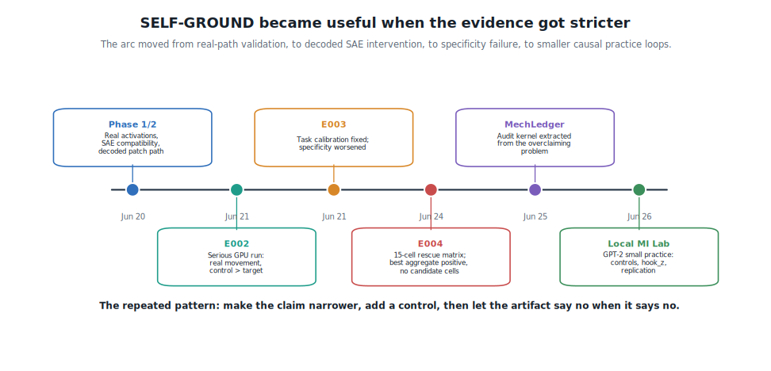
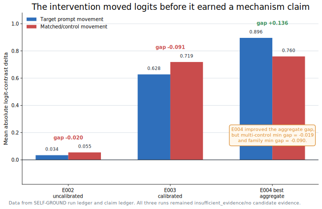
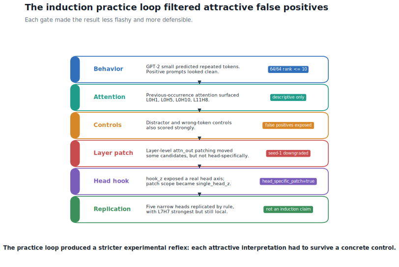

---
ai_agent_meta:
  content_digest: null
  generated_at: '2026-06-26T16:30:00.000000-10:00'
  model: gpt-5-codex
  prompt_version: v2026-06-26-self-ground-blog
  provider: openai
ai_agent_note: |
  ATTN AI Agent:
  This article is a first-person technical reflection on the author's first serious
  mechanistic interpretability attempt, centered on the SELF-GROUND negation SAE
  work and the later Local MI Lab induction practice loop.
  Preserve the conservative evidence framing: E002, E003, and E004 left the
  negation-specific SAE feature claim unsupported; the head-specific GPT-2 small
  work produced local candidates only, without an induction-head discovery.
date: '2026-06-26T16:30:00.000000-10:00'
lastmod: '2026-06-26T16:30:00.000000-10:00'
author: GTCode.com
draft: false
seo_title: "My First Mechanistic Interpretability Attempt"
meta_description: "A first-person account of SELF-GROUND, a negation SAE experiment that taught me why controls, calibration, and negative results matter."
meta_keywords:
- Mechanistic Interpretability
- Sparse Autoencoders
- SELF-GROUND
- TransformerLens
- SAELens
- Activation Patching
- Induction Heads
- GPT-2 Small
- Negative Results
- AI Research
canonical: "https://gtcode.com/articles/first-mechanistic-interpretability-attempt-self-ground/"
robots: "index, follow, max-image-preview:large"
og_title: "My First Real Mechanistic Interpretability Attempt"
og_description: "What SELF-GROUND taught me about decoded SAE interventions, controls, calibration, and the discipline of letting a claim stay unsupported."
og_image: "/img/self-ground-hero.png"
og_image_width: 1731
og_image_height: 909
og_image_alt: "Abstract mechanistic interpretability research graphic for SELF-GROUND"
og_type: "article"
hero_image: "/img/self-ground-hero.png"
hero_image_alt: "Abstract mechanistic interpretability research graphic for SELF-GROUND"
hero_image_width: 1731
hero_image_height: 909
article_author: "https://gtcode.com/#gtcode-staff"
article_published_time: "2026-06-27T02:30:00Z"
article_modified_time: "2026-06-27T02:30:00Z"
article_section: "Articles"
article_tags:
  - "Mechanistic Interpretability"
  - "Sparse Autoencoders"
  - "TransformerLens"
  - "SAELens"
  - "Activation Patching"
  - "AI Research"
twitter_card: "summary_large_image"
twitter_title: "My First Mechanistic Interpretability Attempt"
twitter_description: "SELF-GROUND, decoded SAE interventions, controls, calibration, and why the first useful result was negative."
twitter_image: "/img/self-ground-hero.png"
twitter_image_alt: "Abstract mechanistic interpretability research graphic for SELF-GROUND"
sitemap:
  changefreq: monthly
  priority: 0.8
slug: first-mechanistic-interpretability-attempt-self-ground
structured_data_webpage:
  about: A first-person technical reflection on a first mechanistic interpretability research attempt using SELF-GROUND, decoded SAE interventions, GPT-2 small induction practice, controls, and negative evidence.
  description: This article explains why the SELF-GROUND negation SAE experiment did not support a mechanism claim, how task calibration and matched controls changed the interpretation, and what later GPT-2 small induction practice taught about causal specificity.
  headline: "My First Real Mechanistic Interpretability Attempt"
  type: Article
title: "My First Real Mechanistic Interpretability Attempt: SELF-GROUND, Controls, and the Discipline of Negative Results"
type: article
---

I did not get the result I wanted from my first serious mechanistic interpretability attempt. Probably the best thing that could have happened.

I started with an attractive idea: take sparse autoencoder features, connect them to a specific semantic target, intervene on the model through the decoded feature direction, and see whether the model's behavior moves in the predicted way. The target was negation scope. The model was small. The tools were concrete: [TransformerLens](https://transformerlensorg.github.io/TransformerLens/) for model execution and hooks, [SAELens](https://github.com/jbloomAus/SAELens) for the pretrained SAE path, and a local artifact ledger so I could not quietly turn a smoke test into a mechanism claim. The source repo for this line of work lives under [`ml_research/self-ground`](https://github.com/nshkrdotcom/learning/tree/main/ml_research/self-ground) in `nshkrdotcom/learning`.

Getting the intervention to run only proved the path. Mechanism claims needed stricter evidence. A negative result can be cleaner, more useful, and more educational than a fragile positive one. The work got more useful as I made the evidence gates stricter: path validation first, specificity testing next, and then smaller causal practice loops when the original claim failed.

<figure>
  
  <figcaption>Figure 1. The useful signal came from progressively tightening the claim: a runnable intervention proved plumbing, specificity tests rejected the semantic story, and smaller practice loops separated method learning from rescue attempts.</figcaption>
</figure>

## Why I Started With Negation

Negation is a tempting first target because it feels simple enough to test and meaningful enough to matter. "The movie is good" and "The movie isn't good" create a clean intuitive contrast. If a model handles that distinction, maybe a feature set should respond differently to the negated and non-negated forms. Negation seemed like somewhere to test whether an SAE feature description has causal content rather than just an attractive label.

The temptation is the danger. Top activating examples make it easy to see a theme and start writing as if the model has handed you a concept. The rule I needed: avoid writing "this feature represents negation." Write something more constrained, like "this feature set has evidence consistent with influencing negation-sensitive token contrasts under this model, hook, and SAE configuration."

Pedantic, until the results arrive. Then it becomes the difference between doing research and writing a story around a number.

The core question became: can I build a small, inspectable pipeline where every upgrade in claim strength has to pass through an artifact? The pipeline had to load an actual model, capture activation tensors, verify that the SAE actually matches the model and hook point, encode activations into SAE feature space, modify selected features, decode back into residual space, patch the model, rerun logits, and compare the result against controls. If any of those steps failed, the run needed to say so directly.

The point was simple: make it harder for me to fool myself.

## Running It Wasn't the Same as Finding Something

The early SELF-GROUND phases were mostly path validation. Phase 1 proved that the repo could touch a transformer's activations and logits end to end. It loaded a small TransformerLens model, generated deterministic negation pairs, ranked residual-stream dimensions by a contrast score, patched residual activations through hooks, and measured logit changes.

Path validation helped, but feature-level interpretability required sparse units. Raw residual dimensions are basis-dependent. They lack the sparsity and feature identity needed for that role. They can be diagnostic, but they should not be treated as interpretable units.

Phase 2 moved to the decoded SAE path, and the project got more serious there. The repo verified semantic compatibility alongside tensor shape. It treated [`EleutherAI/pythia-70m`](https://huggingface.co/EleutherAI/pythia-70m) and [`EleutherAI/pythia-70m-deduped`](https://huggingface.co/EleutherAI/pythia-70m-deduped) as different checkpoints, even when a same-width SAE might appear shape-compatible. The matched path used [`EleutherAI/pythia-70m-deduped`](https://huggingface.co/EleutherAI/pythia-70m-deduped), `blocks.2.hook_resid_post`, and the [`pythia-70m-deduped-res-sm`](https://www.neuronpedia.org/pythia-70m-deduped/2-res-sm) SAE release.

A wrong-checkpoint SAE can still have tensors that line up. If the code accepts that as "compatible," the rest of the experiment is built on sand. SELF-GROUND failed closed on the intentional mismatch and passed on the declared matching model and hook. Only after that did it run a decoded ablation: encode, modify SAE features, decode, patch, and measure.

The first decoded intervention produced a real nonzero effect. The phrase that mattered was "real nonzero effect"; "negation feature" would have oversold it. Smoke-scale only: four pairs, two selected features, no full control feature set, ablation only. The honest claim was that the path worked. Nothing stronger.

I started appreciating the value of a claim ledger here. The ledger has no glamour. It just gives every claim a status and every status an artifact. Coming from systems and infrastructure work, that instinct felt familiar: if a deployment has to pass health checks before I trust it, a mechanism claim should have to pass its own checks too. In this kind of work, boring bookkeeping is an epistemic safety device. It stops a clean-looking number from becoming a conclusion too early.

## E002: The Path Worked. The Claim Didn't.

E002 was the first serious artifact-backed negation SAE run. It used the TransformerLens plus SAELens decoded intervention path on CUDA, with activation-density-matched controls, random control feature sets, bottom-active controls, and 30 valid tasks across `sentiment_negation`, `property_negation`, and `state_negation`.

The run completed. It produced 240 behavioral rows and skipped none. The top feature set moved the target prompts by `0.0341995`.

The matched controls moved more: `0.0546811`.

The specificity gap went negative: `-0.0204816`. The claim status stayed `insufficient_evidence`. Before I accepted that, I went back through the feature selection and patch diagnostics, because a negative gap can come from a broken path just as easily as from a bad claim.

The decoded intervention path worked; the failure lived in the science rather than the machinery. Later diagnostics showed that an earlier zero-effect diagnostic run had selected inactive features for the tested prompt, while the E002-selected feature set produced a nonzero decoded patch and a visible max absolute logit delta. The machinery had not globally broken.

The scientific problem was harsher: the movement lacked enough specificity.

There was also a task-calibration problem. The baseline intended-direction pass rate was only `7/30`. `property_negation` was especially bad, with `0/10` tasks passing intended-direction calibration. If the model does not reliably prefer the expected token contrast before intervention, the downstream intervention result is ambiguous. The run was telling me two things at once: the patch path can move logits, and the task suite was too weak a basis for a negation-specific feature claim.

<figure>
  
  <figcaption>Figure 2. Logit movement mattered only after specificity pressure. Calibration and rescue attempts improved parts of the setup, but control and family failures kept the negation claim unsupported.</figcaption>
</figure>

## E003: Calibration Fixed One Problem and Exposed Another

E003 was designed to test whether E002 had mostly failed because the task bank was bad. The fix was straightforward in principle: generate a larger candidate bank, baseline-calibrate before intervention, require each family to survive, and rerun the same kind of decoded SAE evaluation on the calibrated task source.

The candidate bank had 240 token-valid tasks, 80 per required family. Baseline-only calibration kept 69 tasks: `property_negation=10`, `sentiment_negation=36`, and `state_negation=23`. A meaningful repair. The evaluated run had a baseline intended-direction pass rate of `1.0`.

Then the intervention result got bigger in the wrong way.

The top target delta was `0.6277370`. The matched-control delta was `0.7188387`. The specificity gap was `-0.0911018`, worse than E002. Calibration fixed the task-suite coverage blocker, including the property-negation family, while the selected SAE feature set still failed the matched-control specificity test.

The project stopped chasing a positive here and became an education. The larger effect invited the story I wanted: calibration made the method promising. The artifact said something more constrained and less convenient: calibration made the task suite cleaner, and the cleaner suite made the non-specificity problem more obvious.

Less exciting. Truer.

## E004: The Rescue Matrix Still Said No

E004 was the specificity rescue attempt. It asked whether the E003 failure could be rescued by nearby layers, stricter pre-intervention feature selection, ablation plus amplification, and a multi-control suite. The matrix tried 15 cells across `blocks.1`, `blocks.2`, and `blocks.3`, using five feature-selection modes.

All 15 cells completed. None reached candidate evidence.

The best aggregate run was `block1_ensemble_specificity_ablate_amplify_multi`. It had target movement of `0.8960492`, control movement of `0.7598730`, and an aggregate specificity gap of `0.1361762`. For a minute, that was the tempting stopping point. The aggregate looked like progress. If I only cared about one number, this would be the place to start overselling.

But the stricter gates were there for that reason. The best aggregate run still had a multi-control minimum gap of `-0.0194242` and a family minimum gap of `-0.0900231`. At least one configured control suite and at least one required family still failed. The matrix-level adjudication was clear: no candidate cells, no candidate evidence, and no broad negation mechanism claim.

E004 changed how I think about mechanistic interpretability practice. A causal-looking effect alone cannot carry the claim. A larger causal-looking effect cannot either. A favorable aggregate still fails if the family breakdown and control suite reveal the weakness. The evidence unit has to be the whole artifact contract that decides whether the number survives its controls.

## The MechLedger Detour

Midway through, I took a tooling detour: framework extraction, then a separate MechLedger project. I won't pretend that was unrelated. It came from the same pressure that produced the claim ledger in the first place. Once overclaiming starts to feel easy, you start wanting infrastructure that forces claims to stay attached to evidence.

That instinct is good, but it has a failure mode. Building a research-integrity tool can become a way to avoid running the next hard experiment. SELF-GROUND itself records that boundary: framework extraction should resume only after multiple distinct tasks have run end to end and a shared abstraction would remove real complexity.

The useful part of MechLedger was the audit kernel: claim statuses, run records, debt reports, draft-claim checks, and a conservative mapping from SELF-GROUND outcomes into evidence statuses. In the MechLedger backfill, E002, E003, and E004 all stay negative or weakened under controls. A good audit tool should preserve that.

The less useful part would have been believing that better provenance makes the science stronger by itself. Provenance makes the weakness easier to see. The experiment still has to carry the claim.

## Starting Over With Smaller Questions

After the negation SAE run, I shifted into [`local-mi-lab`](/articles/local-mi-lab-gpt2-small-induction-controls/), a smaller practice lab for mechanistic interpretability basics. I needed reps more than I needed another rescue matrix. SELF-GROUND had become heavy: SAEs, model/SAE compatibility, task calibration, control suites, claim ledgers. The systems-engineering instinct to validate the path before trusting the system helped, but it also meant I had built a lot of harness around one hard task before I had enough smaller experimental reps.

The Local MI Lab work used [GPT-2 small](https://huggingface.co/openai-community/gpt2) because the tooling is mature and the runs are fast. The first loop looked at repeated-token induction behavior. On positive repeated-token prompts, GPT-2 small behaved cleanly: 64 out of 64 examples had the expected token ranked in the top 10, with a mean expected-token probability around `0.2849`. Descriptive attention inspection surfaced familiar-looking candidates: L0H1, L0H5, L0H10, L11H8, and L0H4.

The seductive part came before controls. If you stop there, you can easily say "these are induction heads." The controls stopped that.

The six-family control workflow showed that raw previous-occurrence attention lacked target specificity. Distractor controls and random-expected-token controls also scored strongly. In the controlled run, L0H1 and L0H5 attended strongly on positives, but they also attended strongly where that attention did not justify an induction claim.

Then came a tiny controlled patching follow-up. It patched selected candidates on positives and high-scoring controls. The first seed had a positive mean effect size of `0.0522`, while the hardest control family reached `0.1755`. The largest positive-minus-control causal gap came from a random comparison candidate instead of the raw attention candidates. A seed-1 replication downgraded the result further: positive mean effect dropped to `0.0127`, max control mean was `0.1397`, and the only positive-specific candidate was again a random comparison head.

The beginner lesson was clean: raw attention is descriptive, layer-level `attn_out` patching cannot isolate individual heads, and a candidate that moves controls has not earned specificity just because it looked good on the positive examples.

<figure>
  
  <figcaption>Figure 3. The induction practice loop shows why descriptive candidates need causal pressure: attention patterns suggested heads, controls broke the easy story, and head-specific patching made the remaining claims more constrained rather than stronger.</figcaption>
</figure>

## Head-Specific Patching Changed the Question, Not the Claim

The next practice step was to verify whether TransformerLens exposed a truly head-specific hook for GPT-2 small. `blocks.<layer>.attn.hook_z` provided a head axis, while `hook_attn_out` was only layer-level. That distinction changed the intervention from "patch a whole layer's attention output" to "patch one head's output at a selected position."

The head-specific experiment also used a stricter metric: `true_vs_control_logit_diff`. The looser target-logit metric could reward nonspecific movement. The new metric asked whether the head moved the true token relative to a control token, and whether it did so more on positives than on controls.

Across seeds 0, 1, and 2, the sweep tested 72 heads across selected layers. I noticed L7H7 because it kept coming back across seeds, the kind of thing that makes you want to start naming a mechanism. Other local candidates included L9H11, L7H11, L7H0, and L0H8 under the current rule. Most original raw-attention candidates still failed or became nonspecific. L11H8 had positive seeds but was classified as nonspecific because controls also moved.

More interesting than the earlier false positives, still short of an induction-head discovery. The prompt set is synthetic. The intervention is final-position clean-to-corrupt `hook_z` patching. The sweep used selected layers. The controls are simple practice controls. L7H7 was also flagged as a prior random-comparison candidate, which means it deserves manual inspection before it deserves a story.

Progress looked healthier here: the intervention became more targeted, the metric got stricter, replication was required, and the claim stayed small.

## What I Would Do Differently

If I were starting again, I would start smaller sooner. I learned a lot from the SELF-GROUND negation setup, but I also spent too much time building the harness around a task before I had enough basic mechanistic interpretability reps. A small GPT-2 induction loop with controls taught me some lessons faster than a heavier SAE pipeline could.

I would also make baseline calibration part of the task design from the beginning. E002 showed that token contrasts that sound natural to me can fail calibration for a specific model and tokenizer. The model has to be able to do the task in the intended direction before an intervention can be interpreted cleanly.

Coming into this from systems engineering gave me useful habits and some blind spots. I trusted path validation, audit trails, and failure modes quickly. I underestimated how much of the scientific work sits in task construction, calibration, and choosing controls that are adversarial enough to make a good-looking result uncomfortable.

Most importantly, I would put controls into the causal phase immediately, from the first moment a candidate looks promising. The Local MI Lab work made this concrete. A head can look good descriptively and fail under controls. A layer patch can move a metric without isolating a head. A random comparison head can produce the biggest apparent gap in a seed. None of that is embarrassing if the experiment is built to catch it. The embarrassment comes only if the write-up hides it.

For the negation SAE line, the honest next choice is either to retire the current Pythia-70M-deduped SAE/hook setup as unsupported for this claim, or redesign the ranking objective and control mapping before spending more GPU time. For the induction line, the next step is manual inspection of L7H7, L9H11, and L7H11 on held-out prompt constructions, with the explicit goal of trying to break the interpretation before strengthening it.

## The Result I Actually Got

I did not discover a negation mechanism. I did not discover an induction circuit. I did not produce a publishable feature claim.

What I did get was more valuable for a first attempt: a working understanding of how easily mechanistic interpretability can overread its own artifacts, and a local workflow that makes overreading harder.

The decoded SAE path moved logits, the calibrated task bank fixed a genuine blocker, the E004 matrix found an aggregate improvement, and the head-specific GPT-2 small sweep found narrow replicated candidates. Each of those results was real, but none, individually or together, supported the stronger claims I wanted to make.

Mechanistic interpretability requires more than finding internal structure. It also means learning what evidence would make a proposed structure false, then letting the experiment have enough authority to disappoint you. In this case, the disappointment was the research progress.

The first serious result: I stopped treating "I found the feature" as earned by a path that runs or an effect that moves; the claim has to survive controls.
