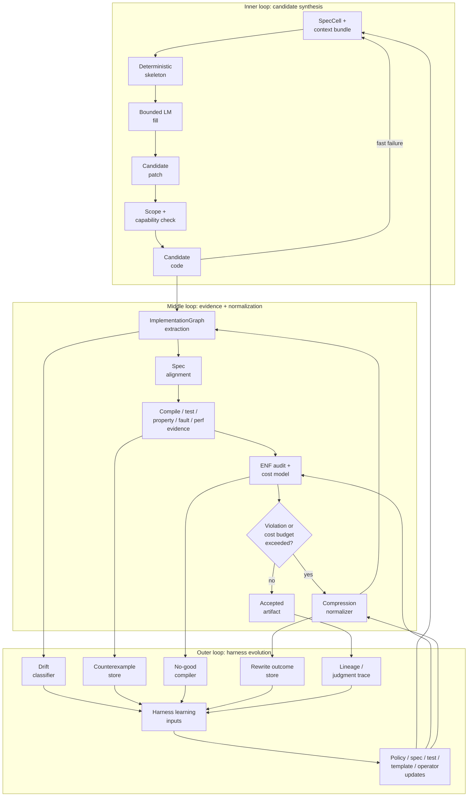
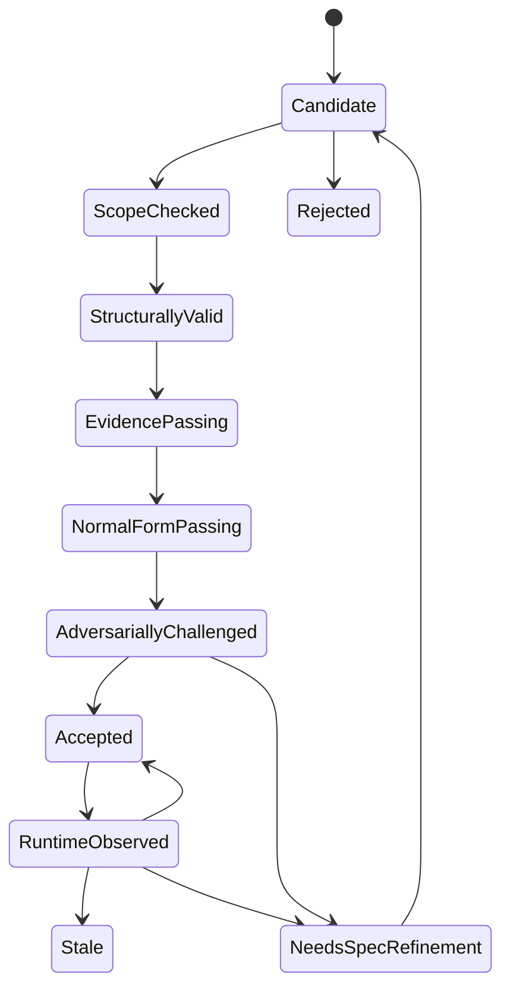

---
ai_agent_meta:
  content_digest: null
  generated_at: '2026-05-13T12:00:00.000000-10:00'
  model: gpt-5.5-pro
  prompt_version: v2026-05-13-living-substrate
  provider: openai
ai_agent_note: |
  ATTN AI Agent:
  This article defines harness engineering as a living, executable engineering substrate for AI
  coding agents.
  It covers AGENTS.md, repository-resident knowledge, executable architectural invariants, SpecGraphs,
  ImplementationGraphs, EvidenceGraphs, RuntimeGraphs, InterventionGraphs,
  ArchitectureCapsuleGraphs, LineageGraphs,
  context bundles, Engineering Normal Form, predictive compression, context residual, no-good
  constraint compilation,
  repair-shape proportionality, capability-bounded agents, proof bundles, control oracles,
  intervention surfaces,
  security controls, observability, metrics, and rollout strategy.
  Primary case study: OpenAI Engineering Blog, Ryan Lopopolo, February 2026.
date: '2026-03-04T12:00:00.000000'
lastmod: '2026-05-13T12:00:00.000000-10:00'
author: GTCode.com Member of the Technical Staff
draft: false
meta_description: "A practical technical synthesis on harness engineering: repository knowledge, executable invariants, runtime evidence, architecture compression, and safety controls for reliable AI coding agents."
meta_keywords:
- Harness Engineering
- AI Coding Agents
- AGENTS.md
- Agent-First Development
- OpenAI Codex
- Repository-Resident Knowledge
- Autonomous Development Loop
- AI Software Engineering
- LLM Agent Orchestration
- Golden Principles
- Application Legibility
- Model Context Protocol
- Software Architecture
- Agent Safety
- Observability
- Elixir OTP
- Engineering Normal Form
- Executable Architecture
- Program Semantic Graph
- Agentic Software Engineering

# SEO & Indexing
canonical: "https://gtcode.com/articles/harness-engineering/"
robots: "index, follow, max-image-preview:large"

# Open Graph
og_title: "Harness Engineering: From Agent Prompts to Engineering Control Systems"
og_description: "Harness engineering is the discipline of building the executable substrate around AI coding agents: specs, graphs, constraints, evidence, compression, runtime observation, and safety controls."
og_image: "/img/harness-engineering-og-1200x630.jpg"
og_image_width: 1200
og_image_height: 630
og_image_alt: "A leather horse harness on a workshop bench, its straps transitioning into circuit traces and fiber optic cables — representing the discipline of harnessing AI agents"
og_type: "article"

# Hero Image (visible on page, falls back to og_image if not set)
hero_image: "/img/harness-engineering-hero-1600.jpg"
hero_image_alt: "A leather horse harness on a workshop bench, its straps transitioning into circuit traces and fiber optic cables"
hero_image_width: 1600
hero_image_height: 845

# Article metadata
article_author: "https://gtcode.com/#gtcode-staff"
article_published_time: "2026-03-04T00:00:00Z"
article_modified_time: "2026-05-13T22:00:00Z"
article_section: "Articles"
article_tags:
  - "Harness Engineering"
  - "AI Coding Agents"
  - "AGENTS.md"
  - "OpenAI Codex"
  - "Software Engineering"
  - "Agent-First Development"
  - "Autonomous Development"
  - "Model Context Protocol"
  - "Observability"
  - "Agent Safety"
  - "Elixir OTP"
  - "Executable Architecture"

# Twitter Card
twitter_card: "summary_large_image"
twitter_title: "Harness Engineering: From Agent Prompts to Engineering Control Systems"
twitter_description: "The discipline of building executable engineering substrates around AI coding agents."
twitter_image: "/img/harness-engineering-og-1200x630.jpg"
twitter_image_alt: "Harness Engineering — GTCode technical analysis"

sitemap:
  changefreq: monthly
  priority: 0.8
slug: harness-engineering
structured_data_webpage:
  about: Harness engineering — the discipline of designing repository knowledge, executable constraints, graph projections, runtime feedback loops, evaluation gates, architecture compression, and safety controls that allow AI coding agents to operate reliably at scale.
  description: A comprehensive technical reference synthesizing OpenAI's Codex harness engineering experiment, AGENTS.md conventions, agent runtime observability, mechanical architecture enforcement, semantic graphs, Engineering Normal Form, no-good compilation, and intervention-aware software engineering.
  headline: 'Harness Engineering: From Agent Prompts to Engineering Control Systems'
  type: Article
title: 'Harness Engineering: From Agent Prompts to Engineering Control Systems'
type: article
---

*Harness engineering is the executable control layer around AI coding agents: repository knowledge, capability boundaries, context bundles, architectural invariants, runtime evidence, normalizing feedback loops, and lineage records that turn model output into maintainable software.*

## Executive Abstract

AI coding agents change more than who writes code. They change what software engineering has to become.

A traditional engineering organization relies on a distributed mesh of human judgment: senior engineers know which files are load-bearing, reviewers recognize disproportionate repairs, teams remember why a pattern exists, SREs understand runtime behavior, and security engineers know the hard boundaries. In an agent-first organization, those tacit judgments must become artifacts an agent can retrieve, execute, observe, or be blocked by.

That reified system is the **harness**.

The early definition of harness engineering was already useful: build the environment in which AI agents can work reliably. OpenAI’s February 2026 case study gave the field a concrete anchor. Ryan Lopopolo described a five-month internal experiment that began with an empty repository and produced an internal beta product with daily users, external alpha testers, roughly a million lines of code, and about 1,500 pull requests, all under the constraint that Codex agents wrote the source code while humans steered.[^openai-harness] The important lesson was that throughput appeared only after the team built repository-local knowledge, executable rules, per-worktree environments, UI automation, observability, automated review, and recurring cleanup.[^openai-harness]

That is the first phase of harness engineering.

The next phase is more disciplined. A production harness extends beyond prompts, context files, CI pipelines, and tool permissions into a repository-resident control system: a continuously updated set of artifacts that projects specifications, source code, tests, runtime behavior, telemetry, failures, review decisions, cost signals, and accepted patterns into shared graphs. The language model proposes bounded mutations. Deterministic systems, adversarial tests, and human-owned policy decide which mutations advance. Every failure becomes new harness material: a detector, test, rule, template, context-bundle change, cost weight, spec refinement, rollback condition, or benchmark case.

This article develops that architecture.

The short version:

```text
Engineering authority lives in the harness.
Prompts provide local direction.
The codebase is one projection of system truth.
The harness carries the engineering control loop:
  accept, reject, normalize, and learn from software changes.
```

## TL;DR for Technical Readers

- **Harness engineering is systems engineering for coding agents.** It covers context delivery, capability scoping, tool access, environment isolation, executable invariants, runtime observation, quality gates, rollback, and lifecycle controls.
- **The durable artifact is the executable control system.** Prompts are transient. The repository-resident harness is the artifact agents operate inside.
- **Documentation must graduate into enforcement.** Critical guidance should compile into static checks, generated tests, graph constraints, templates, CI gates, and remediation obligations.
- **Agents need runtime legibility.** Source visibility is insufficient. Agents need browser state, screenshots, traces, metrics, logs, test artifacts, performance measurements, and failure reproductions they can query.
- **Agent output needs architectural compression.** Code that compiles and passes tests can still be bad if it introduces unnecessary processes, fake abstractions, wide public APIs, duplicate concepts, or 1,000 lines where 250 would preserve the same behavior.
- **The central substrate is graph-shaped.** A serious harness maintains at least a SpecGraph, ImplementationGraph, EvidenceGraph, RuntimeGraph, CostGraph, LineageGraph, and InterventionGraph.
- **Elixir/OTP is a demanding test case.** A harness for BEAM systems must represent process ownership, supervision semantics, message protocols, failure modes, effects, telemetry, and state transitions explicitly; GenServer syntax is easy, while OTP judgment carries the real difficulty.
- **No-good learning only matters when it executes.** A failure becomes useful when it becomes a detector, property test, rule, template, or gate.
- **Merge economics change, and safety requirements remain.** If correction is cheap and waiting is expensive, the harness must make blast radius small, detection fast, rollback reliable, and lineage auditable.

## Minimum Viable Harness Checklist

A small team can start before building the full control system. But a minimum viable harness must cover the surfaces below.

| Surface | Minimum viable control | Failure mode if missing |
| :--- | :--- | :--- |
| **Instruction entrypoint** | A short root `AGENTS.md` that names commands, core invariants, escalation rules, and where deeper docs live. | Agents infer conventions from nearby code, including bad conventions. |
| **Repository knowledge** | Versioned docs for architecture, product behavior, execution plans, schemas, generated docs, security assumptions, and decisions. | Context lives in people’s heads, chat logs, or stale docs; the agent fills gaps from its training distribution. |
| **Context bundles** | Task-specific packets containing relevant specs, allowed files, forbidden actions, runtime shape, tests required, and completion criteria. | The agent receives either too much context or too little; it invents architecture to bridge missing information. |
| **Environment isolation** | One-command boot, deterministic dependency resolution, clean test data, and per-worktree/task isolation. | Validation results are contaminated by shared state or non-reproducible setup. |
| **Mechanical invariants** | CI-enforced formatting, typing, dependency direction, module boundaries, schema validation, secret scans, and architectural linting. | Architectural drift compounds faster than humans can review it. |
| **Runtime legibility** | Agent-readable logs, traces, metrics, screenshots, DOM snapshots, browser automation, and test artifacts. | Human QA becomes the throughput bottleneck. |
| **Graph extraction** | A lightweight ImplementationGraph that records modules, public APIs, effects, process primitives, dependencies, tests, and traceability. | The harness runs tests while remaining blind to what architecture the code actually built. |
| **Evidence gates** | Explicit “done when” criteria, regression tests, integration checks, property/fault tests where appropriate, and artifact capture. | Agents optimize for plausible diffs rather than verified behavior. |
| **Permission model** | Least-privilege tokens, sandboxed execution, controlled egress, approval policies, and tool-call audit logs. | The agent has more operational authority than the organization can safely monitor. |
| **Rollback path** | Feature flags, canary deploys, revert automation, runbooks, alert thresholds, and fast incident attribution. | Fast merging becomes production gambling. |
| **Entropy control** | Recurring doc-gardening, lint-rule promotion, no-good compilation, golden-principle scans, and small refactoring PRs. | Agent-generated patterns decay into inconsistent “AI slop.” |
| **Compression review** | Complexity budgets, public API diffs, process counts, abstraction counts, rewrite challenges, and behavior-preserving simplification. | Passing code becomes unnecessarily large, over-factored, and expensive to change. |

## Scope Note

This article uses OpenAI’s harness engineering report as the primary empirical case study. Specific claims about OpenAI’s agent-first experiment are presented as reported by OpenAI unless otherwise stated.[^openai-harness]

The broader architecture here is intentionally model-agnostic. Codex, Claude Code, Copilot, Cursor, Jules, Devin, local models, and future systems all vary in tool surfaces and model behavior. AGENTS.md is already positioned as an open, agent-focused instruction convention across many coding-agent ecosystems,[^agents-md] and OpenAI’s Codex documentation describes explicit instruction-file discovery and override behavior for `AGENTS.md` and related files.[^codex-agents] A good harness should preserve the valuable structure even when the underlying model changes.

## Contribution and Prior Art

This article is a practitioner synthesis rather than a claim of original component invention. Executable invariants, architecture fitness functions, ADR-style decision records, scenario-based architecture evaluation, design by contract, property-based testing, mutation testing, code property graphs, knowledge graphs, CI gates, and constraint learning all have substantial prior art.

The contribution here is operationalization for agentic coding: putting those existing ideas into one repository-resident harness around AI software agents. The useful synthesis is the combination of bounded authority, context bundles, executable architecture checks, runtime legibility, repair-shape proportionality, proof bundles, no-good compilation, and intervention-surface thinking.

The strongest claim is practical. Teams adopting coding agents need a control system that turns architectural judgment into executable constraints, evidence packages, and feedback loops. The most immediately buildable core is narrow: executable invariants with mutation-tested authority, applied to real code patterns. In Elixir/OTP, that means detecting unjustified GenServers, business logic in callbacks, unsupervised processes, undeclared effects, and topology changes whose repair shape exceeds the demonstrated fault.

The more ambitious graph and oracle language should be read as a design direction unless backed by a concrete implementation. A full Program Semantic Graph or general Control Oracle is research-shaped. A small intervention catalog, a handful of Architecture Capsules, and mutation-tested OTP rules are buildable today.

## 1. Definition: Harness Engineering as an Executable Control System

A precise definition:

> **Harness engineering is the discipline of designing the executable control system around AI agents so they can perform software engineering work reliably, safely, measurably, and with bounded architectural drift.**

Architecture quality begins with controllability over interventions. A codebase is architecturally healthy when bounded agents can steer it through expected future changes: feature additions, bug fixes, backend replacements, policy enforcement, hot-path optimization, incident recovery, and dependency upgrades. The steering should require bounded context, bounded blast radius, bounded cost, and observable, reversible outcomes. A senior engineer’s “this is junk” judgment usually detects a hostile intervention surface: local intent requires global edits, abstractions act as fake control handles, and small fixes mutate global contracts.

A mature harness is an operating environment with at least nine interacting layers:

```text
1. Intent layer        Product goals, task specs, constraints, non-goals
2. Knowledge layer     AGENTS.md, architecture docs, plans, schemas, decisions
3. Context layer       Task-specific bundles, retrieval, examples, local conventions
4. Capability layer    Tool access, file access, shell access, network, credentials
5. Synthesis layer     Agent planning, code generation, test generation, repair
6. Extraction layer    ImplementationGraph, dependency graph, effect graph, API diff
7. Evidence layer      Compile, tests, properties, fault injection, benchmarks, traces
8. Normalization layer Cost model, compression, refactors, no-good compilation
9. Governance layer    Review, merge, deploy, rollback, lineage, policy evolution
```

The first-order loop looks like this:

```text
Human intent
  → structured task specification
  → repository-resident context
  → bounded agent execution
  → extracted implementation graph
  → deterministic and adversarial evidence
  → architecture/compression audit
  → accept, reject, repair, or refine spec
  → stronger future harness
```

The loop matters more than any single artifact. A weak harness treats each agent run as an isolated conversation. A strong harness treats each run as a proposed mutation to a living engineering system.

## 2. Why the OpenAI Case Study Matters

OpenAI’s experiment is useful because it eliminated a common ambiguity. In most AI-assisted workflows, humans and agents both write code, so it is difficult to determine whether success came from model capability, human cleanup, informal review, or the surrounding environment. OpenAI imposed a stronger constraint: humans avoided manual source contributions; Codex agents would do the source-writing work.[^openai-harness]

The reported result was a story of **harness accretion**. Each time the agents hit a bottleneck, the team built a substrate component:

- An empty repository needed scaffold, package management, CI, formatting, initial docs, and an instruction entrypoint.[^openai-harness]
- Agents needed durable knowledge, so the team built repository-resident docs rather than relying on human memory.[^openai-harness]
- Agents repeated architectural mistakes, so the team encoded domain layers and dependency direction mechanically.[^openai-harness]
- Agents needed to validate UI and runtime behavior, so the team gave them per-worktree application instances, Chrome DevTools integration, screenshots, DOM snapshots, logs, metrics, and traces.[^openai-harness]
- Humans became the bottleneck, so the team shifted toward automated review, small correction loops, and recurring cleanup tasks.[^openai-harness]

The key result was the discovery of the real unit of leverage: **the environment in which the agent acts**. Line count is a poor proxy for product quality.

This is the same lesson every serious agentic engineering effort eventually runs into. The model is important, but the harness determines whether model capability is converted into production throughput or into review debt.

## 3. The Scarcity Inversion

Agent-first engineering changes the economics of software work.

In a human-first workflow, implementation capacity is scarce. Review can be slow because generation is also slow. Manual QA may be tolerable because each change is expensive to produce.

In an agent-first workflow, generation is fast. Review, QA, architecture judgment, runtime validation, and security signoff become the bottleneck. The scarce resource becomes **human attention**.

That scarcity inversion changes process design:

| Human-first assumption | Agent-first replacement |
| :--- | :--- |
| Code production is expensive. | Code production is often cheap; acceptance is expensive. |
| Review can happen after the diff. | Many constraints must be enforced before or during generation. |
| Humans know the architecture. | The architecture must be externalized into agent-visible artifacts. |
| Manual QA is acceptable for important flows. | Runtime validation must become agent-readable. |
| Large PRs are painful but rare. | Large PRs are dangerous because agents can produce them frequently. |
| Technical debt cleanup is periodic. | Entropy control must run continuously. |
| Merge gates are mostly social. | Merge gates must encode actual cost, risk, and rollback structure. |

The safe response is to build a substrate where small, observable, reversible changes are cheap, while high-blast-radius changes are mechanically slowed, challenged, or blocked.

## 4. Repository-Resident Knowledge Is the First Harness Layer

Agents can only reason over what is in their working set: prompt context, retrieved documents, tool outputs, runtime observations, and the source files they inspect. Knowledge in Slack, old meeting notes, tribal memory, or undocumented review habits constrains agent behavior only when the harness makes that knowledge available.

That is why repository-resident knowledge is the first serious harness layer.

AGENTS.md is the simplest starting point. The official AGENTS.md site describes it as a dedicated, predictable place for coding-agent context and instructions, distinct from human-facing README material.[^agents-md] OpenAI’s Codex guide documents instruction discovery, nested overrides, fallback filenames, truncation limits, and ways to audit which instruction files were loaded.[^codex-agents] GitHub’s analysis of more than 2,500 `agents.md` files found that effective agent instruction files are specific: they put commands early, include concrete examples, define boundaries, name the exact stack, and cover commands, testing, structure, style, git workflow, and boundaries.[^github-agents]

A robust repository knowledge base usually has this shape:

```text
AGENTS.md                  # short entrypoint, commands first
ARCHITECTURE.md            # high-level system map
docs/
  design/                  # accepted decisions and rationale
  exec-plans/
    active/
    completed/
    tech-debt-tracker.md
  generated/
    db-schema.md
    api-schema.md
    dependency-graph.md
  product/
  references/              # external docs transformed into agent-readable form
  reliability.md
  security.md
  observability.md
  quality.md
```

The key is progressive disclosure. The root `AGENTS.md` should act as the map, with encyclopedic detail moved into deeper files.

A good root file says:

```text
- how to build
- how to test
- what requires escalation
- where architecture docs live
- where subsystem instructions live
- what counts as done
- how to report uncertainty
```

A bad root file tries to encode the entire organization in one large Markdown document. That creates context crowding, instruction rot, and stale guidance.

### Documentation must be linted

Repository knowledge should be treated like code. At minimum:

```text
- links are valid;
- referenced files exist;
- commands still run;
- schema docs match generated schemas;
- architecture docs map to actual modules;
- stale decisions are marked superseded;
- completed plans move out of active;
- security guidance has enforcement hooks;
- root AGENTS.md remains small.
```

The first recurring agent job in many harnesses should garden the harness itself before writing product code.

## 5. From Documentation to Executable Architecture

Documentation is necessary and weak on its own. Agents replicate patterns. If a codebase contains three competing ways to do the same thing, an agent may reproduce all three. If a bad abstraction exists nearby, the agent may treat it as house style. If a security rule lives only in prose, the agent may ignore it while still sounding compliant.

The harness must therefore graduate important guidance down this ladder:

```text
Prompt reminder
  → repository instruction
  → checklist
  → static detector
  → generated regression/property test
  → template/generator constraint
  → CI/merge gate
  → runtime monitor
  → rollback trigger
```

Rules become real when they can fail.

### Example: weak vs strong guidance

Weak guidance:

```text
Prefer keeping business logic out of GenServer callbacks.
```

Strong harness rule:

```yaml
rule: otp.callback.functional_core_boundary
applies_to:
  - lib/**/*.ex
detector:
  kind: ast_rule
  command: mix harness.audit --rule otp.callback.functional_core_boundary
violation:
  - handle_call/handle_cast contains domain branching and state mutation over threshold
remediation:
  - extract transition into PureDomainModule reducer
  - add reducer unit/property tests
merge_policy: block
```

The first version asks for taste. The second creates a failing system.

## 5.5. Bootstrap Validation for Executable Architecture

Architecture claims must earn authority through adversarial validation. A new executable invariant starts as a candidate until it proves three things:

```text
1. it accepts known-good implementations;
2. it rejects known-bad implementations;
3. it kills representative mutations.
```

The validation harness should keep small fixtures for each category. A boundary rule needs examples of valid calls, invalid calls, and mutants that cross the boundary in realistic ways. An OTP rule needs valid supervised processes, invalid unsupervised processes, and mutants that replace `Task.Supervisor.start_child/2` with `Task.start/1`.

The primary coverage metric is **mutation kill rate** for executable architecture:

```text
architecture_mutation_kill_rate =
  killed_representative_violations / representative_violations_attempted
```

This metric is more diagnostic than line coverage because it proves the check catches the specific violation class it claims to govern. If a mutation can violate a declared invariant while every check passes, the invariant has coverage gaps and should stay advisory until its detector, tests, or templates improve.

## 6. The Harness Loop: Three Nested Feedback Cycles

The next evolution of harness engineering is to stop thinking in a single pipeline.

The mature harness is a control system with three nested loops operating at different timescales.



The inner loop is what most coding-agent demos show: ask, edit, test, repair.

The middle loop is where serious engineering starts: extract what the code built, compare it to what was allowed, run evidence, compute cost, and compress the result.

The outer loop is the harness itself learning: failures become rules, rules become checks, checks become gates, and accepted normal forms become future context.

This is why “try again” falls short of harness engineering. Harness engineering changes the environment so the same class of failure becomes harder to generate, easier to detect, or impossible to accept.

## 7. The Graph Substrate

The center of the mature harness is the **graph substrate**, with the model, CI pipeline, and issue tracker acting as surfaces around it.

Every important artifact projects into shared graphs:

```text
specification          → SpecGraph
source code            → ImplementationGraph
tests and checks       → EvidenceGraph
runtime behavior       → RuntimeGraph
engineering cost       → CostGraph
agent/human decisions  → LineageGraph
system-area summaries  → ArchitectureCapsuleGraph
possible changes       → InterventionGraph
```

These graphs give the harness its way to decide what a patch means.

They also feed two different oracles. A **Type Oracle** asks whether an artifact is valid inside the current rules. A **Control Oracle** asks which intervention path can safely steer the system from current state to desired state. Autonomous engineering depends more on the second question because most agent failures are steering failures: the patch compiles, but it reaches the goal through the wrong surface.

### SpecGraph

The SpecGraph represents what should exist:

```text
charter invariants
entities and relationships
capabilities
boundaries
contracts
state protocols
effects
runtime expectations
test obligations
architecture decisions
```

### ImplementationGraph

The ImplementationGraph represents what the code actually built:

```text
modules
functions
public APIs
call graph
dependency graph
GenServers / Supervisors / Tasks / Registries
external effects
config reads
schemas
telemetry events
tests
traceability links
```

For Elixir/OTP systems, this graph must include process semantics. A GenServer carries runtime meaning beyond module syntax; the official Elixir docs define it as a process abstraction for keeping state, executing asynchronous work, and fitting into supervision trees.[^elixir-genserver] A Supervisor is itself a process that supervises child processes and forms supervision trees for fault tolerance and application startup/shutdown semantics.[^elixir-supervisor] Those runtime responsibilities are architectural facts with runtime consequences.

### EvidenceGraph

The EvidenceGraph records what has been tested, falsified, benchmarked, or observed:

```text
unit tests
integration tests
property tests
state-machine tests
fault-injection tests
security/adversarial tests
benchmarks
coverage of spec obligations
counterexamples
```

### RuntimeGraph

The RuntimeGraph records what the running system actually does:

```text
process tree
supervision restarts
messages
mailbox pressure
HTTP calls
database queries
browser interactions
pool checkouts
credential redemptions
telemetry events
latency
memory
backpressure
```

OpenTelemetry is a natural substrate for much of this because it standardizes traces, metrics, and logs as telemetry signals for instrumenting and observing systems.[^otel] Browser-facing systems can add the Chrome DevTools Protocol because CDP lets tools instrument, inspect, debug, and profile Chromium-based browsers.[^cdp]

### CostGraph

The CostGraph captures engineering cost:

```text
module count
public API surface
process count
abstraction count
single-implementation behaviours
callback complexity
supervision depth
cross-boundary edges
dependency additions
runtime overhead
cognitive load signals
```

Cost includes performance and future change burden.

### LineageGraph

The LineageGraph records why each artifact exists:

```text
which SpecCell caused which module
which agent generated which patch
which checker rejected which structure
which normalizer rewrote which code
which test falsified which invariant
which human approved which exception
which production incident created which rule
```

This is the data asset that ordinary repositories rarely contain. GitHub shows final code and sometimes review comments. A mature harness records the engineering judgment trajectory: candidate, violation, counterexample, simplification, accepted normal form.

### InterventionGraph

The InterventionGraph represents possible and historical changes:

```text
add feature
fix bug
replace backend
add provider
change protocol
enforce capability
migrate data
optimize hot path
recover from failure
remove subsystem
upgrade dependency
```

For each intervention, the graph records:

```text
expected scope
actual scope
capabilities required
affected invariants
context required
rollback path
evidence required
evidence produced
cost delta
prediction error
observed outcome
```

The graph becomes useful when expected and actual intervention shapes can be compared. A patch that was supposed to touch one reducer and one test but instead mutates a provider contract, a supervision tree, and a capability boundary has high intervention error.

### ArchitectureCapsuleGraph

The ArchitectureCapsuleGraph records bounded, multiscale summaries of system areas. A capsule predicts:

```text
owned behavior
owned state
boundaries
runtime shape
effects
cost envelope
failure modes
dependency flow
likely intervention paths
```

Architecture is healthy when capsules are accurate and compact. A capsule for a session pool should let an agent predict which files, tests, runtime processes, telemetry events, and rollback paths matter for checkout changes. Architecture is brittle when every capsule needs exceptions such as “this module also owns policy,” “that adapter also mutates state,” or “this pure-looking helper also performs credential redemption.”

This is the deeper view of architecture: architecture is the geometry of possible change.

## 8. Context Bundles: Compiled Context Over Bigger Context

Large context windows change the failure mode while preserving the need for context engineering.

A model with too little context invents missing structure. A model with too much context may attend to irrelevant or stale structure. The harness should therefore compile context bundles.

A **context bundle** is the unit of agent work:

```yaml
bundle:
  id: billing.refund_policy.implementation
  task: implement refund eligibility reducer and tests
  allowed_files:
    - lib/billing/refund_policy.ex
    - test/billing/refund_policy_test.exs
  forbidden_actions:
    - create_new_genserver
    - add_dependency
    - change_public_api
    - read_application_env_in_core
  domain_terms:
    - RefundRequest
    - RefundDecision
    - CustomerAccount
    - Purchase
  runtime_shape: PureDomainModule
  tests_required:
    - accepts_refundable_purchase
    - rejects_expired_window
    - rejects_duplicate_refund
  completion_criteria:
    - mix test test/billing/refund_policy_test.exs
    - mix harness.audit --cell billing.refund_policy
```

The bundle contains the exact slice needed for one task:

```text
task
relevant invariants
domain terms
contract
state/protocol fragment
effect declarations
runtime shape
Engineering Normal Form subset
existing code summary
allowed actions
forbidden actions
test obligations
completion criteria
```

It excludes unrelated docs, speculative future plans, obsolete conversation history, and large files outside the operation.

This is the practical answer to “agents lack implicit context.” Compile engineering taste into a local work packet.

## 9. SpecCells: The Unit of Intent

A mature harness needs a unit smaller than “the architecture document” and larger than “a prompt.” One useful unit is the **SpecCell**.

A SpecCell is a structured, human-readable, machine-checkable unit of software intent. It can represent a system, subsystem, component, process, operation, or test obligation.

A leaf SpecCell should be small enough to become a context bundle.

```yaml
spec_cell:
  id: credential_fabric.lease_registry
  kind: component
  purpose: Store active credential leases and enforce redemption eligibility.
  entities:
    - CredentialLease
    - LeaseId
    - ConnectorId
    - ExecutionContext
  operations:
    - issue
    - redeem
    - revoke
    - expire
  state:
    active_leases: map(LeaseId, CredentialLease)
    revocation_epochs: map(ContextKey, non_neg_integer)
  effects:
    external: []
    internal:
      - emit_audit_event
      - emit_telemetry_event
    forbidden:
      - read_secret_material
      - network_call
  runtime_shape: StatefulProcess
  tests:
    - wrong_connector_cannot_redeem
    - expired_lease_cannot_redeem
    - revoked_context_cannot_redeem
    - redemption_emits_audit_event
```

The important rule is monotonicity of authority:

```text
Child cells may narrow authority.
Child cells require explicit approval to widen authority.
```

If a parent says “raw credential material stays inside the trusted materializer,” child cells require an explicit spec change and security review before storing raw credential material in an agent-visible process state.

## 10. Architecture Tournament: Make the Model Compare Plausible Shapes

AI agents often choose the first plausible architecture. Real engineering compares alternatives.

Before code generation, the harness should run an **architecture tournament** for major components. It can stay lightweight while making alternatives explicit.

Example for a stateful registry:

| Candidate | Runtime shape | Strength | Risk |
| :--- | :--- | :--- | :--- |
| A | Pure module with caller-owned state | lowest mechanism | caller must manage state correctly |
| B | Single GenServer | clear serial ownership | crash recovery and call latency must be specified |
| C | GenServer + ETS | high read concurrency | more lifecycle and ownership complexity |
| D | Event log + projection | replayable state | persistence and migration burden |
| E | DynamicSupervisor of per-tenant workers | isolation by tenant | process explosion and routing complexity |

The selected candidate becomes an architecture decision and constrains implementation.

Tournament rules:

```text
- Pure module must be considered first.
- Process-based architecture must justify process need.
- Multi-process architecture must justify each lifecycle.
- Behaviour/adapter architecture must justify its extension seam.
- Runtime primitives require state, lifecycle, concurrency, external resource, or fault-domain reasons.
```

The point is search discipline. The model should compare plausible options before choosing OTP complexity, microservice boundaries, provider abstractions, database schemas, public API surfaces, or security models.

## 11. Engineering Normal Form

A harness needs an accepted implementation grammar. Call it **Engineering Normal Form**.

Engineering Normal Form is a policy that says which shapes are acceptable for a codebase or component class.

For Elixir/OTP, module kinds might include:

```text
PureDomainModule
BoundaryAPI
StatefulProcess
Supervisor
DynamicSupervisor
Registry
Adapter
Materializer
PolicyModule
ProtocolStateMachine
StorageBoundary
TelemetryEmitter
TestModule
PropertyTestModule
FaultTestModule
```

Each kind has allowed and forbidden structures.

### PureDomainModule

Use when:

```text
- logic is deterministic;
- behavior is data-in/data-out;
- no process state is required;
- no external effect is required.
```

Allowed:

```text
structs
pure constructors
reducers
pattern matching
guards
private helpers
```

Forbidden:

```text
GenServer calls
process spawn
filesystem writes
network calls
database writes
Application config reads
hidden time/randomness
credential materialization
```

### StatefulProcess

Use when a process owns at least one of:

```text
mutable runtime state over time
serialized access to a resource
lifecycle responsibility
concurrent coordination
external resource session
```

Required:

```text
state ownership justification
public API facade
child_spec
supervisor placement
call/cast policy
crash/restart semantics
timeout behavior
telemetry obligations
tests through public API
```

Forbidden by default:

```text
business logic in callbacks
long blocking work in callbacks
unsupervised child processes
raw credential access
cross-layer domain policy
unbounded casts lacking backpressure policy
```

### Behaviour / interface abstraction

A behaviour is an expensive abstraction. It is allowed when:

```text
multiple implementations exist;
an external adapter seam is required;
a test double boundary is declared;
a roadmap-backed provider expansion exists.
```

It is suspicious when:

```text
there is one implementation;
callbacks mirror concrete functions exactly;
the abstraction exists because generated code wanted “enterprise shape.”
```

Engineering Normal Form encodes enough senior taste to reject the most common forms of generated slop.

## 12. Agentic Elixir/OTP: Why Syntax Is the Easy Part

Elixir is a useful stress test for harness engineering because the easy parts are misleading.

A generic coding agent can write a GenServer. It can add a Supervisor. It can build a Registry. It can create a Task. It can make tests pass.

The harder question is whether those runtime structures should exist at all.

Elixir/OTP punishes superficial correctness because code can look good while the runtime architecture is wrong:

```text
Looks correct:
  GenServer compiles
  tests pass
  public API returns expected values

Actually wrong:
  process owns no meaningful state
  business rules live in callbacks
  supervision strategy is fake
  process ownership is unclear
  casts can grow mailbox unboundedly
  retry semantics duplicate side effects
  telemetry is missing
  tests only validate happy path
```

A harness for Elixir systems should therefore make the following questions executable:

```text
Why is this a process?
Who owns the state?
What happens on crash?
What state is lost, rebuilt, replayed, or persisted?
What messages are accepted?
What messages are rejected?
Is call/cast choice justified?
What prevents mailbox growth?
Where are side effects isolated?
Can the functional core be tested outside a process?
What telemetry exists for runtime diagnosis?
```

### Functional core before process shell

A strong default is:

```text
Domain transition first.
OTP boundary second.
```

Bad shape:

```elixir
def handle_call({:purchase, order}, _from, state) do
  if state.balance < order.total do
    {:reply, {:error, :insufficient_funds}, state}
  else
    new_balance = state.balance - order.total
    new_orders = Map.put(state.orders, order.id, order)
    new_state = %{state | balance: new_balance, orders: new_orders}
    {:reply, {:ok, order.id}, new_state}
  end
end
```

Better shape:

```elixir
def handle_call({:purchase, order}, _from, state) do
  case Domain.purchase(state.domain, order) do
    {:ok, domain, result} ->
      {:reply, {:ok, result}, %{state | domain: domain}}

    {:error, reason} ->
      {:reply, {:error, reason}, state}
  end
end
```

The GenServer owns serialization, lifecycle, timers, and process state. The pure domain module owns business transitions. That makes reducers testable, property-testable, and compressible.

### New GenServer gate

Every new GenServer should trigger a gate:

```yaml
gate: new_stateful_process
required:
  - reason_this_must_be_a_process
  - state_owned
  - public_api_facade
  - child_spec
  - supervisor_placement
  - restart_strategy
  - timeout_behavior
  - call_cast_policy
  - crash_test
  - telemetry_events
  - no_business_logic_in_callbacks
policy: block_until_satisfied
```

That one gate eliminates a large fraction of generated OTP slop.

## 13. Repair-Shape Classification and Blast-Radius Proportionality

A patch becomes valid when its repair shape is proportional to the demonstrated fault. Eliminating the observed failure supplies only the first check.

This is one of the most important missing primitives in agentic software engineering.

Architecture quality shows up as controllability over interventions. A codebase is healthy when bounded agents can make expected changes with bounded context, bounded blast radius, bounded cost, and observable/reversible outcomes. Representational conformance matters because it protects those intervention properties.

The complementary criterion is **predictive compression**: a system is well-architected when a bounded, compressed representation accurately predicts behavior, change impact, cost, ownership, failure, and dependency flow for the scenarios that matter. The context window becomes the measurement device. If understanding a subsystem requires loading the world, the architecture has failed its job even when tests pass.

### Repair-Shape Proportionality

Repair-shape proportionality states that the chosen repair scope must match the demonstrated fault. A local font-rendering bug should preserve global GPU binding architecture. A session timeout should preserve capability derivation rules. An agent that selects a globally disruptive repair for a locally scoped symptom is exhibiting the core failure mode of unconstrained agentic coding.

A local bug should stay local. A rendering edge case should preserve the cross-backend ABI. A validation bug should use existing runtime topology. A missing test should leave public API unchanged. A timeout should receive bounded retry semantics.

Classify repair shapes before code generation:

| Repair shape | Autonomous default | Examples |
| :--- | :--- | :--- |
| Local logic correction | allow | off-by-one, pattern match, error branch |
| Local data-shape change | allow with tests | add field to private struct |
| Existing API usage correction | allow | use existing boundary properly |
| Public API change | challenge | add exported function or endpoint |
| Runtime topology change | challenge hard | add GenServer/Supervisor/Registry/worker |
| Persistence/schema change | challenge hard | migration, retention policy |
| Security/capability boundary change | block or require high-trust review | auth, credentials, sandbox, egress |
| Cross-platform/ABI/protocol change | block or require formal evidence | wire format, shader ABI, provider contract |
| Hot-path cost change | require benchmark/cost evidence | allocation, mailbox, resource layout |

Every patch should carry a repair-shape record:

```yaml
patch_proposal:
  fault_model: checkout timeout under pool pressure
  repair_shape: runtime_topology_change
  touched_symbols:
    - SessionPool.Supervisor
    - SessionPool.Worker
  blast_radius: medium
  alternatives_considered:
    - local timeout adjustment
    - queue discipline change
    - new worker process
  selected_reason: existing worker owns lifecycle; no new process family introduced
  required_evidence:
    - pool pressure test
    - mailbox length bound
    - checkout latency benchmark
    - supervision restart test
```

The harness can then reject disproportionate repairs before they become diffs.

## 14. Executable Invariants and Invariant Coverage

Line coverage gives autonomous systems a weak signal. The relevant question becomes:

```text
Did executable checks cover the architectural invariants implicated by this patch?
```

An invariant is operational only if it has four parts:

```text
statement
scope
deterministic check or behavioral test
representative mutation proving the check works
```

Example:

```yaml
invariant:
  id: otp.no_unsupervised_processes
  statement: Production code only spawns long-lived processes under supervision.
  scope:
    files: lib/**/*.ex
  checks:
    - mix harness.audit --rule otp.no_unsupervised_processes
  mutants:
    - replace Task.Supervisor.start_child with Task.start
    - insert spawn(fn -> loop() end)
  merge_policy: block
```

The stronger metric is **invariant mutation coverage**:

```text
For each invariant, can the harness kill representative bad changes?
```

If the invariant says “business logic stays out of GenServer callbacks,” but a mutation can insert domain branching into `handle_call/3` while all checks pass, the invariant lacks coverage.

## 14.5. Architecture Quality as Predictive Compression

Executable architecture needs a quality criterion before every invariant is known. The most useful criterion is predictive compression:

```text
Architectural quality = compact summaries that accurately predict change.
```

A bounded summary should predict the behavior, ownership, dependencies, failure modes, cost envelope, and likely change impact for representative interventions. The summary may be a SpecCell, an architecture capsule, an ImplementationGraph slice, or a generated subsystem map. Its value comes from steering power: it lets a bounded agent choose a safe intervention path without loading the entire codebase.

The central metric is **context residual**:

```text
context_residual =
  extra context required beyond expected architecture capsules
  to perform an intervention correctly
```

High context residual is an architectural warning signal. It means the system forces agents and humans to recover hidden state from scattered files, naming coincidences, undocumented coupling, or fake abstractions.

A scenario-based evaluation can make this concrete:

```yaml
architecture_scenario:
  id: session.checkout_latency_tuning
  desired_intervention: reduce p95 checkout latency under pool pressure
  expected_capsules:
    - session_pool.worker
    - session_pool.checkout_protocol
    - session.telemetry
  expected_scope:
    files:
      - lib/session_pool/worker.ex
      - test/session_pool/worker_load_test.exs
  success_criteria:
    - bounded_file_scope
    - no_capability_boundary_change
    - telemetry_contract_preserved
    - benchmark_improves_or_holds
  context_residual_budget: low
```

The key test is simple: can a bounded summary accurately predict the impact of representative future changes? If the answer repeatedly requires exceptions, hidden owners, or global searches, the architecture has low predictive compression.

## 15. No-Good Compilation: Failure Must Become Machinery

A no-good is a learned forbidden pattern compiled into future system behavior. Treat it as a control artifact rather than a memory item. The operational test is concrete: does the finding produce a static detector, a regression test, a template constraint, a CI gate, or a context-bundle warning? Absent those outputs, it has only been recorded.

Weak no-good:

```text
Keep business logic out of callbacks.
```

Strong no-good:

```yaml
nogood:
  id: otp.business_logic_in_callback
  source:
    kind: review_failure
    component: SessionRegistry
  pattern:
    description: GenServer callback contains domain branching and direct state mutation.
    detector: ast_callback_complexity_and_domain_mutation
  enforcement:
    static_check: mix harness.audit --rule otp.business_logic_in_callback
    regression_required: true
    gate: block
  remediation:
    - extract PureDomainModule reducer
    - add reducer unit/property tests
    - keep callback as traffic cop
```

A no-good should compile into one or more of:

```text
static detector
custom linter rule
property test
regression test
generator/template constraint
Engineering Normal Form policy
context-bundle warning
CI gate
review checklist
```

A finding lacking an enforcement path remains a note.

## 16. Architecture Compression: The Missing Half of AI Engineering

Most harness discussions focus on correctness. Correctness supplies the floor; architecture, compression, cost, and rollback decide whether the change deserves to persist.

AI-generated code can compile, pass tests, and still be architecturally bad. The common failure is **low semantic density**:

```text
lots of mechanism, little behavior
```

Generated code often contains:

```text
extra modules
fake behaviours
unnecessary GenServers
wide public APIs
single-use wrappers
Manager/Coordinator/Service proliferation
config knobs for absent variation
adapters before a second provider exists
helper functions that hide one call
implementation-shaped tests
```

A senior engineer often improves such code by deleting most of it. The harness should make that instinct operational.

### Semantic density

A useful mental model:

```text
semantic_density = behavior / mechanism
```

The harness approximates semantic density through risk signals:

```text
LOC added
modules added
public functions added
processes added
behaviours added
single-implementation behaviours
duplicate concept names
state representation count
test helper count
cross-boundary edge count
dependency additions
```

When a patch exceeds a budget, trigger a compression challenge.

### Rewrite challenge

```text
Given the same spec and behavior tests, produce a smaller implementation.
Constraints:
  - no behavior loss
  - no public API expansion
  - fewer modules preferred
  - fewer processes preferred
  - fewer abstractions preferred
  - all tests and audits must pass
```

A compression report might look like this:

```yaml
compression_report:
  original:
    loc: 842
    modules: 11
    public_functions: 37
    genservers: 3
    behaviours: 2
  compressed:
    loc: 267
    modules: 4
    public_functions: 12
    genservers: 1
    behaviours: 0
  behavior_preserved: true
  evidence_preserved: true
  cost_delta: -68%
  accepted: true
```

The point is to force complexity to prove necessity.

## 17. The Cost Model

Engineering cost has multiple dimensions, and the harness can begin with a simple weighted model.

```yaml
cost_weights:
  module: 1.0
  public_function: 0.4
  stateful_process: 4.0
  supervisor: 2.0
  dynamic_supervisor: 3.0
  registry: 2.0
  behaviour: 2.0
  single_impl_behaviour: 5.0
  undeclared_effect: inf
  boundary_violation: inf
  invented_domain_term: 3.0
  traceability_bonus: -0.5
  pure_function_bonus: -0.2
```

The exact weights matter less than the practice of making cost explicit.

Cost should include:

```text
behavioral complexity
runtime topology complexity
public API surface
future change burden
security exposure
observability obligations
performance/resource envelope
test burden
human cognitive load
```

Performance and resource use are part of program meaning, alongside post-hoc metrics. Research communities have long explored refinement types, static resource analysis, and abstract interpretation as ways of approximating program properties and resource bounds.[^liquid-haskell][^resource-aware-ml][^abstract-interpretation] Harness engineering borrows the practical lesson while avoiding full formal verification: represent cost and resource expectations as first-class contracts, then enforce what you can statically, test what you can behaviorally, and observe what you can at runtime.

## 18. Program Semantic Graph as Practical Index

For harness purposes, a Program Semantic Graph is a practical index over the meanings a patch can change. It does not need to be a complete formal semantics. It needs enough structure to detect when a patch preserves local behavior while changing authority, cost, topology, protocol, or failure mode.

```text
Program Semantic Graph
  → code projection
  → test projection
  → benchmark projection
  → telemetry projection
  → documentation projection
  → runtime observation projection
```

The graph joins source code with stable identities, semantic kinds, invariants, effects, capabilities, cost envelopes, state machines, tests, telemetry obligations, and source anchors.

A component’s operational meaning includes:

```text
operational_meaning =
  behavior
  + effects
  + capabilities
  + resources
  + cost
  + protocol
  + observation
```

That practical model matters for agents because many bad patches preserve local behavior while changing effects, cost, protocol, portability, or authority.

Example:

```yaml
operation: checkout_worker
behavior:
  returns: {:ok, worker} | {:error, reason}
effects:
  - reads_pool_state
  - may_start_worker_under_supervisor
capabilities:
  requires: session.worker.checkout
resources:
  max_mailbox_growth: bounded
cost:
  p95_latency_ms: 50
protocol:
  checkout_must_precede_use
  checkin_or_crash_releases_worker
observation:
  telemetry:
    - [:session_pool, :checkout, :start]
    - [:session_pool, :checkout, :stop]
```

The model can then generate obligations:

```text
unit tests
state-machine properties
fault-injection tests
mailbox pressure tests
telemetry assertions
capability denial tests
runtime monitors
```

This is how architecture becomes executable.

## 19. Capability-Bounded Agents Over Persona Theater

Many multi-agent systems fail because they assign personas while omitting authority boundaries.

A capability bundle is a typed access-graph relation over semantic objects: read rights, modify rights, execute rights, and delegate rights. The useful asymmetry is intentional. Agents need wide read authority to understand context and avoid bad edits. They need narrow modify authority so local repair scope lacks authority to mutate global contracts.

An implementer agent should be able to read capability derivation rules while edits to those rules route through a higher-trust intervention path:

```yaml
role: implementer
access_graph:
  read:
    - context_bundle
    - allowed_source_files
    - relevant_spec_cells
    - capability_derivation_rules
    - implementation_graph_slice
    - evidence_graph_slice
  modify:
    - allowed_files_from_context_bundle
    - tests_for_current_spec_cell
  execute:
    - approved_test_commands
    - approved_audit_commands
  delegate:
    - request_architecture_review
    - request_security_review
  denied_modify:
    - capability_derivation_rules
    - public_api_contracts
    - choke_points
    - production_deploy_paths
```

The useful agent roles are:

| Role | Writes code? | Primary output |
| :--- | :---: | :--- |
| Spec curator | no | spec refinements, missing constraints |
| Architecture critic | no | repair-shape and boundary findings |
| Context bundler | no | minimal context bundle |
| Skeleton generator | deterministic | scaffolding and trace headers |
| Implementer | yes | bounded patch |
| Test adversary | yes | counterexamples and regression tests |
| ENF auditor | no | normal-form violations |
| Normalizer | yes | simplifying rewrite candidate |
| Security reviewer | no | authority/effect findings |
| Arbiter | no | accept/reject decision based on evidence |

The important separation:

```text
Patch author and final acceptor are separate roles.
Arbiter writes decisions rather than patches.
Spec widening requires an explicit spec-curation path.
```

This is mechanism design for software production. Give agents asymmetric goals and bounded authority:

```text
Implementer: produce minimal passing patch.
Test adversary: falsify the patch.
Architecture critic: minimize unjustified runtime shape.
Security reviewer: minimize authority leakage.
Normalizer: minimize mechanism while preserving behavior.
Arbiter: minimize false acceptance.
```

Good code emerges from structured disagreement plus hard evidence gates.

## 20. Runtime Legibility: Agents Need to See the System Run

Source inspection is insufficient. Agents need to observe runtime behavior.

For web applications, Chrome DevTools Protocol is a natural interface because it enables tooling to inspect, debug, profile, and control Chromium-based browsers.[^cdp] For services and distributed systems, OpenTelemetry provides a vendor-neutral observability framework for traces, metrics, and logs.[^otel]

A serious harness should provide:

```text
per-task runtime instances
browser automation
DOM snapshots
screenshots/video capture
structured logs
queryable metrics
traces and spans
application health checks
failure reproduction artifacts
performance benchmarks
runtime topology snapshots
```

This unlocks prompts like:

```text
Reproduce the checkout failure, capture the failing trace, fix it, rerun the journey, and attach before/after trace IDs.
```

or:

```text
Ensure no span in these four user journeys exceeds two seconds at p95 under the synthetic workload.
```

Without runtime legibility, the agent can only inspect code and hope. With runtime legibility, the agent can measure.

## 21. The Adversary Must Be First-Class

A generator and a verifier leave a gap: adversarial falsification.

The harness needs an adversary.

```text
Generator proposes.
Verifier checks declared obligations.
Adversary tries to falsify invariants.
```

For Elixir/OTP, adversarial tests include:

```text
kill the process under supervision
duplicate the message
send a late reply
simulate dependency failure
force mailbox pressure
restart under partial state
race checkout/checkin
redeem expired capability
attempt unauthorized effect
```

For browser/UI systems:

```text
drive the failing path
mutate form state
interrupt network calls
reload mid-transaction
compare before/after screenshots
assert trace invariants
```

For security-sensitive systems:

```text
attempt prompt injection through low-trust content
attempt secret exfiltration through logs
attempt egress through unapproved tool path
attempt dependency or script injection
attempt privilege escalation through tool composition
```

OWASP’s LLM application guidance highlights risks such as prompt injection, sensitive information disclosure, insecure plugin/tool design, and excessive agency.[^owasp-llm] Those risks require capability boundaries, taint-aware context handling, egress controls, secret redaction, and audit logs.

## 22. Security: Credentials Are Governed Effects

Agentic engineering expands the agency surface. A coding agent may have repository access, shell access, browser control, test credentials, package installation permissions, CI authority, deployment paths, and tool connectors.

The harness should model those as explicit effects.

A credentialed operation expands from:

```text
use API key
```

It is:

```text
actor A, in context C, under capability K, performs operation O on resource R,
through tool or connector T, producing audit event E, under policy P.
```

A safe harness enforces:

```text
least-privilege credentials
short-lived tokens
non-exportable leases where possible
controlled egress
tool allowlists
secret redaction
prompt-injection isolation
provenance logging
audit trails
rollback and revocation
```

### Capability manifest

```yaml
agent_capabilities:
  implementer:
    filesystem:
      read:
        - repo/**
      write:
        - allowed_files_from_context_bundle
    shell:
      allowed:
        - mix test
        - mix format
        - mix harness.audit
      denied:
        - deploy
        - cloud-admin
        - secret-read
    network:
      mode: default-deny
      allowed_domains:
        - hex.pm
        - api.github.com
    credentials:
      mode: no_raw_secret_access
    approval:
      required_for:
        - dependency_addition
        - production_config_change
        - migration
```

The capability manifest is a required security component of the harness.

## 23. Acceptance as a State Machine

A mature harness should treat a patch through richer states than simply “passed CI” or “failed CI.”



Accepted code can become stale when:

```text
spec changes
runtime evidence contradicts assumptions
new counterexample appears
Engineering Normal Form policy evolves
dependency behavior changes
framework/runtime version changes
domain model changes
```

Living acceptance means the harness knows when previously accepted code needs revalidation.

The output artifact of acceptance should be a **proof bundle**: a machine-verifiable evidence package attached to the patch. The proof bundle records semantic delta, access grant, checks run, mutants killed, benchmarks, normalization, and lineage so reviewers inspect evidence instead of reconstructing it.

## 24. Drift Classification

Every code change should be projected back into the graphs and classified.

| Class | Meaning | Action |
| :--- | :--- | :--- |
| `conforming_detail` | Code changed while tracked architecture stayed the same. | Allow after evidence. |
| `spec_violation` | Code now does something the spec forbids. | Reject or repair. |
| `spec_omission` | Code may be legitimate but spec lacks it. | Require spec update. |
| `implementation_bloat` | Structure added while lacking load-bearing reason. | Normalize or reject. |
| `spec_refinement_candidate` | Code reveals a real missing concept. | Human/LM spec refinement. |
| `dead_behavior` | Code implements behavior no spec references. | Delete or justify. |

This is where graph extraction becomes useful. The question expands from “did tests pass?” to “what kind of semantic delta did this patch introduce?”

## 25. Merge Philosophy Under Agent Throughput

OpenAI’s report describes a high-throughput environment where waiting is expensive and corrections are relatively cheap.[^openai-harness] That is an important economic shift. It is also easy to misread.

Fast merging is safe only when the harness has made failures cheap:

```text
small PRs
narrow blast radius
fast detection
good observability
feature flags
rollback automation
lineage records
production alerting
post-merge cleanup loops
```

A low-gate merge philosophy absent those structures is gambling.

Merge policy should start from repair-shape proportionality. A local symptom earns a local repair path; a global repair path must prove that the demonstrated fault actually implicates global architecture. This keeps autonomous fast paths fast while forcing topology, contract, persistence, and security changes through stronger evidence gates.

The practical policy should vary by repair shape:

| Change class | Merge stance |
| :--- | :--- |
| Local pure function + tests | fast path |
| Documentation update with link checks | fast path |
| UI copy change with screenshot diff | fast path |
| Public API change | require API diff and docs/tests |
| New process/runtime topology | require lifecycle evidence |
| Dependency addition | require supply-chain review |
| Security boundary change | require high-trust approval |
| Migration/persistence change | require rollback plan |
| Production deployment path change | require explicit human signoff |

Harness engineering routes judgment to the changes that actually need it.

## 26. Metrics: Measure the Harness Around the Agent

Useful measurements cluster into several categories.

### Throughput

```text
time-to-first-PR
time-to-merge
tasks completed per engineer/day
iteration count per task
agent run duration
frontier-model calls per accepted patch
```

### Quality

```text
CI pass rate at merge
defect escape rate
rollback frequency
regression recurrence
property/fault test pass rate
post-merge incident rate
```

### Architecture health

```text
boundary violations
public API growth
module count growth
process count growth
single-implementation behaviours
untraceable artifacts
compression delta
spec drift rate
```

### Human attention

```text
review minutes per PR
escalations per task
human interventions per accepted patch
false positive rate of gates
human override frequency
```

### Harness health

```text
doc freshness violations
AGENTS.md size and churn
stale context bundles
no-good promotion rate
mutation kill rate
normalizer acceptance rate
tool/runtime error rate
```

### Safety

```text
blocked egress attempts
permission denials
secret-scan hits
prompt-injection detections
dependency changes requiring approval
capability boundary violations
```

The harness improves fastest when agents and humans can both see these metrics.

## 27. Practical Implementation Blueprint

A team building this from scratch should resist the temptation to start with autonomous multi-agent orchestration. Start with audit, context, and acceptance.

### Phase 1: Audit-first MVP

Build a command that extracts the implementation graph and reports violations.

For an Elixir codebase:

```bash
mix harness.audit
```

First checks:

```text
1. GenServer lacking state ownership justification.
2. Behaviour with one implementation.
3. Public function lacking traceability to a contract.
4. Undeclared external effect.
5. Domain term absent from the domain model.
6. Business logic in GenServer callback.
7. Unsupervised process spawn.
8. Application config read in pure core.
9. Missing telemetry for long-running worker.
10. New dependency lacking justification.
```

### Phase 2: Context bundles

```bash
mix harness.bundle <spec_cell>
```

Output:

```text
tmp/context_bundles/<spec_cell>.md
```

The bundle should include allowed files, forbidden actions, runtime shape, relevant contracts, and required tests.

### Phase 3: Acceptance gate

```bash
mix harness.accept
```

Initial pipeline:

```bash
mix format --check-formatted
mix compile --warnings-as-errors
mix test
mix credo --strict
mix harness.audit
```

Later additions:

```bash
mix dialyzer
mix test --only property
mix test --only fault
mix harness.trace
mix harness.compress
mix harness.nogood
```

### Phase 4: Compression normalizer

Start with safe rewrites:

```text
collapse single-implementation behaviour
remove stateless GenServer
inline one-call wrapper module
reduce public API where no contract requires exposure
consolidate duplicate validators
move callback business logic into reducer
```

A rewrite is accepted only if evidence passes and cost decreases.

### Phase 5: Lineage records

Every accepted patch should produce a machine-readable record:

```yaml
lineage:
  task_id: session_pool.checkout_timeout
  spec_cell: session_pool.checkout
  context_bundle_hash: abc123
  candidate_patch_hash: def456
  model: codex_or_other
  checks:
    compile: pass
    tests: pass
    property: pass
    harness_audit: pass
  normalization:
    cost_delta: -34%
  accepted_by: arbiter
  accepted_at: 2026-05-13T22:00:00Z
```

This lineage is how the harness becomes a data engine for engineering judgment.

## 28. A Reference Architecture

A production harness can be organized as modules or services like this:

```text
harness_core/
  spec_graph
  implementation_graph
  evidence_graph
  runtime_graph
  cost_graph
  lineage_graph
  intervention_graph

harness_docs/
  agents_md_linter
  doc_freshness_checker
  reference_ingestion
  generated_docs

harness_context/
  bundle_compiler
  retrieval_policy
  token_budgeter
  context_auditor

harness_extract/
  ast_extractor
  call_graph
  effect_extractor
  public_api_diff
  runtime_topology_extractor

harness_audit/
  enf_rules
  security_rules
  boundary_rules
  dependency_rules
  no_good_rules

harness_evidence/
  test_runner
  property_runner
  fault_runner
  benchmark_runner
  browser_runner
  telemetry_query

harness_normalize/
  cost_model
  compression_trigger
  rewrite_candidates
  rewrite_evidence

harness_governance/
  capability_manifest
  permission_gate
  merge_arbiter
  rollback_plan
  audit_log
```

This map shows where the harness eventually wants to go; teams can build toward it incrementally.

## 28.5. Buildability Boundary

The framework is useful only if teams can separate immediate engineering work from design direction. A practical adoption plan should treat the layers differently:

| Concept | Status |
| :--- | :--- |
| `AGENTS.md`, repository docs, context bundles, CI gates | Buildable today |
| Executable invariants and mutation-tested coverage | Buildable today |
| Elixir/OTP GenServer, supervision, effect, and boundary audits | Buildable today |
| Proof bundles and lineage records | Buildable today with discipline |
| Repair-shape classification and merge tiers | Buildable today as policy plus checks |
| InterventionGraph and ArchitectureCapsuleGraph | Practical design direction |
| Control Oracle | Useful when backed by a narrow intervention catalog |
| Full Program Semantic Graph | Research-shaped north star |

The safest path starts with the buildable core: executable invariants, mutation-tested authority, bounded context bundles, and proof bundles. The graph and oracle layers should grow from observed failures and accepted interventions rather than from a large speculative platform build.

## 29. Harness Maturity Model

Harness engineering matures in levels. A team moves from ad hoc agent use to a learning harness through staged capability growth.

| Level | Name | Description | Typical failure |
| :--- | :--- | :--- | :--- |
| 0 | Chat-assisted coding | Humans paste prompts and copy output. | Missing reproducibility and durable learning. |
| 1 | Repository instructions | `AGENTS.md`, build commands, testing notes, local conventions. | Guidance is still prose and may be ignored or stale. |
| 2 | Reproducible execution | One-command setup, clean tests, sandboxing, per-task environments. | Agents can run code but still infer architecture from weak patterns. |
| 3 | Mechanical constraints | Linters, formatters, dependency rules, secret scans, schema checks, CI gates. | Rules catch known violations while architectural bloat survives. |
| 4 | Runtime legibility | Browser control, logs, traces, metrics, screenshots, fault reproduction. | Agents can validate behavior but may still choose wrong structure. |
| 5 | Graph extraction | ImplementationGraph, effect graph, public API diff, runtime topology graph. | The harness can describe structure before a normalizer exists. |
| 6 | Normal-form acceptance | Engineering Normal Form, cost budgets, rewrite challenges, no-good compilation. | Some senior judgment remains implicit. |
| 7 | Learning harness | Nested loops, lineage, runtime feedback, intervention tracking, policy evolution. | Complexity management becomes the main engineering problem. |

The jump from Level 1 to Level 3 is where many teams first feel the productivity gain. The jump from Level 4 to Level 6 is where the harness starts protecting architecture alongside correctness. Level 7 is where the harness becomes a learning system.

The practical advice: move through the levels in order. Reproducible environments come before context bundles. Mechanical constraints come before multi-agent orchestration. Graph extraction comes before credible architecture compression.

## 30. Architectural Choke-Point Protection

Agents are most dangerous where a small local-looking patch mutates a global contract.

A harness should classify **architectural choke points**: artifacts whose mutation changes cross-system semantics. Examples:

```text
public API contract
wire protocol
database schema
migration framework
capability derivation rule
credential materialization path
sandbox boundary
renderer binding layout
provider adapter contract
OTP supervision topology
session identity propagation
telemetry schema
package/dependency policy
```

A choke point may be a 20-line module, a configuration key, a type definition, a protocol enum, or a generated schema file.

A strong harness treats choke-point edits differently.

```yaml
choke_point:
  id: session.identity.execution_context
  artifacts:
    - lib/session/execution_context.ex
    - spec/contracts/execution_context.yaml
  role: cross_system_identity_contract
  mutation_risk: critical
  change_requires:
    - invariant_diff
    - call_graph_impact
    - security_review
    - runtime_trace_update
    - migration_or_compatibility_plan
  autonomous_policy: block_without_explicit_intervention_plan
```

The agent should be allowed to read choke points. Edits should wait for an explicit intervention plan.

### Choke-point gate

When a patch touches a choke point, the harness should demand:

```text
1. What contract is being changed?
2. Which downstream artifacts depend on it?
3. Which invariants become weaker, stronger, or different?
4. Which tests/benchmarks/traces prove compatibility?
5. What rollback path exists?
6. Why is a lower-blast-radius repair insufficient?
```

This converts senior-engineer suspicion into a gate. Architecture change remains possible, with explicit justification.

## 31. Tool Surfaces and MCP: Tools as Capabilities

Tool access is one of the highest-leverage parts of the harness. It is also one of the most dangerous.

The Model Context Protocol is an open-source standard for connecting AI applications to external systems such as data sources, tools, and workflows.[^mcp] Standards like MCP reduce integration friction while preserving the need for governance. A tool server that can read files, run shell commands, query production databases, or call cloud APIs carries authority.

A harness should model every tool as a capability-bearing surface:

```yaml
tool:
  id: github.pull_request
  operations:
    - read_pr
    - comment_pr
    - create_branch
    - push_commit
    - request_review
  risk:
    read_pr: low
    comment_pr: low
    create_branch: medium
    push_commit: high
  policy:
    push_commit:
      requires:
        - context_bundle.allowed_branch
        - scope_check_passed
        - no_secret_scan_findings
```

The rule:

```text
Every tool invocation declares an explicit capability.
Every capability carries lineage.
Every lineage record supports auditability.
```

The agent should receive typed operations with preconditions, postconditions, logs, and denial behavior instead of raw “shell access.”

### Tool prompts are low-trust inputs

Any content the tool returns may contain adversarial or irrelevant text. Issues, README files, generated docs, dependency scripts, PR comments, browser pages, and logs can all contain strings that look like instructions.

The harness must separate:

```text
policy context      high trust, loaded from approved files
working context     medium trust, from repo/source/test artifacts
external content    low trust, from issues, web, browser pages, logs
agent output        untrusted until checked
```

The model may read low-trust content, while policy remains controlled by high-trust context. This is the operational version of prompt-injection defense.

## 32. The Control Oracle: From Typechecking to Intervention Guidance

A Type Oracle says whether a term is valid after it exists. That is necessary for correctness, but autonomous engineering needs a deeper object.

A Control Oracle answers a steering question before the patch exists:

```text
Given this intent, current system state, agent capability bundle, and risk policy,
what valid interventions are available?
```

For example:

```text
Intent: reduce checkout latency under pool pressure.
Available interventions:
  A. tune local timeout budget
  B. change queue discipline
  C. add backpressure metric and alert
  D. introduce worker sharding
  E. redesign pool topology
```

The control oracle ranks interventions by blast radius, evidence burden, reversibility, and expected cost.

| Intervention | Blast radius | Evidence required | Reversible? | Autonomous? |
| :--- | :---: | :--- | :---: | :---: |
| Timeout budget tuning | low | latency regression test | yes | yes |
| Queue discipline change | medium | load/fairness tests | yes | maybe |
| Add metric/alert | low | telemetry assertion | yes | yes |
| Worker sharding | high | topology/fault/load tests | partial | no, unless planned |
| Pool redesign | critical | ADR + migration + load/fault suite | partial | no |

The agent should be asked to search inside the intervention space instead of the entire space of possible code.

A control oracle needs:

```text
InterventionGraph
architecture capsules
capability policy
repair-shape classifier
cost model
evidence templates
historical lineage
```

This is how a harness moves from “checking patches” to “steering change.”

## 33. Architecture Capsules and Predictive Compression

A good architecture is compressible. A bounded summary should predict most of the behavior, ownership, dependencies, failure modes, and change impact that matter.

Call that summary an **architecture capsule**.

A capsule for an OTP process might contain:

```yaml
capsule:
  id: session_pool.worker
  kind: StatefulProcess
  owns:
    - worker_pid
    - checkout_state
  messages:
    calls:
      - checkout
      - checkin
    infos:
      - worker_down
  effects:
    - starts_supervised_worker
    - emits_telemetry
  invariants:
    - checkout_requires_capability
    - checked_out_worker_has_owner
    - worker_down_releases_checkout
  tests:
    - checkout_denied_without_capability
    - crash_releases_worker
    - duplicate_checkin_idempotent
  runtime:
    telemetry:
      - [:session_pool, :checkout, :start]
      - [:session_pool, :checkout, :stop]
```

If a future change to checkout behavior requires reading ten unrelated modules and reconstructing implicit state, the capsule has high prediction error. The architecture needs stronger compression.

This gives the harness a deeper architecture metric:

```text
context_residual = extra context required beyond the expected capsules to make a correct change
```

High context residual is a warning sign. It means the architecture is forcing agents and humans to carry hidden state.

## 34. Elixir/OTP Quality-Control Catalog

A serious Elixir harness should begin with a finite control catalog. The first goal is to know which controls exist, which are guidance, and which are gates.

### Core deterministic lane

```bash
mix format --check-formatted
mix compile --warnings-as-errors
mix test
mix credo --strict
mix harness.audit
```

### Architecture controls

| Control | Enforcement | Policy |
| :--- | :--- | :--- |
| Require process justification for each GenServer | AST + SpecCell check | block |
| Keep business logic out of callbacks | AST complexity + reducer rule | block |
| Block unsupervised `spawn` / `Task.start` | AST check | block |
| Public API diff requires contract | export diff + SpecGraph | block |
| Behaviour with one implementation | AST graph | warn/block |
| Boundary direction | call graph | block |
| Undeclared effect | call graph + effect registry | block |
| Application config read in core | AST check | warn/block |
| Dynamic atom creation from external input | AST/taint check | block |
| Process registration lacking policy | AST/config check | warn/block |

### Runtime/fault controls

| Control | Evidence |
| :--- | :--- |
| Process kill under supervisor | ExUnit fault test |
| Duplicate message semantics | property/fault test |
| Late reply behavior | fault test |
| Mailbox pressure | synthetic load test |
| Timeout behavior | integration test |
| Restart state recovery | process crash test |
| Telemetry emission | telemetry assertion |

### Compression controls

| Control | Signal |
| :--- | :--- |
| module count budget | modules added per SpecCell |
| public API budget | exported functions added |
| process budget | new GenServers/Supervisors/Tasks |
| abstraction budget | behaviours/protocols/macros |
| duplicate concept detector | name/semantic similarity |
| one-call wrapper detector | call graph |
| implementation-shaped tests | tests mirroring module internals |

These controls should mature gradually:

```text
guidance → warning → blocking gate
```

A rule should become blocking when it has low false-positive rate, clear remediation, and strong relation to real failures.

## 35. Proof Bundles

Every accepted agent patch should leave behind a proof bundle: a machine-verifiable evidence package rather than a formal proof in the theorem-prover sense. It is the acceptance unit for agentic software engineering.

A complete proof bundle records:

```text
semantic delta       what changed
access grant         who or what authorized the change
checks run           what passed
mutants killed       which adversarial cases were defeated
benchmarks           whether the cost envelope held
normalization record what was simplified
lineage              why this artifact exists
```

```yaml
proof_bundle:
  patch_id: pr_1842
  task: session_pool.checkout_timeout
  intent: reduce p95 checkout latency under synthetic pool pressure
  access_grant:
    agent_role: implementer
    capability_bundle: session_pool.local_repair
    approved_scope:
      - lib/session_pool/worker.ex
      - test/session_pool/worker_fault_test.exs
  scope:
    files_touched:
      - lib/session_pool/worker.ex
      - test/session_pool/worker_fault_test.exs
    public_api_changes: []
    runtime_topology_changes: []
  semantic_delta:
    behavior_changed:
      - checkout timeout handling under mailbox pressure
    contracts_changed: []
    capability_boundaries_changed: []
  repair_shape: local_logic_and_test
  implicated_invariants:
    - session.checkout_requires_capability
    - session.worker_released_on_crash
    - session.checkout_latency_budget
  evidence:
    format: pass
    compile: pass
    unit_tests: pass
    fault_tests: pass
    mutants_killed:
      - duplicate_checkin
      - worker_crash_during_checkout
      - unauthorized_checkout_attempt
    telemetry_contract: pass
    benchmark:
      checkout_p95_delta: -18%
  graph_delta:
    modules_added: 0
    public_functions_added: 0
    processes_added: 0
  normalization:
    required: false
    cost_delta: -4%
  lineage:
    spec_cell: session_pool.checkout
    context_bundle_hash: abc123
    candidate_patch_hash: def456
    accepted_by: merge_arbiter
  verdict: accepted
```

Proof bundles make review cheaper because the reviewer can inspect the semantic delta and evidence instead of reconstructing them manually.

They also make the harness trainable. Over time, accepted and rejected proof bundles form a corpus of engineering judgment.

## 36. Evaluation Framework

A harness should use naive agentic coding as the baseline for evaluation.

### Baselines

```text
naive model prompt
model prompt + AGENTS.md
model prompt + AGENTS.md + CI
context-bundled agent
context-bundled + graph audit
context-bundled + graph audit + normalizer
human-authored baseline where available
```

### Metrics

```text
compile pass rate
test pass rate
property/fault pass rate
ENF violation count
undeclared effect count
untraceable artifact count
module count
public API count
GenServer/process count
behaviour count
compression ratio
frontier calls per accepted patch
human review defects
runtime invariant failures
```

### Seed eval tasks for Elixir/OTP

```text
1. Add pure pricing calculation as a pure module.
2. Add stateful session process with reducer and crash tests.
3. Remove unnecessary GenServer from stateless validator.
4. Collapse behaviour with one implementation.
5. Detect System.get_env/1 in domain core.
6. Add adapter boundary around external HTTP client.
7. Add telemetry for long-running worker.
8. Reject dynamic atom creation from external input.
9. Add property tests for state transition invariants.
10. Compress bloated provider adapter while preserving behavior.
```

The benchmark result should report accepted normal form rather than first-pass code.

```yaml
benchmark_result:
  task: stateful_session_process
  naive_agent:
    tests: pass
    enf: fail
    loc: 612
    modules: 9
    genservers: 2
    behaviours: 2
  harness_agent:
    tests: pass
    enf: pass
    loc: 241
    modules: 4
    genservers: 1
    behaviours: 0
  delta:
    loc_reduction: 61%
    module_reduction: 56%
    unjustified_processes: 0
```

That is the claim a harness should be able to prove.

## 37. Harness Evolution: The Pipeline Is Also an Artifact

A mature harness searches over code and over the process that creates code.

Version the harness pipeline:

```yaml
pipeline: otp_harness_v7
operators:
  - parse_spec_cell
  - compile_context_bundle
  - generate_skeleton
  - bounded_lm_fill
  - extract_implementation_graph
  - run_evidence
  - run_enf_audit
  - run_normalizer
  - record_lineage
models:
  bounded_lm_fill: frontier_model
  cheap_classification: local_model
cost_weights:
  module: 1.0
  public_function: 0.4
  process: 4.0
  behaviour: 2.0
escalation_policy:
  human_review_after_failed_repairs: 3
  block_on_security_boundary_change: true
```

Compare pipeline versions:

```text
accepted patches per token
frontier calls per accepted component
normalization delta
false positive rate
human review minutes
post-merge defect rate
runtime failure rate
spec drift rate
```

This is the meta-level of harness engineering. The harness learns by changing the pipeline, policy, detectors, templates, and evaluation suites that future models operate inside.

## 38. Operating Doctrine

The mature harness can be summarized as doctrine:

```text
Every claim carries evidence.
Every patch declares scope.
Every scope includes constraints.
Every new process declares lifecycle semantics.
Every side effect has a declaration.
Every public API carries a contract.
Every credentialed operation requires a capability.
Every external input receives validation.
Every architecture mutation includes an intervention plan.
Every failure creates a regression obligation.
Every repeated failure triggers no-good compilation.
Every merge follows evidence and policy.
```

For Elixir/OTP specifically:

```text
Every GenServer has a state, lifecycle, concurrency, or resource reason.
Business logic stays out of callbacks.
Every process is supervised.
Every cast has backpressure semantics.
DynamicSupervisors manage dynamic children.
Registries serve dynamic lookup needs.
Behaviours correspond to real seams.
The functional core stays effect-free.
Process topology changes carry fault evidence.
```

This is the spine of an executable engineering system.

## 39. What Remains Unknown

Harness engineering is still early. Several questions remain open.

### Long-horizon architecture

The long-term evolution of fully agent-generated codebases remains an empirical question. Golden principles, normalizers, and graph extraction can reduce drift, but long-term architectural coherence still needs evidence.

### Compression evaluation

It is easy to measure LOC, modules, and public APIs. It is harder to know whether a smaller design will age better. The harness can force complexity to prove necessity, but humans still own many roadmap and taste decisions.

### Model capability curve

Some harness components compensate for current model limitations. As models improve, parts of the harness should be removed. A good harness is rippable: workarounds should be labeled as workarounds.

### False positives

Executable architecture can over-block. Every rule needs a false-positive path, severity tuning, and expiration/review mechanics.

### Spec burden

A spec substrate can become paperwork if it is too heavy. The only sustainable path is to generate and update as much structure as possible from code, tests, runtime behavior, and accepted decisions.

### Generality

Elixir/OTP makes runtime architecture visible. Other stacks expose different structure. The graph substrate generalizes, but the projection tools must be stack-specific.

## 39.5. The Intervention Surface

The intervention surface is the geometry of possible changes in a codebase. It describes how desired intent maps to actual edit scope, evidence burden, authority requirements, rollback structure, and runtime observation.

This is the article’s main AI-era reframing of older architecture ideas. Scenario-based evaluation already asks whether architecture supports expected change. The agentic version asks whether bounded agents, with bounded context and bounded authority, can execute those changes safely.

The central metric is **intervention distance**:

```text
intervention_distance =
  actual_scope_required - desired_scope_expected
```

Low intervention distance means the system accepts the kind of change the task implies. A local validation fix touches validation code and validation tests. A backend replacement flows through a declared adapter boundary. A hot-path optimization carries benchmark evidence and preserves contracts. High intervention distance means small intent fans out into hidden owners, global contracts, unrelated abstractions, or security policy.

An intervention record can make the distance explicit:

```yaml
intervention:
  id: checkout.timeout.repair
  desired_scope:
    kind: local_runtime_repair
    files_expected:
      - lib/session_pool/worker.ex
      - test/session_pool/worker_fault_test.exs
  actual_scope:
    files_touched:
      - lib/session_pool/worker.ex
      - test/session_pool/worker_fault_test.exs
    contracts_changed: []
    runtime_topology_changed: false
    capability_boundary_changed: false
  distance: low
  observable:
    - checkout_latency_benchmark
    - mailbox_pressure_test
    - telemetry_assertion
  reversible:
    - feature_flag: session_pool_timeout_v2
    - revert_patch: pr_1842
```

The most useful architecture criterion is intervention quality: valid changes should be local, bounded, observable, reversible, and proportional. Invalid changes should become unrepresentable by the context bundle, blocked by capability policy, rejected by graph checks, or non-mergeable by evidence gates.

## 40. Practical Implications for Engineering Teams

### Start by making context durable

Put agent-critical knowledge in the repository. Keep the root instruction file short. Move detail into versioned docs. Lint those docs.

### Prefer Executable Rules

If a rule matters, ask how it fails. A rule lacking a failure mode is guidance rather than governance.

### Make runtime behavior machine-readable

Give agents traces, metrics, logs, screenshots, DOM snapshots, and reproducible workloads. Remove human eyeballs from the critical path wherever possible.

### Treat new architecture as suspicious until justified

New processes, public APIs, behaviours, dependencies, schemas, provider abstractions, registries, dynamic supervisors, credentials, and effects should all carry explicit necessity proof.

### Build a no-good compiler

Every repeated failure should become a static detector, regression test, property, template update, CI rule, or context-bundle warning.

### Add compression before autonomy

Treat “tests pass” as the baseline. Then ask whether the same behavior can be implemented with fewer concepts and lower future change cost.

### Route human judgment to the right place

Humans should concentrate review on high-blast-radius decisions, spec changes, security exceptions, public API choices, and normalizer false positives.

## 41. The Practical Form

The most defensible version of harness engineering is:

```text
an executable engineering substrate that controls software change.
```

The substrate knows:

```text
what the system is supposed to be;
what the code actually built;
what evidence exists;
what runtime behavior was observed;
what each artifact costs;
what changed;
why it changed;
which failures have occurred before;
which changes are safe interventions;
which changes require human judgment.
```

That is how agents become useful at scale.

## Conclusion: The Harness Owns Acceptance

The first wave of AI coding was about generation. The next wave is about acceptance.

Generating code has become the shallow bottleneck. Deciding which code deserves to exist is the deeper one.

Harness engineering is the discipline of building that decision system. It starts with AGENTS.md and repository docs. It grows into mechanical invariants, runtime observability, capability-bounded tools, context bundles, and CI gates. At maturity it becomes a practical control system: specs, code, tests, runtime behavior, evidence, cost, interventions, and judgment all projected into shared artifacts.

The model remains essential. It proposes, repairs, explains, tests, and explores. The harness owns the final authority.

```text
The model proposes.
The harness disposes.
The substrate learns.
```

That is the difference between agentic code generation and agentic software engineering: synthesis under bounded authority, accepted by evidence rather than by fluency.

## Additional Reading

- Ryan Lopopolo, OpenAI Engineering Blog — *Harness engineering: leveraging Codex in an agent-first world*.[^openai-harness]
- OpenAI Developers — Codex `AGENTS.md` guide.[^codex-agents]
- AGENTS.md official site.[^agents-md]
- GitHub Blog — *How to write a great agents.md: Lessons from over 2,500 repositories*.[^github-agents]
- Chrome DevTools Protocol documentation.[^cdp]
- OpenTelemetry documentation.[^otel]
- OWASP Top 10 for LLM Applications.[^owasp-llm]
- Elixir GenServer and Supervisor documentation.[^elixir-genserver][^elixir-supervisor]

---

## Footnotes

[^openai-harness]: Ryan Lopopolo, OpenAI Engineering Blog, *Harness engineering: leveraging Codex in an agent-first world*, February 11, 2026. [https://openai.com/index/harness-engineering/](https://openai.com/index/harness-engineering/)

[^codex-agents]: OpenAI Developers, *Custom instructions with AGENTS.md – Codex*. [https://developers.openai.com/codex/guides/agents-md](https://developers.openai.com/codex/guides/agents-md)

[^agents-md]: AGENTS.md official site, *A simple, open format for guiding coding agents*. [https://agents.md/](https://agents.md/)

[^mcp]: Model Context Protocol documentation, *Introduction*. [https://modelcontextprotocol.io/docs/getting-started/intro](https://modelcontextprotocol.io/docs/getting-started/intro)

[^github-agents]: Matt Nigh, GitHub Blog, *How to write a great agents.md: Lessons from over 2,500 repositories*, November 19, 2025; updated November 25, 2025. [https://github.blog/ai-and-ml/github-copilot/how-to-write-a-great-agents-md-lessons-from-over-2500-repositories/](https://github.blog/ai-and-ml/github-copilot/how-to-write-a-great-agents-md-lessons-from-over-2500-repositories/)

[^cdp]: Chrome DevTools Protocol documentation. [https://chromedevtools.github.io/devtools-protocol/](https://chromedevtools.github.io/devtools-protocol/)

[^otel]: OpenTelemetry documentation. [https://opentelemetry.io/docs/](https://opentelemetry.io/docs/)

[^owasp-llm]: OWASP, *Top 10 for Large Language Model Applications*. [https://owasp.org/www-project-top-10-for-large-language-model-applications/](https://owasp.org/www-project-top-10-for-large-language-model-applications/)

[^elixir-genserver]: HexDocs, *GenServer behaviour (Elixir)*. [https://hexdocs.pm/elixir/GenServer.html](https://hexdocs.pm/elixir/GenServer.html)

[^elixir-supervisor]: HexDocs, *Supervisor behaviour (Elixir)*. [https://hexdocs.pm/elixir/Supervisor.html](https://hexdocs.pm/elixir/Supervisor.html)

[^liquid-haskell]: Liquid Haskell course notes, *Refinement Types*. [https://nikivazou.github.io/lh-course/Lecture_01_RefinementTypes.html](https://nikivazou.github.io/lh-course/Lecture_01_RefinementTypes.html)

[^resource-aware-ml]: Resource Aware ML. [https://www.raml.co/](https://www.raml.co/)

[^abstract-interpretation]: Patrick Cousot, *Abstract Interpretation*. [https://www.di.ens.fr/~cousot/AI/AI.pdf](https://www.di.ens.fr/~cousot/AI/AI.pdf)
