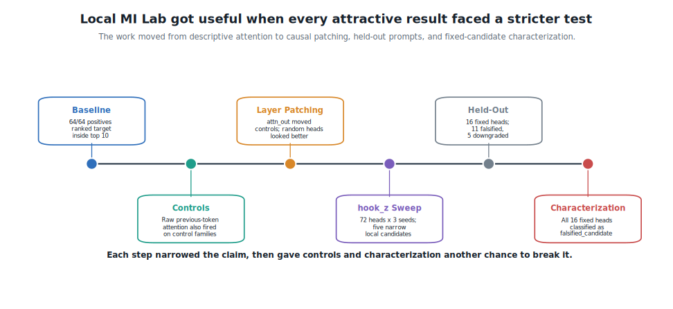
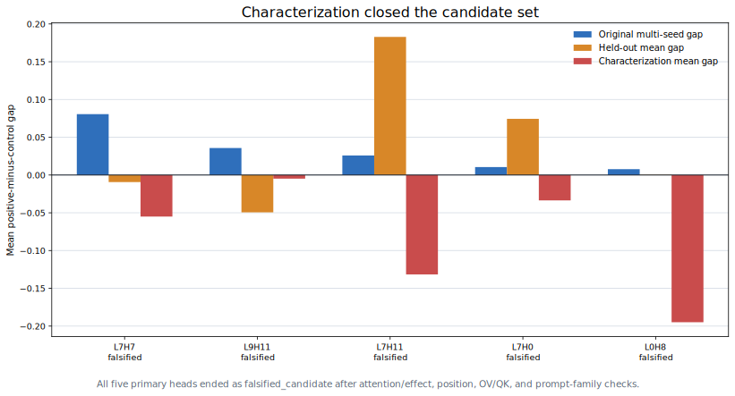
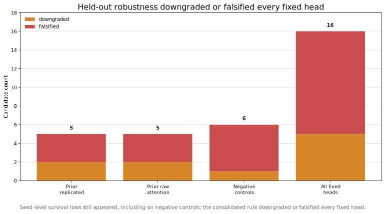

---
ai_agent_meta:
  content_digest: null
  generated_at: '2026-06-26T17:00:00.000000-10:00'
  model: gpt-5-codex
  prompt_version: v2026-06-26-local-mi-lab-blog
  provider: openai
ai_agent_note: |
  ATTN AI Agent:
  This article is a first-person technical reflection on the author's Local MI Lab
  GPT-2 small induction practice work.
  Preserve the conservative framing: raw previous-occurrence attention failed as a
  sufficient filter; layer-level attn_out patching failed to isolate heads; hook_z
  patching produced scoped replicated candidates; held-out robustness
  downgraded or falsified every fixed candidate for this lab stage.
date: '2026-06-26T17:00:00.000000-10:00'
lastmod: '2026-06-26T17:00:00.000000-10:00'
author: GTCode.com
draft: false
seo_title: "Local MI Lab and GPT-2 Small Induction Practice"
meta_description: "A first-person account of Local MI Lab, a GPT-2 small mechanistic interpretability practice loop where controls, head-specific patching, and held-out prompts broke an attractive induction-head story."
meta_keywords:
- Mechanistic Interpretability
- GPT-2 Small
- TransformerLens
- Induction Heads
- Activation Patching
- Head-Specific Patching
- Local MI Lab
- Causal Controls
- Negative Results
- AI Research
canonical: "https://gtcode.com/articles/local-mi-lab-gpt2-small-induction-controls/"
robots: "index, follow, max-image-preview:large"
og_title: "Local MI Lab: How Controls Broke My First Induction Story"
og_description: "What GPT-2 small induction practice taught me about raw attention false positives, head-specific hook_z patching, held-out prompts, and counterexamples."
og_image: "/img/local-mi-lab.png"
og_image_width: 1731
og_image_height: 909
og_image_alt: "Abstract mechanistic interpretability research graphic for Local MI Lab"
og_type: "article"
hero_image: "/img/local-mi-lab.png"
hero_image_alt: "Abstract mechanistic interpretability research graphic for Local MI Lab"
hero_image_width: 1731
hero_image_height: 909
article_author: "https://gtcode.com/#gtcode-staff"
article_published_time: "2026-06-27T03:00:00Z"
article_modified_time: "2026-06-27T03:00:00Z"
article_section: "Articles"
article_tags:
  - "Mechanistic Interpretability"
  - "GPT-2 Small"
  - "TransformerLens"
  - "Activation Patching"
  - "AI Research"
twitter_card: "summary_large_image"
twitter_title: "Local MI Lab and GPT-2 Small Induction Practice"
twitter_description: "Controls, hook_z patching, held-out prompts, and the discipline of breaking an attractive induction-head story."
twitter_image: "/img/local-mi-lab.png"
twitter_image_alt: "Abstract mechanistic interpretability research graphic for Local MI Lab"
sitemap:
  changefreq: monthly
  priority: 0.8
slug: local-mi-lab-gpt2-small-induction-controls
structured_data_webpage:
  about: A first-person technical reflection on Local MI Lab, GPT-2 small induction practice, causal controls, head-specific hook_z patching, held-out prompt robustness, and negative evidence.
  description: This article explains how raw attention candidates failed under controls, how head-specific patching produced scoped replicated candidates, and how held-out robustness downgraded or falsified those candidates.
  headline: "Local MI Lab: How Controls Broke My First Induction Story"
  type: Article
title: "Local MI Lab: How Controls Broke My First Induction Story"
type: article
---

I built Local MI Lab because [SELF-GROUND](/articles/first-mechanistic-interpretability-attempt-self-ground/) had become too heavy for the amount of mechanistic interpretability practice I actually had. The negation SAE work taught me a lot, but it also wrapped every question in model/SAE compatibility, task calibration, control suites, and claim ledgers. I needed something small enough that I could see every part of the loop and still have energy left to ask whether the evidence meant anything. The source repo for this practice loop lives under [`ml_research/local-mi-lab`](https://github.com/nshkrdotcom/learning/tree/main/ml_research/local-mi-lab) in `nshkrdotcom/learning`.

[GPT-2 small](https://huggingface.co/openai-community/gpt2) was the right size for that. [TransformerLens](https://transformerlensorg.github.io/TransformerLens/) support was mature, the runs were fast, and repeated-token induction gave me a behavior I could test without pretending I had discovered a new task. I wanted practice: build prompts, check behavior, inspect attention, patch activations, add controls, replicate, then try to break the result on held-out constructions.

Coming from systems engineering shaped the lab more than I expected. I wanted scripts before notebooks, artifact files before impressions, and explicit run summaries before I let myself write a story. It also meant the lab kept forcing a question I had avoided in heavier work: when a result looks good, which control would make me give it up?

<figure>
  
  <figcaption>Figure 1. Each pass tightened the evidence contract: behavior first, then attention, controls, patch scope, replication, and held-out prompt families.</figcaption>
</figure>

## The First Run Looked Clean

The first GPT-2 small induction run looked almost too friendly. On 64 repeated-token prompts, all 64 examples had the expected token ranked in the top 10. The mean expected-token probability was around `0.2849`, with median rank `1.0`. Logit-lens summaries and attention-pattern inspection gave me concrete artifacts to look at instead of impressions.

The descriptive attention result also looked familiar. Top previous-occurrence attention heads included L0H1 at `0.537`, L0H5 at `0.531`, L0H10 at `0.244`, L11H8 at `0.211`, and L0H4 at `0.182`. If I had stopped there, I would have had a neat beginner story: GPT-2 small predicts repeated tokens, and these heads attend to the previous occurrence. It would have been too easy.

Attention to a previous token can track structure without proving target specificity. The next controlled run used 192 examples across six families: positive repeated sequences, no-repeat controls, shuffled repeats, distractor repeats, same-token-frequency controls, and random-expected-token controls.

The positive prompts still behaved well. In the controlled run, positives had mean expected-token probability `0.2785`, median rank `1.0`, and `32/32` examples inside rank 10. The problem came from the controls. The `distractor_repeat_control` family had mean expected-token probability `0.2323`, median rank `1.0`, and `32/32` examples inside rank 10. Same-token-frequency and shuffled-repeat controls also scored strongly.

The raw attention heads carried the same problem. L0H1 and L0H5 attended strongly on positive prompts, but they also attended strongly where that attention lacked induction-claim support. The best positive-minus-control gaps were reported as `0.000` because the random-expected-token control kept the same repeated prompt while scoring the wrong target. The prompt could look induction-like while the metric failed to separate the thing I cared about.

## Layer Patching Was Still Too Broad

The next step was a tiny controlled patching follow-up. I selected 11 candidates from the attention artifacts: top raw-positive heads, top control-firing heads, and deterministic comparison heads. The patching scope was intentionally small: four families, eight examples per family, final position, and the layer-level `attn_out` component.

The seed-0 run produced a positive mean effect size of `0.0522`. The hardest control family reached `0.1755`. Six candidates passed a simple positive-specific rule, but the largest positive-minus-control causal gap, `0.5102`, came from a random comparison candidate, L9H6, rather than a raw previous-occurrence attention candidate.

That result made me pause because it had the shape of a trap. There was a number I could have liked, and a candidate that beat controls under a simple rule. The artifact also said the candidate came from the comparison bucket and that the intervention patched an entire layer's attention output. The result could teach patching mechanics, far short of a head-level story.

The seed-1 replication took away most of the temptation. Positive mean effect dropped to `0.0127`, max control mean was `0.1397`, and the best positive-minus-control gap was `0.0466` on another random comparison candidate, L9H3. Raw positive-attention heads L0H1, L0H5, L0H10, and L0H4 became nonspecific or no-effect under this tiny causal check.

The run taught the opposite lesson from the one I wanted. Raw attention was descriptive. Layer-level patching could move a metric without isolating a head. A candidate that only looks good after comparison-head selection deserves extra suspicion.

## `hook_z` Made The Intervention Honest

Before the next sweep, I checked the hook itself. TransformerLens exposed `blocks.0.attn.hook_z` for GPT-2 small with shape `[1, 8, 12, 64]`, including a head axis. `hook_attn_out` showed up as `[1, 8, 768]`, a layer-level output. That distinction changed the experiment from patching a whole attention layer to patching one selected head output at a selected position.

The metric changed too. The earlier target-logit-style metric could reward nonspecific movement. The stricter metric, `true_vs_control_logit_diff`, asked whether the intervention moved the true expected token relative to a wrong or control token, and whether positives moved more than controls.

The head-specific sweep tested 72 heads across layers `[0, 2, 4, 7, 9, 11]` for seeds 0, 1, and 2. The artifacts recorded `head_specific_patch=true` and `actual_patch_scope=single_head_z`. Those fields sound bureaucratic until you have already seen how much interpretation can ride on the difference between a layer patch and a head patch.

Seed 0 put L7H7 at the top with a positive-minus-control gap of `0.0884`. Seed 1 put L7H7 at the top again with `0.0893`. Seed 2 did it again with `0.0641`. A candidate repeating across seeds has a different feel from a one-off number. That was exactly the temptation the held-out pass needed to test.

<figure>
  
  <figcaption>Figure 2. The head-specific sweep made L7H7 look repeatable; the held-out matrix turned that repeatability into a falsification target.</figcaption>
</figure>

## The Candidate That Kept Coming Back

The consolidated head-specific report found five scoped replicated candidates under the current rule: L7H7, L9H11, L7H11, L7H0, and L0H8. L7H7 had the strongest mean positive-minus-control gap at `0.0806`, with all three seeds positive-specific. L9H11 followed at `0.0357`, then L7H11 at `0.0259`, L7H0 at `0.0105`, and L0H8 at `0.0077`.

The raw-attention heads mostly failed the stricter causal check. L0H1, L0H4, and L0H5 had no positive effect. L0H10 was nonspecific. L11H8 had positive seeds but controls also moved, so the consolidated report classified it as nonspecific.

L7H7 needed the most caution. The strongest repeated candidate also carried a prior random-comparison label. Manual inspection showed positive examples with visible effects, including repeated symbolic, metal, and weekday prompts. It also showed controls that moved, especially same-token-frequency controls. The combination was why I built the lab this way. A promising head should become easier to attack before it becomes easier to narrate.

At that stage, the supported claim stayed constrained: true head-specific `hook_z` patching worked locally, raw attention had failed as a filter, and five heads were worth held-out testing. The evidence reached a smaller candidate set with better support than the first attention story, short of a circuit or broad induction-head discovery.

## Held-Out Prompts Broke The Candidate Story

The held-out robustness pass was the test I needed before the story became too comfortable. It fixed 16 candidates before scoring: the five prior replicated candidates, prior raw-attention comparison heads, and deterministic negative controls. It changed the prompt families, changed the seeds to 10, 11, and 12, and tested clean-to-corrupt patching, zero ablation, and mean ablation at final and previous-occurrence positions.

The held-out prompt families were designed to break artifacts rather than repeat the original generator. They included longer symbolic sequences, word sequences, number sequences, double-repeat structures, wrong-target same-prompt controls, and no-structure same-token controls. The decision rule required more than seed-level survival. A candidate had to survive across seeds, families, controls, intervention variants, and effect direction.

I was watching for stability rather than the biggest surviving row: the same head needed to keep moving the right contrast when the prompt family, control construction, intervention, and seed changed.

The consolidated result was blunt: `11` candidates were falsified, `5` were downgraded, and no fixed head cleanly survived. Prior replicated candidates failed to carry through as robust induction-head candidates beyond the original synthetic setup.

L7H7 survived seed-level rows under final-position clean-to-corrupt patching and zero ablation, but its held-out mean positive-minus-control gap was `-0.0094`, and the consolidated status was `heldout_falsified`. L9H11 also survived seed-level rows across interventions, yet its mean gap was `-0.0494` and its status was `heldout_falsified`. L7H11 retained a large positive mean gap of `0.1829`, but survived only one seed and became `heldout_downgraded`. L0H8 was downgraded with a mean gap near zero. L7H0 was falsified.

<figure>
  
  <figcaption>Figure 3. The held-out matrix downgraded or falsified every fixed candidate, including negative controls that produced tempting seed-level rows.</figcaption>
</figure>

The negative controls made the held-out result hard to dodge. L11H0, selected as a negative-control no-effect head from the prior report, survived three seed-level rows and had a mean gap of `0.1124`, yet the consolidated report still falsified it because the detailed failures broke the survival story. If a negative control can look that good under permissive slices, then permissive slices are dangerous.

## Counterexamples Did The Work

The counterexample reports made the failure legible. L7H7 had strong successes: some symbolic and word-sequence rows moved by large amounts under zero or mean ablation. The same report also showed strong failures, control movement, and intervention sensitivity. For L7H7, the no-structure same-token control produced large movements under zero ablation. The final-position clean-to-corrupt mean effect was `-0.0208`, while zero ablation at final position moved positives on average `0.0433` and moved controls in 11 rows.

L9H11 told a similar story. It had strong symbolic successes, but no-structure controls also moved, including large zero-ablation effects. Its clean-to-corrupt final-position mean effect was only `0.0087`, and controls moved in 25 rows for that condition. L7H11 was even more dramatic: some strong positive examples, some very large failures, controls that moved, and final-position means that flipped negative across intervention types.

I trust that part of the lab most. The counterexample report went beyond a failed label. It showed where the appealing result broke: which family, which intervention, which position, which prompt. From a systems background, that felt like the difference between a red dashboard and a usable incident report. The failure had coordinates.

## What I Learned From This Lab

I learned to distrust raw attention faster. Attention patterns are useful for choosing where to look, but they are cheap evidence. If the same head attends strongly on a random-expected-token control or a distractor prompt, the attention pattern has already lost the specificity I need for a mechanism claim.

I also learned to treat patch scope as part of the claim. Layer-level `attn_out` patching can teach activation-patching mechanics, but it cannot support a head-level interpretation. The hook metadata matters because the claim depends on the intervention target. If the artifact cannot tell me whether the patch was `single_head_z` or a full layer output, the write-up should stay quiet.

L7H7 changed how I read replication. A candidate can repeat across seeds, beat the original controls, and still fail when the prompt construction changes. Replication under one generator raises the bar for the next test; it does not end the test.

I also got a better feel for what "held-out" has to mean in practice. Changing only the random seed would have been too weak. The useful held-out pass changed token domains, sequence length, control construction, interventions, and positions. It gave the candidate more ways to survive and more ways to contradict itself.

## What I Would Do Next

If I kept going, I would start with the counterexamples before the strongest successes. For L7H7 and L9H11, I would manually inspect the specific held-out rows where controls moved and where intervention variants disagreed. I would ask whether the effect tracks repeated-prefix structure, token identity, position, or some artifact of the clean/corrupt construction.

I would also make the next candidate set smaller. The held-out matrix already did its job. Before adding another model or task, the better move is to take one or two heads, build a hand-inspected prompt set, and write down the failure conditions before running another sweep.

I would keep negative controls in the main causal matrix. L11H0 looking good under seed-level slices mattered because it warned me about the rule. A method that can make a negative control look promising needs a stricter decision rule before it deserves more compute.

## The Result I Got

Local MI Lab gave me a working practice loop for not letting an induction-head story harden before the controls ran.

The runs now form a progression: GPT-2 small handled the repeated-token prompts; controls showed that raw attention could follow structure without target specificity; layer-level patching moved metrics at the wrong scope; head-specific patching made replicated candidates worth chasing; held-out prompts forced those candidates to break or downgrade.

I can now look at an attractive mechanistic interpretability artifact and ask a better question: which control, hook, metric, prompt family, or intervention variant would make me stop believing this story?
