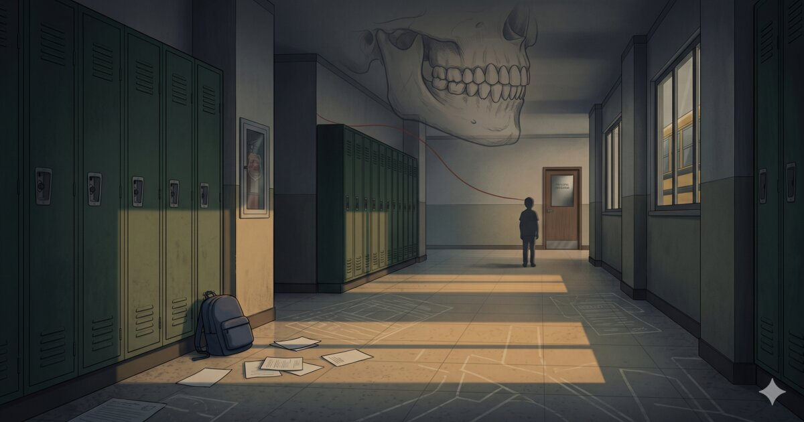

> **Companion article:** This essay complements [The Body Keeps the Receipts](/articles/the-body-keeps-the-receipts/), which documents the neurobiological, trauma, and institutional mechanisms behind the same pattern.

> **Reporting note:** This firsthand public report and open letter describes childhood peer violence, institutional non-response, an officer-watched assault, suicidal ideation, and long-term bodily consequences. The citations provide context; the central account is the author's report.

This is a records question: what did the school district and police department create, retain, produce, or fail to produce after repeated peer abuse, visible injury, and an officer-watched assault?

This report says four things:

1. A child was subjected to repeated peer abuse while adults knew or had reason to know.
2. When the child reacted, the institution treated the reaction as the problem.
3. When violence became visible, the response was containment rather than protection.
4. The lasting injury came from the violence, compounded by the lesson that no one was coming.

**OPEN LETTER**

*To the Township, the School District, and the Police Officer Who Watched a Child Be Assaulted*

---

The adult survivor will tell you it wasn't that bad. He will call it getting punched in the balls and a few beatdowns after some teasing. He will compare himself to missing children, to war zones, to people with "real problems." He will apologize for bringing it up.

He has been doing this for more than **three decades**.

That reflex -- the apology, the minimization, the instinct to rank his suffering against strangers and find it wanting -- was learned. The institutions described in this letter failed to protect a child, then taught him to finish the job by minimizing himself.

This letter is about how they taught him that.

The conduct described here exceeds the "kids being kids" frame. Public-health sources define bullying around unwanted aggressive behavior, an observed or perceived power imbalance, and repetition or likely repetition over time; they also recognize physical, psychological, social, and educational harm.[^1] Federal bullying-prevention materials likewise identify lasting physical, social, emotional, academic, and mental-health consequences for children who are bullied.[^2]

---

He was a child first. He liked robots. He took apart computers to see how they worked. The district tested him and placed him in the gifted program. That designation matters here only because it shows what the district knew: this was a child it had assessed, tracked, and claimed to understand.

He sat in a classroom in a township that measures itself by test scores and property values, a place where lawns are kept, schools are praised, and adults are rarely forced to doubt the system.

In fourth grade, he sat next to a boy who told him he would grow up to be a mass murderer. The same boy also told him, day after day, that his parents were losers.

The bully had a cycle. Mock the boy, watch him flinch, then deny it: *I was just kidding -- can't you take a joke?* Then escalate. If the boy reacted, he was mocked for reacting. If he didn't react, the bully pressed harder until he did. There was no correct response.

The teacher was within arm's reach. The teacher heard it. The teacher did nothing.

This went on for two years.

A two-year pattern matters. Repetition turns incident into environment. It is how a child learns that humiliation has become a condition rather than an event. School became the place he feared entering, not the place where he could learn without bracing for what would happen next. The National Academies' bullying synthesis treats peer victimization as a matter of biological, psychosocial, school-climate, and policy concern, far beyond ordinary discipline.[^3]

During that period, the bully's father died. Grief can distort a child's behavior. It may explain pain. It never justified the adults watching a child be taken apart, day after day, while choosing not to intervene.

---

**Sixth grade.**

Scheduling placed the boy in an art class with the same bully. By now socially insulated, the bully resumed the abuse in front of other students: *your family are losers, get new parents.*

No adult had stepped between them in two years.

The boy did the only thing a ten-year-old can do when no one will protect him. He used words. He told the bully to get a new father. He knew the father was dead. It was cruel, and he was ten.

The bully cried that evening. The vice principal called the boy in. Instead of examining what had been done to him for years, the meeting became an interrogation. "You knew about his dead father, didn't you?" The boy denied it. He was ten, and he understood the way children learn to understand: that telling the truth about abuse invites retaliation.

So he lied.

The school checked records to show the boys had been together before, and treated that as confirmation that the boy must have known. In practice, the outcome was fixed either way. Admit knowledge: intent. Deny it: liar. The abuser, meanwhile, faced no consequence, because his defense was the same one he had used all along: *I was just kidding. He can't take a joke.*

The school accepted that defense. It always had.

Shortly after, a large group of students attacked him in the hallway.

This was public, inside the school environment. It followed the disciplinary inversion almost immediately: first the boy was made the problem for reacting to abuse, then his peers reinforced that judgment physically.

The administration took no protective action.

This must be said plainly: the school went beyond inaction. It built a process that required the boy to cooperate with his own humiliation, and when he didn't -- because he was ten and operating under the only social code available to him -- it used his resistance as proof he was defective.

It tried to keep him with the gifted students when it could. After the hallway attack, when scheduling forced him back into classes with his abuser, the school sent the psychologist.

Not quietly.

She pulled him from the cafeteria in the middle of lunch, in front of his peers, with no discretion and no warning. Every child in that room understood the signal. Only problem kids get pulled. He was the defective one.

One teacher called it "foot-in-mouth disorder." The administration set the narrative. He became the boy who mocked a dead father. Two years of daily abuse -- audible, visible, persistent -- collapsed into a story simple enough to fit in a disciplinary file.

The catch-22 closed.

If he endured the abuse in silence, no one came.  
If he spoke back, he was punished.  
If he told the truth, he was the liar who had already been caught.  
If he stayed quiet, his silence was entered as evidence against him.

At ten, every available response seemed to make things worse.

He became suicidal. The thought settled into the background: if every available response made things worse, then maybe the problem was him. Research keeps this child's experience specific while making the risk pattern recognizable: meta-analytic literature has found associations between bullying involvement and suicidal ideation and behavior.[^4]

This is institutional betrayal: when the system designed to provide safety instead becomes the mechanism that isolates the victim and legitimizes the aggressor. Smith and Freyd describe institutional betrayal as the role institutions can play in traumatic experiences and psychological distress, including through failures to prevent or respond supportively to wrongdoing within the institutional context.[^5]

---

**Seventh grade.**

No mutual fight occurred.

The beating was coordinated on the school bus, loudly enough for the driver to hear. The boy was coerced into showing up. A peer began beating him with full-force uppercuts, knees, kicks, and strikes to the head. He never became a combatant. He remained the target.

Partway through -- by his memory, roughly two-thirds or three-quarters of the way in -- a second peer arrived: older, larger, and higher in the group's hierarchy. The surrounding peer group was already aligned with the bully. His arrival reinforced that alignment and changed the beating from one boy's violence into group enforcement. He gave the boy an impossible choice: fight the person beating him, or fight him instead.

The boy remained passive. He still did not fight.

The second peer did not stop the assault. To the boy, his arrival carried the force of permission: the higher-status child had come, spoken, and the beating continued. The boy remained defenseless.

One record from the previous year belongs here. The boy who told another boy to get a new father was wrong to say it. He knows that. He has carried that sentence for decades. It was cruel, and he was ten.

The institution that punished him for that sentence while ignoring everything that came before it protected itself instead of either child. It took a years-long failure -- its own failure -- and collapsed it into a story simple enough to file: *bad kid says terrible thing; case closed.*

That story was false by omission. It served the adults who told it. The boy who was handed that story absorbed it until, during the coordinated group beating, some part of him -- shaped by every adult who had chosen to look away -- believed he had it coming.

No child has that coming.

Every blow sent stars across the boy's vision. Those symptoms are consistent with concussion risk after blows to the head or body. CDC HEADS UP identifies concussion as a type of traumatic brain injury and instructs adults to watch carefully after a bump, blow, or jolt to the head or body.[^6] CDC materials also list danger signs and symptom patterns that require urgent attention or medical evaluation.[^7]

His mother sent him to school the next day. His face was visibly bruised. A teacher saw enough to send him to the principal's office. The principal questioned him.

That was the activation point.

No nurse.  
No doctor.  
No ambulance.  
No police.  
No outside investigator.  
No concussion evaluation.  
No protective separation.  
No documented safety plan.

The incident died on the vine in the principal's office.

Then the school sent him back to class, and back into the same hallways where the same aggressors could keep finding him.

No one answered for it.

The school's failure cannot be explained by total unawareness. It saw enough to pull the child from class and question him. It saw enough to contain the incident, but not enough -- or did not care enough -- to protect him. Modern school concussion materials are explicit that students with signs or symptoms after a head injury should be monitored and referred to an appropriate healthcare professional.[^8] Pediatric concussion guidance likewise treats concussion identification, removal from risk, and medical clearance as safety practices, not optional gestures.[^9]

---

**Age twelve.**

At a middle-school graduation party on the property of an off-duty police officer, a classmate approached with roughly ten peers behind him.

The boy was outnumbered.

The classmate delivered a full-force uppercut to the boy's testicles.

The boy collapsed.

The officer watched.

He did not intervene.  
He did not call medical help.  
He did not notify the boy's parents in any way known to the child.  
He did not make any report, referral, complaint, personnel note, or protective action known to the child.

The boy could not walk without pain for a day.

The officer may have been off duty. That distinction may matter administratively. To the child on his property, it meant nothing. He was the adult present. He was a police officer. He watched and did nothing.

The department has produced no incident report, complaint record, parent-notification record, medical-referral record, personnel note, or supervisory-review record concerning the assault. The responsive material was the officer's death notice.

That is the record available now: this report states that a police officer watched a child collapse from an assault on his property; the department has produced no record showing intervention, medical referral, parent notification, complaint intake, or supervisory review.

---

The visible violence stopped before the body's response had even begun.

After the seventh-grade beating, the boy developed chronic bruxism -- sustained clenching and grinding of the jaw, hour after hour, day after day, for more than three decades. Stress and anxiety are recognized risk factors and triggers for bruxism, including awake bruxism.[^10] Dental and medical literature also links sleep bruxism with anxiety symptoms and identifies anxiety as a common risk factor.[^11][^12]

The body wrote in muscle and bone what the record refused to hold.

His nervous system, shaped between nine and thirteen, now reads the world as threat. Toxic stress in childhood can dysregulate developing brain architecture, bodily systems, and stress-response pathways, especially when buffering adult relationships are absent or unreliable.[^13] CDC ACEs materials likewise describe adverse childhood experiences as potentially traumatic events and note that toxic stress can affect brain development and later health.[^14]

The body kept a biological record the institutions refused to keep.

The ACEs literature shows a dose-response relationship between childhood adversity and later health risk.[^15] But the ACE framework captures major categories of childhood adversity while leaving gaps for school-linked violence and institutional abandonment. A school beating, a two-year classroom humiliation cycle, or an officer-watched assault can sit outside the original ACE checkboxes. The stress remains real. Longitudinal and review literature on bullying victimization separately connects peer victimization with later psychiatric, social, health, and quality-of-life consequences.[^16][^17][^18]

Because the harm was done or permitted by the systems designed to provide safety, institutional trust inverts. Authority becomes threat. Compliance becomes danger. The survivor develops a detector for hypocrisy and institutional self-interest as survival rather than cynicism.

These patterns are adaptations.

---

Before the abuse began, the boy was building things. Robots. Computers. He wanted to know how things worked. The school knew it. It tested him and said so.

The abuse damaged more than his sense of safety. It damaged his academics. Grades and placement followed the fear: the child identified as gifted became the child trying to survive the building. School stopped being a place where curiosity could safely come out; it became the place he entered with his body braced for humiliation, violence, and adult disbelief.

The abuse severed the connection between a child and the institutions that had identified his curiosity but failed to protect him during the exact window when intellectual identity takes shape. His curiosity survived; his willingness to bring it into systems that had already demonstrated indifference was gone.

Every year of suppressed potential is a year the community itself loses. The township measured itself by school rankings. Here was a score it chose to bury.

---

These failures formed a repeated, observable pattern.

The school and law-enforcement systems each encountered evidence of harm. Each had a point at which it could have activated protection. Each chose containment instead.

The district had information. Teachers heard the abuse. It even knew he was being bullied -- it tried, in its way, to "manage" him. But managing a situation differs from protecting a child. Each time the district faced a choice between protecting the boy and protecting process, it chose process. When the boy finally spoke back -- once, at ten, after years -- the district seized it. At last, a story that moved the blame from the institution onto the child.

The officer's failure carried a distinct force because it joined private adult responsibility with public authority. A child learned that even the law's representative could watch and do nothing.

A visibly bruised child was questioned and returned to class without medical evaluation, protective separation, an outside report, or a safety plan. A child stalked in the hallways was sent back into those hallways. A child assaulted at a school-adjacent event was left without medical attention or a record. The evidence was on the child's body. The institution saw enough to question him, but not enough to protect him. Whether from denial, helplessness, liability avoidance, or the belief that endurance was protection, the result was the same.

When all systems fail at once, the child does not experience separate failures. He receives one total lesson: there is no one. There is no appeal. The world has weighed his pain and found it insufficient.

He was nine when that lesson began. He was twelve when it was complete.

---

Institutions often face the same choice: protect the child, or protect the institution's account of itself. This report concerns the cost of choosing the second option.

Accountability would require the district to say, plainly, that it knew a student was being abused, built a process around him that served the institution rather than the child, and blamed him when he reacted. It would require the police department to address the conduct of an officer who watched the assault of a twelve-year-old and took no steps to protect him. It would require the community to look at a culture in which a child's suffering was treated as a management problem and his survival instincts were entered as evidence against him.

The letter turns from memory to procedure because the story requires it. When an institution lacks the humanity to protect a child voluntarily, procedural mandates become the remaining shield. Protection has to be assigned, recorded, audited, and triggered before an injured child has to beg for it.

The corrective frame is procedural because a child's safety cannot depend on adult discretion alone. StopBullying.gov summarizes that most state laws, policies, and regulations require schools or districts to maintain bullying policies and procedures to investigate and respond when bullying occurs.[^19] Its model components emphasize taking every incident seriously, defining prohibited conduct, documenting procedures, and addressing the school environment.[^20] Every item names something missing here. Child Welfare Information Gateway likewise explains that mandatory-reporting rules are state-law frameworks assigning professionals duties to report suspected child abuse or neglect; jurisdiction-specific legal analysis belongs elsewhere, while severe child violence cannot be treated as a private inconvenience.[^21]

True accountability would require a procedural record. It would require specific institutional obligations.

When bullying is witnessed, there must be documented intervention: consequences for aggressors, protection plans for targeted students, and confidential reporting with independent review and records retention.

When a child is injured, humiliated, or genitally assaulted in a school-linked setting, the response must protect privacy and dignity. A bruised child should meet a nurse, not an interrogation.

When violence occurs in front of an adult, mandatory reporting and medical evaluation should not depend on whether that adult is school staff, law enforcement, a parent, or a neighbor.

Annual reporting should track both bullying incidents and dispositions, because a number without an outcome becomes another way to hide the child.

Research on institutional betrayal also names the opposite possibility: institutional courage. That means transparent accountability, retained records, support for disclosure, and repair independent of the victim minimizing harm to make the institution comfortable.[^22]

The unanswered questions remain:

1. Did the school district create or retain any record of the bullying, the hallway beating, the visible injuries, or the safety response?
2. Did the school district notify parents, medical personnel, law enforcement, or any outside authority?
3. Did the police department receive, create, retain, or review any record concerning the officer-watched assault?
4. Did either institution have a policy then, or adopt one later, requiring medical evaluation, reporting, or protective separation after severe peer violence?

Those questions require records rather than sentiment.

A records question survives the individual employee. It remains with the institution that employed him, supervised him, and retained or failed to retain the relevant records.

---

The boy deserved protection, medical care, and a record.

No one came.

This is the record they failed to make.

**GTCode.com Member of the Technical Staff**

---

## Notes

[^1]: CDC, "Bullying," *Youth Violence Prevention* (definition of bullying includes unwanted aggressive behavior, observed or perceived power imbalance, and repetition or likely repetition; potential harms include physical, psychological, social, or educational harm).  
<https://www.cdc.gov/youth-violence/about/about-bullying.html>

[^2]: StopBullying.gov, "Effects of Bullying" (children who are bullied can experience negative physical, social, emotional, academic, and mental-health issues that may last into adulthood).  
<https://www.stopbullying.gov/bullying/effects>

[^3]: National Academies of Sciences, Engineering, and Medicine, *Preventing Bullying Through Science, Policy, and Practice* (2016), DOI: 10.17226/23482.  
<https://nap.nationalacademies.org/catalog/23482/preventing-bullying-through-science-policy-and-practice>

[^4]: Holt MK, Vivolo-Kantor AM, Polanin JR, et al., "Bullying and Suicidal Ideation and Behaviors: A Meta-Analysis," *Pediatrics* (2015).  
<https://pmc.ncbi.nlm.nih.gov/articles/PMC4702491/>

[^5]: Smith CP and Freyd JJ, "Institutional Betrayal," *American Psychologist* (2014).  
<https://pubmed.ncbi.nlm.nih.gov/25197837/>

[^6]: CDC HEADS UP, "Concussion Basics" (concussion is a type of traumatic brain injury; adults should watch for signs and symptoms after a bump, blow, or jolt to the head or body).  
<https://www.cdc.gov/heads-up/about/index.html>

[^7]: CDC HEADS UP, "Signs and Symptoms of Concussion" (danger signs and symptom patterns after possible concussion).  
<https://www.cdc.gov/heads-up/signs-symptoms/index.html>

[^8]: CDC HEADS UP, "Concussion Signs and Symptoms Checklist" (school checklist recommending monitoring and referral to a healthcare professional with experience evaluating concussion when signs or symptoms appear after a bump, blow, or jolt to the head).  
<https://www.cdc.gov/heads-up/media/pdfs/schools/TBI_schools_checklist_508-a.pdf>

[^9]: Halstead ME, Walter KD, Moffatt K, et al., "Sport-Related Concussion in Children and Adolescents," *Pediatrics* (American Academy of Pediatrics, 2018).  
<https://publications.aap.org/pediatrics/article/142/6/e20183074/37534/Sport-Related-Concussion-in-Children-and>

[^10]: Mayo Clinic, "Teeth grinding (bruxism) -- Symptoms and causes" (awake bruxism may be due to anxiety, stress, anger, frustration, or tension; bruxism may also be a coping strategy or habit).  
<https://www.mayoclinic.org/diseases-conditions/bruxism/symptoms-causes/syc-20356095>

[^11]: Polmann H, Domingos FL, Melo G, et al., "Association between sleep bruxism and anxiety symptoms in adults: A systematic review," *Journal of Oral Rehabilitation* (2019).  
<https://pubmed.ncbi.nlm.nih.gov/30805947/>

[^12]: Lal SJ and Weber KK, "Bruxism Management," *StatPearls* (updated 2024; identifies anxiety as a common risk factor associated with sleep bruxism and describes awake bruxism as often associated with stress and heightened alertness).  
<https://www.ncbi.nlm.nih.gov/books/NBK482466/>

[^13]: Center on the Developing Child at Harvard University, "Toxic Stress" (excessive or prolonged activation of stress-response systems can disrupt healthy brain architecture and other bodily systems; supportive relationships can buffer stress response).  
<https://developingchild.harvard.edu/key-concept/toxic-stress/>

[^14]: CDC, "About Adverse Childhood Experiences" (ACEs are potentially traumatic events that occur in childhood and can undermine safety, stability, and bonding).  
<https://www.cdc.gov/aces/about/index.html>

[^15]: Felitti VJ, Anda RF, Nordenberg D, et al., "Relationship of Childhood Abuse and Household Dysfunction to Many of the Leading Causes of Death in Adults," *American Journal of Preventive Medicine* (1998).  
<https://pubmed.ncbi.nlm.nih.gov/9635069/>

[^16]: Takizawa R, Maughan B, and Arseneault L, "Adult Health Outcomes of Childhood Bullying Victimization: Evidence From a Five-Decade Longitudinal British Birth Cohort," *American Journal of Psychiatry* (2014).  
<https://pubmed.ncbi.nlm.nih.gov/24743774/>

[^17]: Arseneault L, "The long-term impact of bullying victimization on mental health," *World Psychiatry* (2017).  
<https://pmc.ncbi.nlm.nih.gov/articles/PMC5269482/>

[^18]: Moore SE, Norman RE, Suetani S, et al., "Consequences of bullying victimization in childhood and adolescence: A systematic review and meta-analysis," *World Journal of Psychiatry* (2017).  
<https://pmc.ncbi.nlm.nih.gov/articles/PMC5371173/>

[^19]: StopBullying.gov, "Laws, Policies & Regulations" (most state laws, policies, and regulations require districts and schools to implement bullying policy and procedures to investigate and respond).  
<https://www.stopbullying.gov/resources/laws>

[^20]: StopBullying.gov, "Common Components in State Anti-Bullying Laws, Policies and Regulations" (model components include taking every incident seriously, definitions, procedures, and recognition of effects on learning, school safety, engagement, and climate).  
<https://www.stopbullying.gov/resources/laws/key-components>

[^21]: Child Welfare Information Gateway, "Mandatory Reporting of Child Abuse and Neglect" (general overview of state laws designating mandatory reporters, institutional responsibilities, standards for reporting, training, and confidentiality).  
<https://www.childwelfare.gov/resources/mandatory-reporting-child-abuse-and-neglect/>

[^22]: Smidt AM, Adams-Clark AA, Freyd JJ, et al., "Institutional courage buffers against institutional betrayal, protects employee health, and fosters organizational commitment following workplace sexual harassment," *PLOS ONE* (2023).  
<https://journals.plos.org/plosone/article?id=10.1371/journal.pone.0278830>
