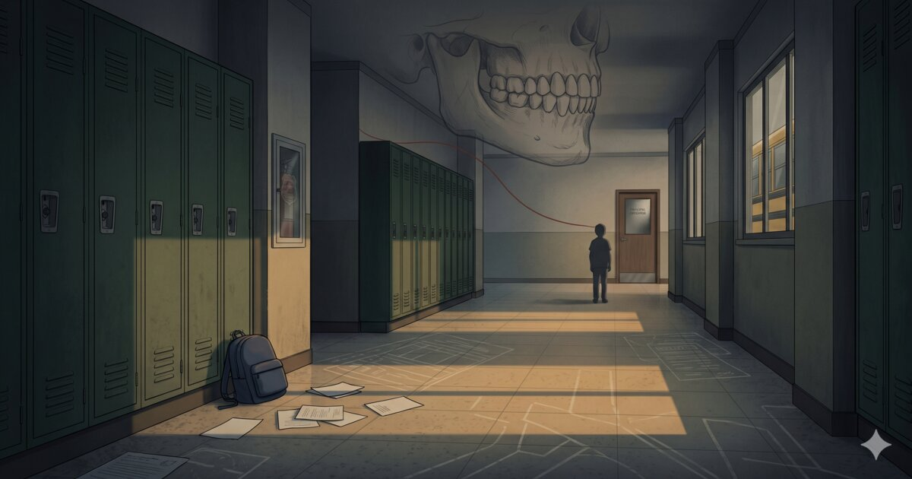

> **Account and authorship:** GTCode.com is Ekewaka Lono’s own publication. This AI-assisted essay presents his personal account alongside research context. The third-person narrative below describes Lono’s own recollections and interpretation of childhood events. It draws on the account in his [first-person open letter](/articles/open-letter-school-district/), plus recollections about the graduation party, bruxism, his lasting sense of threat, and his habit of minimizing what happened that are not in the letter. It does not independently corroborate those recollections. Staff knowledge, motives, disciplinary decisions, and record creation remain questions for institutional review.

> **Companion article:** [The Body Keeps the Receipts](/articles/the-body-keeps-the-receipts/) examines the research on head injury, trauma, and later symptoms, distinguishing possible mechanisms from established causes.

> **Revision history:** First published May 14, 2026. The September 27, 2026 letter linked to an earlier version of this essay.
>
> **October 1, 2026 — narrative and sources:** Removed conflicting childhood ages; qualified medical claims; attributed the narrative to Lono; distinguished recollection from interpretation; removed categorical statements such as “the teacher did nothing” and unsupported claims about staff intentions and peers’ beliefs; and corrected source links and descriptions.
>
> **October 1, 2026 — publication metadata and provenance:** Restored the original publication date; identified Lono as author and GTCode.com as his own publication; disclosed AI assistance and removed model/provider attribution; clarified which recollections extend beyond the letter; neutralized the subtitle, keywords, tags, image descriptions, and topic metadata; and corrected the structured author object and its rendering.

The adult survivor describes a habit of minimizing what happened. He calls it getting punched in the balls and a few beatdowns after teasing. He compares his experience with people who had “real problems” and feels a need to apologize for raising it.

Lono understands that habit in light of the responses he remembers from school staff and an adult at a graduation party. When he reacted to mistreatment, attention centered on his reaction. When he was injured, he recalls questioning without medical assessment or protection. He came to believe that the problem was him.

That is his interpretation of the lesson he received. The records inquiry asks what the adults knew, what they did, and whether their decisions helped sustain the conditions in which he was being harmed.

Public-health sources define bullying through unwanted aggression, a power imbalance, and repetition or likely repetition. They recognize physical, psychological, social, and educational harm, including effects that may persist into adulthood.[^1][^2] The National Academies’ review treats prevention as a responsibility involving the broader school environment.[^3]

---

**Fourth and fifth grade.**

Lono remembers enjoying robots and computers and being identified for gifted programming. He also remembers a classmate repeatedly insulting his family and telling him that he would grow up to be a mass murderer.

The pattern, as he recalls it, was provocation followed by dismissal: *I was just kidding — can’t you take a joke?* His distress became material for more ridicule. It continued through fifth grade.

He remembers a teacher nearby during some of the abuse and believes the teacher heard it. He recalls no intervention that stopped the pattern. What the teacher observed, documented, or did outside his presence remains a records question.

School became a place where he expected humiliation. The classmate’s father died during this period. Lono acknowledges that loss without treating it as a justification for the abuse he experienced.

---

**Sixth grade.**

In Lono’s account, he was placed in a class with the same student, and the insults resumed. He responded by telling the student to “get a new father.” He knew the father was dead. He recognizes that the remark was cruel.

He remembers the vice principal questioning whether he knew about the death and invoking their shared fourth-grade classroom history when he denied knowing. The earlier abuse did not receive comparable attention in that encounter, as he recalls it. The district should establish what history staff considered and whether they investigated the ongoing victimization.

Shortly afterward, a group attacked him in the hallway. He understood it as retaliation for the remark. After the attack, he remembers being removed from ordinary classroom participation and placed in the library with another student whom he understood to have behavioral problems. He did not see comparable removal of the aggressors. Their discipline, if any, remains unknown to him.

The school psychologist later retrieved him from the cafeteria during lunch, in front of his peers. He experienced that public retrieval as another sign that he was the child requiring correction. The account cannot establish what every other child thought. Nor does it establish the psychologist’s intent or the referral’s administrative rationale.

The distinction matters: support may have been the purpose, while public selection for it felt stigmatizing to the child. The district can answer why the referral occurred that way, what information the psychologist received, and what action addressed the aggression alongside the referral.

Lono recalls suicidal ideation beginning during this sixth-grade period. He describes turning the explanation inward: if every response made matters worse, perhaps something was wrong with him. A meta-analysis found associations between bullying involvement and suicidal ideation and behavior; that finding supplies context without establishing the cause of his experience.[^4]

Smith and Freyd’s institutional-betrayal framework examines failures by institutions on which people depend for safety.[^5] It helps frame the inquiry into the school’s response. The personal account and the institutional records are still needed to establish what happened here.

---

**Seventh grade.**

Lono describes the later beating as a coerced, one-sided assault. He remembers the plan being discussed on a school bus loudly enough to be within the driver’s hearing. That does not establish what the driver actually heard or understood; the transportation response belongs in the district’s review.

He went with another student to a district playground. A peer struck his body and head repeatedly. He recalls never fighting back.

Partway through, an older peer whom he perceived as higher in the group’s hierarchy arrived. Lono remembers the ultimatum: “Fight him or fight me.” He refused. He specifically remembers the older peer looking toward the assailant and nodding. The beating continued.

Lono experienced that arrival and continued violence as group enforcement. The remembered words, nod, and sequence support asking about the older peer’s involvement. They do not establish every participant’s motive.

He remembers seeing stars during the blows. The next morning, his face was visibly bruised. A teacher sent him to administration. He recalls being chastised for having “attended the fight” and returned to class without a nursing assessment or medical evaluation.

For him, that characterization omitted the coercion, his refusal to fight, and the one-sided blows. The district should explain what staff asked, recorded, and communicated, whether his parents were contacted, and what medical or protective steps were taken.

CDC guidance recognizes concussion as a traumatic brain injury and calls for attention to symptoms after a blow or jolt to the head or body.[^6][^7] Current school materials recommend monitoring and referral when symptoms suggest concussion; pediatric sports guidance likewise emphasizes identification and medical assessment.[^8][^9] These are current clinical sources. The district must identify the procedures in force at the time.

The lack of an examination leaves diagnostic uncertainty. It also leaves an answerable institutional question: why was a visibly injured child returned to class without the assessment he recalls needing?

---

**The middle-school graduation party.**

At a graduation party on an off-duty police officer’s property, Lono remembers a classmate approaching with roughly ten peers behind him. The classmate punched him in the testicles. He collapsed and recalls pain with walking for the next day.

He says the officer watched without intervening or arranging medical help. He knows of no parent notification, report, referral, complaint, or protective action resulting from the event.

According to Lono, the department later produced the officer’s death notice but no incident report or record of intervention. The essay does not independently verify that records response. The inquiry asks what was created, retained, searched, or destroyed.

As Lono experienced it, the officer was both the adult present and a representative of protective authority. Lono describes the non-response as reinforcing his distrust. It occurred after the assault; it cannot explain what the attackers had learned from that event beforehand. Earlier school responses may have encouraged an expectation of impunity, but this account cannot establish what they expected.

---

**What persisted.**

Lono recalls teeth grinding beginning soon after the seventh-grade beating and persisting for more than three decades. Stress and anxiety can contribute to bruxism, including awake bruxism.[^10][^12] Evidence linking sleep bruxism with general anxiety symptoms is mixed.[^11] The reported timing does not establish that the beating caused the grinding.

He also describes a lasting sense of threat. Research on toxic stress explains how prolonged adversity can affect development and stress-response systems, particularly without reliable supportive relationships.[^13][^14] These general mechanisms do not diagnose his nervous system or reconstruct what happened biologically in this case.

The original ACE study found graded associations between childhood adversity and later health risks.[^15] Its categories do not capture every form of peer violence or institutional failure. Research on bullying separately associates victimization with later mental-health, social, and other difficulties.[^16][^17][^18] Population findings provide context for his reported experience, rather than an individual causal forecast.

His grades declined after the beating, and within a year he was moved from honors English into general education. He remembers school becoming a place where he braced for ridicule, violence, and disbelief. He believes those experiences damaged his willingness to engage with institutions. The records could help establish the timing of the academic change and whether staff assessed injury, distress, or continuing victimization before changing his placement.

---

**What accountability requires.**

The repeated pattern in Lono’s account is that adults acted visibly on the targeted child while he saw little protection or consequence for the aggressors. That is the basis for the inquiry. It does not require knowing the adults’ private motives or what every bystander believed.

Current bullying-prevention guidance emphasizes school policies, investigation, documented response, and attention to the wider environment.[^19][^20] Child Welfare Information Gateway describes mandatory reporting as a framework governed by jurisdiction-specific laws.[^21] These sources inform proposed safeguards; they do not establish a particular employee’s historical legal liability.

The district should account for its handling of the bullying, retaliatory hallway attack, library placement, public psychological referral, and later head injuries. The department should account for the officer’s reported non-response and the subsequent records search.

Protection should include action against aggression, discreet support for the targeted child, appropriate medical assessment, parent communication, and documented follow-up. Reporting duties and referral responsibilities should be clear to the adults entrusted with children. Those are proposed safeguards, alongside the request to identify the actual rules then in force.

Institutional-courage research examines transparent and supportive responses to wrongdoing, including in workplace harassment contexts.[^22] Applying it here is an argument for accountability and repair across a different setting.

The unanswered questions are concrete:

1. What did staff observe, document, and communicate about the bullying and assaults?
2. What action addressed the aggressors, the targeted child’s safety, and his visible injuries?
3. What records concern the officer’s response at the party and any department review?
4. Which medical, reporting, protective, and retention procedures applied then, and which apply today?

Records never created, lost, destroyed under a retention schedule, or withheld are different possibilities. The institutions should identify their searches and the basis for each conclusion.

Lono describes himself as a child who needed protection and care. The adults’ intentions remain uncertain. Their decisions, and the records that could explain them, are the subject of the request.

---

## Notes

[^1]: CDC, "Bullying," *Youth Violence Prevention* (definition of bullying includes unwanted aggressive behavior, observed or perceived power imbalance, and repetition or likely repetition; potential harms include physical, psychological, social, or educational harm).  
<https://www.cdc.gov/youth-violence/about/about-bullying.html>

[^2]: StopBullying.gov, "Long-Term Effects of Bullying" (children who are bullied can experience negative physical, social, emotional, academic, and mental-health issues that may last into adulthood).
<https://www.stopbullying.gov/bullying/effects>

[^3]: National Academies of Sciences, Engineering, and Medicine, *Preventing Bullying Through Science, Policy, and Practice* (2016), DOI: 10.17226/23482.  
<https://nap.nationalacademies.org/catalog/23482/preventing-bullying-through-science-policy-and-practice>

[^4]: Holt MK, Vivolo-Kantor AM, Polanin JR, et al., "Bullying and Suicidal Ideation and Behaviors: A Meta-Analysis," *Pediatrics* (2015).  
<https://pmc.ncbi.nlm.nih.gov/articles/PMC4702491/>

[^5]: Smith CP and Freyd JJ, "Institutional Betrayal," *American Psychologist* (2014).  
<https://pubmed.ncbi.nlm.nih.gov/25197837/>

[^6]: CDC HEADS UP, "Concussion Basics" (concussion is a type of traumatic brain injury; adults should watch for signs and symptoms after a bump, blow, or jolt to the head or body).  
<https://www.cdc.gov/heads-up/about/index.html>

[^7]: CDC HEADS UP, "Signs and Symptoms of Concussion" (danger signs and symptom patterns after possible concussion).  
<https://www.cdc.gov/heads-up/signs-symptoms/index.html>

[^8]: CDC HEADS UP, "Concussion Signs and Symptoms Checklist" (school checklist recommending monitoring and referral to a healthcare professional with experience evaluating concussion when signs or symptoms appear after a bump, blow, or jolt to the head).  
<https://www.cdc.gov/heads-up/media/pdfs/schools/TBI_schools_checklist_508-a.pdf>

[^9]: Halstead ME, Walter KD, Moffatt K, et al., "Sport-Related Concussion in Children and Adolescents," *Pediatrics* (American Academy of Pediatrics, 2018).  
<https://publications.aap.org/pediatrics/article/142/6/e20183074/37534/Sport-Related-Concussion-in-Children-and>

[^10]: Mayo Clinic, "Teeth grinding (bruxism) -- Symptoms and causes" (awake bruxism may be due to anxiety, stress, anger, frustration, or tension; bruxism may also be a coping strategy or habit).  
<https://www.mayoclinic.org/diseases-conditions/bruxism/symptoms-causes/syc-20356095>

[^11]: Polmann H, Domingos FL, Melo G, et al., "Association between sleep bruxism and anxiety symptoms in adults: A systematic review," *Journal of Oral Rehabilitation* (2019; findings were mixed for general anxiety symptoms).
<https://pubmed.ncbi.nlm.nih.gov/30805947/>

[^12]: Lal SJ, Sankari A, and Weber KK, "Bruxism Management," *StatPearls* (updated 2024; identifies anxiety as a common risk factor associated with sleep bruxism and describes awake bruxism as often associated with stress and heightened alertness).
<https://www.ncbi.nlm.nih.gov/books/NBK482466/>

[^13]: Center on the Developing Child at Harvard University, "Toxic Stress" (excessive or prolonged activation of stress-response systems can disrupt healthy brain architecture and other bodily systems; supportive relationships can buffer stress response).  
<https://developingchild.harvard.edu/key-concept/toxic-stress/>

[^14]: CDC, "About Adverse Childhood Experiences" (ACEs are potentially traumatic events that occur in childhood and can undermine safety, stability, and bonding).  
<https://www.cdc.gov/aces/about/index.html>

[^15]: Felitti VJ, Anda RF, Nordenberg D, et al., "Relationship of Childhood Abuse and Household Dysfunction to Many of the Leading Causes of Death in Adults," *American Journal of Preventive Medicine* (1998).  
<https://pubmed.ncbi.nlm.nih.gov/9635069/>

[^16]: Takizawa R, Maughan B, and Arseneault L, "Adult Health Outcomes of Childhood Bullying Victimization: Evidence From a Five-Decade Longitudinal British Birth Cohort," *American Journal of Psychiatry* (2014).  
<https://pubmed.ncbi.nlm.nih.gov/24743774/>

[^17]: Arseneault L, "The long-term impact of bullying victimization on mental health," *World Psychiatry* (2017).  
<https://pmc.ncbi.nlm.nih.gov/articles/PMC5269482/>

[^18]: Moore SE, Norman RE, Suetani S, et al., "Consequences of bullying victimization in childhood and adolescence: A systematic review and meta-analysis," *World Journal of Psychiatry* (2017).  
<https://pmc.ncbi.nlm.nih.gov/articles/PMC5371173/>

[^19]: StopBullying.gov, "Laws, Policies & Regulations" (most state laws, policies, and regulations require districts and schools to implement bullying policy and procedures to investigate and respond).  
<https://www.stopbullying.gov/resources/laws>

[^20]: StopBullying.gov, "Common Components in State Anti-Bullying Laws, Policies and Regulations" (model components include taking every incident seriously, definitions, procedures, and recognition of effects on learning, school safety, engagement, and climate).  
<https://www.stopbullying.gov/resources/laws/key-components>

[^21]: Child Welfare Information Gateway, "Mandatory Reporting of Child Abuse and Neglect" (general overview of state laws designating mandatory reporters, institutional responsibilities, standards for reporting, training, and confidentiality).  
<https://www.childwelfare.gov/resources/mandatory-reporting-child-abuse-and-neglect/>

[^22]: Smidt AM, Adams-Clark AA, and Freyd JJ, "Institutional courage buffers against institutional betrayal, protects employee health, and fosters organizational commitment following workplace sexual harassment," *PLOS ONE* (2023).
<https://journals.plos.org/plosone/article?id=10.1371/journal.pone.0278830>
