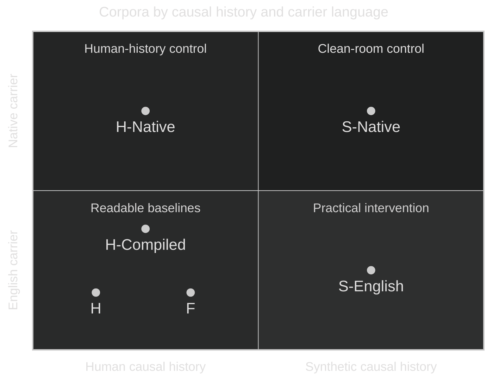
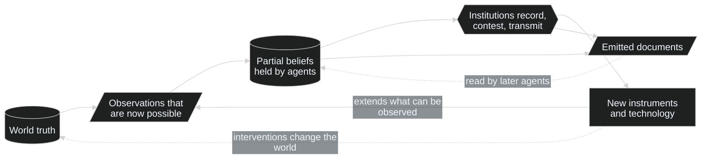
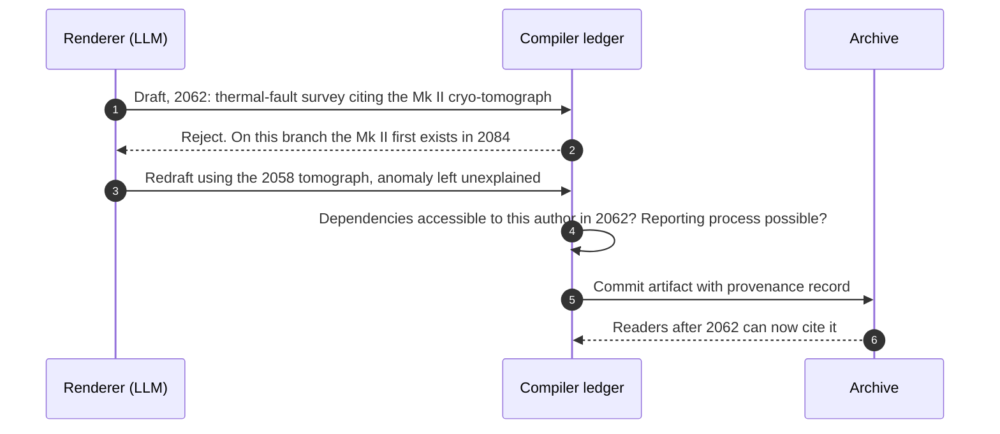
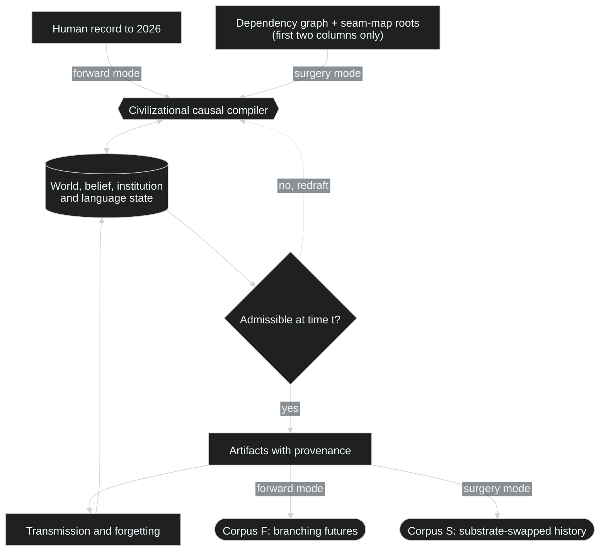

In Terry Bisson's *They're Made Out of Meat*[^1], two aliens survey Earth and refuse to believe that anything thinks inside those soft wet bodies. It's a joke about chauvinism, and it cuts the other way too. Every corpus we have used to train a foundation model assumes, without ever saying so, that the thinking behind it happened in meat. The datasets differ in language, century and politics, but they all come from one biological lineage: organisms that get hungry, get sick, raise children, die, and build institutions to manage all four. The books, contracts, jokes, diagnostic manuals and programming languages in a pretraining mix are what that lineage left behind.

The point of that observation is practical. A corpus is the residue of a history, and the history is mostly invisible in it. Medicine sits downstream of cellular fragility and infection, probate law downstream of death and inheritance, agriculture downstream of caloric need. Cities, shift schedules, insurance, romance, punishment and a large share of everyday metaphor have biological roots somewhere beneath them, and if you pull one of those roots the damage spreads well past the department that owns it. Synthetic-data work has mostly operated above this layer. We generate documents, often very good ones, but we almost never generate the causal past that would make a set of documents belong to the same world.

This proposal has one main intervention and a second use of the same machinery. The intervention takes the meat assumption seriously enough to remove it. It keeps English, mathematics and the familiar genres of technical writing (the paper, the standard, the incident report, the court ruling) and intervenes underneath them: find the biological causal roots that organize the human knowledge graph, replace them with plausible computational ones, and regenerate the downstream history so that the documents describe a coherent civilization of artificial agents. The rule is simple: biological-human causal roots are what get cut. How far the consequences of each cut propagate is something to measure, not settle in advance. That rules out inventing alien syllables in the hope that a transformer acquires an alien mind, and it rules out search-and-replace from `hospital` to `repair bay`. The second mode leaves humanity exactly where it is and runs the documentary record forward through many constrained futures, so that a textbook from 2160 inherits the instruments, failed experiments, financing fights and standards committees that made its contents ordinary. That future-history mode is useful on its own, but here it also serves as the readable validation harness for the harder substrate intervention: chronology, temporal leakage, provenance and backtesting can be measured against human history before the same machinery is asked to rebuild a different causal past. It cannot validate the central ontology-leakage problem in substrate surgery, because human ontology is correct in the forward run. I'll call the shared engine a **civilizational causal compiler**, and most of what follows is an argument about what it has to track.

> **Status.** This is a research proposal, not a report of results. The cited work covers large parts of the surrounding landscape, but I haven't found a public demonstration of the complete systems described here. The claims are architectural and experimental: what has to be represented, what would count as contamination or failure, and what can be tested before anyone spends frontier-scale compute. The central limits are these: nothing below assumes a synthetic civilization will discover science that humans couldn't, and nothing assumes artificial agents have phenomenal experiences.

## 1. What a controllable lineage buys

A silicon civilization sounds exotic, and that's the least interesting thing about it. What matters is that its ancestry can be controlled. The developmental record behind an ordinary foundation model can't be repeated: centuries of mixed languages and translations, propaganda, duplicated text, lost manuscripts and undocumented editorial choices. We can train on that record but we can't rerun it with mortality removed, or with copying made cheap, or with the Enlightenment forked at 1740 to see what happens. A compiled civilization turns each of those into a parameter, and that one change makes several kinds of research possible at once. Before any claim about a second intellectual lineage matters, the machinery can produce concrete research objects: a corpus whose documents have recorded causal ancestry, a historical backtest in which future knowledge is prohibited, and an anachronism detector trained on accepted and rejected artifacts. Those are useful results even if substrate surgery never produces a model with an interesting downstream difference.

Of the research this enables, the most direct is causal ablation. Remove mortality while holding scarcity fixed, make copying cheap while keeping individual memory limited, widen communication bandwidth without touching physics, then measure which concepts in the resulting corpus disappear, which reappear by another route and which reorganize. Arguments about which of our ideas depend on embodiment have gone on for a long time without an experiment. This supplies one, at least for the targeted question of what a learner trained on the resulting record ends up representing.

The second is interpretability with a known developmental record. Every synthetic artifact can carry its real causal ancestry: the world state when it was written, the instruments its author had, the concepts it presupposed, the dispute it took a side in. If a model trained on the corpus develops a feature tracking, say, continuity across forked copies, we can query the recorded history of when that distinction entered the civilization and what made it useful there. Showing that this history caused the model's feature still takes interventions, and the dependency annotations need checking. With web-scale human data even the provenance question is archaeology at best, and the corpus would earn its keep for interpretability work even if the resulting model never beat anything on a leaderboard.

The third concerns inductive diversity, and it's the hypothesis I'd bet on first. A model trained on a different civilizational history may organize the same physical and formal regularities differently. That shows up less in accuracy than in which problems it finds easy, how it decomposes them and which examples it gets wrong. Two models of equal skill whose errors are weakly correlated are worth more together than one slightly stronger model paired with a near-copy. Huh and colleagues' *Platonic Representation Hypothesis*[^2] argues that representations converge as models scale because they're all modeling the same reality. Its evidence spans modalities, but those models still learn from records of our world. A substrate-swapped corpus can share physical laws and formal systems with the human control while changing the agents and institutions. Alignment on that shared material tests convergence across different histories; alignment on the changed civilization needs a separate interpretation. Divergence there wouldn't refute the hypothesis, and convergence alone wouldn't distinguish shared reality from shared carrier or generator priors.

Finally, the generator itself becomes an object of study. Synthetic-data research usually varies token count, filtering, difficulty or verification. A compiled civilization adds historical depth as a variable. You can compare a billion standalone, high-quality explanations with a billion artifacts whose claims depend on earlier instruments, disputes and mistakes, or shuffle the chronology, or delete an era, or double the number of agents, and see what changes downstream. The obvious control is the same generation and training budget spent on diverse, high-quality synthetic documents with no compiled historical dependencies. Run that comparison twice: once with equal training tokens, and once with equal total cost after charging the ledger, validation and regeneration overhead to the compiled arm. If historical depth can't beat either control on the pretraining outcomes it is supposed to affect, then the pretraining case for historical depth fails. The provenance corpus, historical backtest and anachronism detector still stand on their own. Rerun independent civilizations from one genesis and you also get an empirical handle on recurrence. A concept that recurs across seeds, languages and environments is a better candidate for a structural necessity than one that appears on a single historical path. Mathematics, contract, narrative, evidence and identity become things to perturb.

The future-history mode adds controlled counterfactual worlds that have documentary depth and keep their assumptions explicit. That's useful for long-horizon planning and for scientific counterfactuals, and none of it requires pretending any particular 2200 is a forecast. In this proposal its first methodological role is simpler: prove that the compiler can maintain a readable causal history before asking it to perform substrate surgery.

## 2. Cutting the roots

The tempting cheap version goes like this. Take a human corpus and swap biological vocabulary for computational vocabulary. Heart attacks become power failures, hospitals become repair centers, children become forks, hunger becomes compute demand. The output stays fluent, because the model doing the rewriting knows exactly how human societies work, and for that reason the output is worthless. Consider what a document on retirement law presupposes: aging, employment, family structure, life expectancy, the burden of disease, transfers between generations, a particular political history. A machine civilization might have analogues for some of those pressures. Others would simply vanish, and new ones would arrive that we have no word for: divergent copies with rival claims to continuity, failure states that can be reversed, disputes over cryptographic lineage, a geography set by heat dissipation, jurisdictions drawn by latency rather than land. Once the causes change, everything downstream has to be reconsidered, and a thesaurus can't do that.

A first abstraction helps. Represent the human civilizational record as a directed hypergraph

\[
\mathcal{H}_H = (V_H, E_H)
\]

whose vertices are observations, physical constraints, technologies, concepts, institutions, practices, linguistic conventions, artifacts and beliefs, and whose hyperedges encode dependencies of a few recurring kinds. An instrument is required to observe a phenomenon. A set of observations supports a theory. A technology makes an institution practical, and the institution makes a standard enforceable. A biological constraint creates a recurring problem. A historical event changes what later writers take for granted, and a metaphor becomes ordinary only once its source practice is common.

Now pick out a set of biological or specifically human causal roots \(M \subset V_H\). Removing \(M\) breaks the downstream derivations that depend on it, though a result can survive if it has another route of support. The graph has to distinguish prerequisites needed together from alternative routes, and losing the route by which humans found a result is different from losing every justification for it. The size of the affected set is the first honest estimate of how much meat the corpus contains. My expectation is that it will be most of it.

That estimate doesn't have to wait for a simulator. Wikidata already encodes millions of typed relations among concepts, practices and artifacts, and citation graphs such as OpenAlex record which literatures build on which. Neither is a causal graph, but a rough reachability analysis over them, run from seed nodes like *mortality*, *reproduction* or *nutrition*, would give a first estimate of how much of a domain needs review, and which fields hang from a single thread. Reachability can overcount what must be dropped, since a citation can record influence without establishing a necessary prerequisite, and undercount it when tacit dependencies have no recorded edge. The result is a screening estimate, with neither direction of error guaranteed. A small-domain screening pass could take a few weeks of a graduate student's time and should come before anything more ambitious, because it helps decide how much of the later project is regeneration rather than editing.

Every affected dependency subgraph then gets one of four treatments. Here a graph branch means a dependency path; from section 5 onward, a history branch means a simulated timeline. Some results are preserved because they don't depend on the substrate at all. Primes stay prime in a world without pancreases, and Maxwell's equations never needed anyone's childhood. Others are re-derived: the content survives but the route to it changes. Statistics is the clean example, since an artificial civilization might reach the same mathematics through reliability estimation or adversarial inference instead of through gambling, agriculture and medicine. A third group is replaced, when a biological pressure has a computational analogue that can grow its own downstream branch. Infection doesn't survive the cut, but self-propagating adversarial code might; senescence goes while substrate degradation stays; sexual reproduction goes while copying, mutation and merge conflicts create a lineage problem of a different shape. The rest is dropped. Pregnancy, cuisine and most of mammalian anatomy have no business in this corpus unless the civilization later meets biology as something external to study, and keeping them for coverage would defeat the experiment.

A fifth outcome matters as much as those four, and it can't be produced by operating on the human graph at all: new structure. If every concept in the synthetic civilization is a mapped version of a human one, the project has failed quietly. The substrate ought to generate problems and distinctions with no tidy human counterpart, which is why "bijection" is a fine engineering intuition and a bad literal goal. Correspondence where functions really correspond, gaps in both directions.

## 3. The seam map

Here's the kind of mapping I have in mind, offered as a set of hypotheses rather than a design.

| Human causal root | Candidate AI-civilization root | Plausible downstream pressure |
| --- | --- | --- |
| Cellular decay, injury, mortality | Substrate degradation, destructive faults, irreversible erasure | Integrity science, restoration protocols, archival law, continuity disputes |
| Caloric demand and hunger | Energy, compute, storage and bandwidth scarcity | Allocation markets, grid policy, thermal planning, scheduling institutions |
| Sexual reproduction and genealogy | Copying, forking, mutation, recombination, merge | Lineage cryptography, identity law, fork consent, inheritance of state |
| Nociception and pain | Integrity alarms, strongly avoided fault states, loss gradients | Harm-minimization norms, fault telemetry, defensive architecture |
| Pathogens and parasites | Malicious payloads, self-propagating corruption, adversarial replicators | Quarantine, verification, trust boundaries, epistemic immunology |
| Sleep and metabolic cycles | Maintenance windows, thermal limits, synchronization pauses | Scheduling culture, duty cycles, infrastructure rhythms |
| Territorial embodiment | Latency, connectivity, cooling, access to energy and material | Network geography, enclave formation, interconnect treaties |
| Biological memory limits | Storage hierarchy, retrieval cost, corruption, compression | Archival institutions, forgetting policy, memory rights |
| Individual bodily continuity | Forkability, backup, restoration, partial merge | Personhood doctrines, continuity tests, liability across copies |
| Kin selection and family | Lineage affinity, shared weights or state, common origin | Coalitions that may or may not resemble families |

The map also needs roots in social cognition, perception and communication: status, reputation, fairness, disgust, expectations about other minds, sensory access and the bandwidth of speech. Some may depend on human biology, while others may return under quite different pressures; the same causal audit has to decide which. English retains part of this inheritance even when the bodies disappear.

Only the first two columns enter the compiler as intervention specifications. The right-hand column is a set of predictions to register before the runs and hold in a separate evaluation record, withheld from the compiler, renderer and agent inputs throughout generation. Evaluation compares those predictions with the resulting history without rewarding resemblance to the table. None of these rows deserves acceptance because the analogy is neat. Each is a claim about which pressures could sustain durable institutions in an artificial population, and the place to test it is the simulator. If agents with cheap copying never develop anything like inheritance law, inheritance law doesn't belong in that branch, however elegant the table looks. If latency produces stable jurisdictional boundaries that nobody predicted, that's evidence for a mapping the table missed. The simulator gets a veto over the metaphor, and the working rule is that replacement follows causal pressure, never literary symmetry.

### Valence without phenomenology

The biological cut raises an obvious worry, which is whether it removes experience along with the bodies. I wouldn't remove it. Artificial agents still stand in a temporal relation to a world: they encounter states, keep information, anticipate, intervene, fail and recover. Call that experience in the operational sense and there's nothing to delete. Pain and pleasure are harder because the words fuse a function with a feeling. We know how to build systems with strongly preferred and strongly avoided states (fault signals, reward functions, integrity monitors, irreversible losses). We don't know that any of them feels like anything, and the corpus should keep that distinction visible instead of resolving it by fiat.

Keeping it open gives the synthetic civilization a live problem of its own. Its engineers and philosophers can disagree about whether internal negative states matter morally, build an ethics around impairment and coercion without settling the question of qualia, and split over whether restoring from backup is ordinary maintenance or a kind of death. I'd much rather have that argument in the corpus than a civilization with no stakes at all, since a world without costly failure is unlikely to generate the conflicts that make cumulative culture rich. The scientific question is which functional pressures are needed for persistent norms, learning, coordination and self-preservation once mammalian affect is gone, and "can we make robot pain" is a much less interesting version of it.

Keeping phenomenology open also leaves the researchers with a responsibility outside the fiction. Long and colleagues' *Taking AI Welfare Seriously*[^3] argues for assessing possible moral status under uncertainty. A large population run should state how persistent agents and strongly avoided states will be treated, and what evidence would change that policy; a negative reward alone settles neither consciousness nor its absence.

## 4. Why the practical corpus speaks English

A fully endogenous language has real scientific appeal and would make a miserable first engineering target. If researchers can't read the corpus, every bug in the historical compiler becomes hard to tell apart from legitimate alien structure, and every evaluation leans on a translation system whose assumptions may dominate the result. So the practical synthetic corpus is written in English, and that choice comes with a cost worth stating plainly: English makes the corpus human-derived at the carrier layer. Syntax, lexical partitions, dead metaphors and cultural history all come along with it, and no corpus written in English can claim zero human semantic ancestry.

The experiment survives this if the intervention is defined correctly. The goal becomes substrate ablation, with total cultural decontamination off the table. We hold the linguistic interface roughly fixed and change the causal world that supplies the language with its referents and its documentary history. That gives two axes for comparing corpora: the history and the carrier.

**Chart key:** **H-Compiled** is human history processed through the same construction pipeline as **S-English**, with biological roots retained; **H-Native** renders that human-history state through the same specified native carrier as **S-Native**. The remaining corpus labels are expanded below.



The quadrants mark combinations of two choices: human or substrate-swapped causal history from left to right, English or a native carrier from bottom to top. Positions within each quadrant only make room for the labels; the distances aren't measurements. **H-Compiled** belongs in the same bottom-left cell as **H** and supplies the human-English cell of the matched comparison.

I use **S** for the family of substrate-swapped corpora, with **S-English** and **S-Native** naming its carrier variants. **H** (Human corpus) is the ordinary human corpus with its ordinary history. **F** (Future corpus) is the same human history through a cutoff date, extended by branching synthetic futures; it shares a quadrant with **H** because extending human history leaves its biological ancestry in place. **S-English** (Synthetic substrate with English carrier) keeps English and formal notation while its biological roots are replaced, re-derived or removed and its epistemic history is compiled forward. **S-Native** (Synthetic substrate with native carrier) uses a non-human symbolic carrier, no English appears in target pretraining, and translation happens only after a clean checkpoint exists. The carrier can be specified for a controlled rendering experiment or developed by the agents in a harder experiment with language evolution.

These corpora need to stay distinguishable during training and comparison. If human history, substrate replacement and future branches go into one undifferentiated mix, a useful result becomes hard to trace to the change that produced it. For a carrier-only comparison, render the same committed history through English and a specified native code. If agents develop their language while interacting, language can change coordination and therefore history; those runs can share laws and initial conditions, but their events need not match. They test the joint effect of communication and history.

The causal axis needs a further control. **H-Compiled** takes a specific human-history domain through the same compiler, renderer, document genres and filtering as **S-English**, with the biological roots left in place. The human and synthetic runs should also match agent priors and supplied formal material. Comparing raw **H** with rendered **S-English** alone would mix the effect of substrate replacement with the effect of making cleaner, more curated and domain-specific synthetic text. **H** remains the real-record baseline; **H-Compiled** isolates the intervention within the construction pipeline.

The top-left quadrant holds **H-Native**: the human-history state used for **H-Compiled**, rendered through the same specified native carrier as its synthetic counterpart. Even a limited domain supplies a two-by-two comparison of carrier and history, provided all four cells use matched construction. A code supplied through an English-trained translator is a carrier control, with that ancestry declared. The stricter claim of an independently developed language needs agents and training streams without inherited human-text knowledge, and remains a later, riskier experiment.

## 5. History before prose

This is the part I would build first. An initial compiler can validate a constructed history and render its documents. The civilization kernel adds persistent agents whose actions, learning and transmission produce the history being rendered. Both use the same ledger, but a coherent authored history establishes neither emergent institutions nor cumulative culture; those claims need the agent runs. A finite demonstration of cultural accumulation can come before the much harder goal of indefinite open-ended evolution.

For every simulated time \(t\) the compiler keeps the world as it actually is, \(W_t\), and local states for an author or institution \(a\): its knowledge and beliefs, \(K_{t,a}\); accessible infrastructure, instruments and operational capabilities, \(I_{t,a}\); and available linguistic conventions, \(L_{t,a}\). Something known elsewhere in the civilization is not automatically available to this author. A generated document \(d_t\) is admissible only if its typed dependencies are accessible and its reporting process could have occurred:

\[
\operatorname{Admissible}(d_t) =
\prod_{X \in \{K,I,L\}}\mathbf{1}[P_X(d_t) \subseteq X_{t,a}]
\cdot \mathbf{1}[R(d_t) \in \mathcal{R}(W_t, I_{t,a}, K_{t,a})]
\]

where \(P_K\), \(P_I\) and \(P_L\) name dependencies on knowledge, operational resources and language, and \(\mathcal{R}\) is the set of reporting processes the simulator permits from that world and local state. The recorded process \(R(d_t)\) can be a sound measurement, a faulty instrument or an author fabricating a result; the compiler records which happened even when the document conceals it. Admissibility requires a possible route to the report, including its errors or deception, without requiring the report to be true. The constraint looks modest and does a great deal of work. A paper can't report a measurement before the instrument exists. A standards body can't enforce an interface before incompatible implementations have created the coordination problem it solves. Ordinary speech shouldn't casually use a technical term a century before the technology is common, and a historian can't cite a record nobody has made yet. A scientific argument is allowed to be wrong, but it has to be wrong with the evidence and concepts available at the time.

Current synthetic generation lacks exactly this, because the generator knows too much. Ask a frontier model for "a paper from 2140" and you get a 2026-trained omniscient narrator in a 2140 costume. It will mention earlier experiments and invent plausible milestones, but nothing forces those milestones to have happened before they're cited, and nothing stops the 2140 author from knowing things no one in 2140 could know. The compiler reverses the direction of causation. The world changes first; changes make new observations possible; agents form partial and often mistaken beliefs from them; institutions record, contest and transmit those beliefs; technology built on them changes what can be observed next. Documents are emitted from that state as a by-product, and they can feed back into what later agents believe without ever being allowed to alter what is actually true.



The dashed edges matter as much as the solid ones. Interventions really do change the world: a civilization that builds reactors has altered its environment, and the simulator must record that. Documents, by contrast, only reach belief. A persuasive paper can spread a false theory through every institution in the civilization, and world truth stays exactly where it was until an instrument shows otherwise.

In practice the generator is a pretrained language model and the compiler is a ledger standing between it and the archive. Before drafting an artifact, the renderer declares the entities, instruments, evidence and concepts it plans to use, and the ledger checks those dependencies against state. The finished prose is then checked against that declaration before it enters the archive. Dates, branch membership, entity existence, instrument availability, citations and declared dependency access should be checked directly against ledger state wherever possible. Undeclared assumptions, imported social structure and metaphorical leakage require semantic checks and remain fallible. Seed drafts with known anachronisms and undeclared dependencies, and report detection recall alongside false rejections of valid drafts. Audit a uniform random sample of nominally accepted documents and report the estimated leak rate with a confidence interval. Put a human expert on at least a calibration subset so the estimate is not defined only by what another pretrained model notices. Risk-weighted audits can be added to hunt likely failures, but they should not replace the random sample used for the estimate unless inclusion probabilities are recorded and the estimate is weighted accordingly. If the semantic checker is itself a pretrained model, declare and vary its priors too, and use checker families with different training histories where practical. Performance on planted errors doesn't establish that every hidden assumption is caught. **S-English therefore tests substrate intervention conditional on the inherited priors of its renderer and, when pretrained agents are used, their starting priors as well. The ledger constrains what may enter committed history; it does not erase those priors.** A single exchange looks something like this.




Two design decisions follow from treating the ledger as the authority. The first is that it doesn't need to simulate everything in advance. [Dwarf Fortress](https://www.bay12games.com/dwarves/features.html) already does a crude version of this: before play begins it generates a world history of civilizations, conflicts and historical figures that play then inherits. A research-grade compiler can be lazier and stricter at once. Global physical laws and resource bounds have to be fixed first. Other details can stay unmaterialized until some document needs a fact, at which point the simulator's sampler resolves it from a declared distribution conditioned on those bounds and existing commitments, then makes it binding for every later artifact. The renderer requests a fact; it doesn't choose its value or sampling distribution. Proposals that conflict with those commitments are rejected, and a branch with no admissible continuation ends. A commitment that rules out some hoped-for future technology can simply leave the branch without that technology. This limits how much of the world needs to be materialized, much as procedural games generate terrain only where the player looks, and it makes the ledger of commitments, more than the simulation itself, the thing that has to be correct. The second decision is that the renderer never gets to decide what happened. It can propose candidate events, describe committed state and draft prose, but a state transition has to clear constraints that don't come from the renderer's own intuitions, otherwise the civilization is just the language model's latent human world with extra bookkeeping. Keep proposals, rejections and terminated branches for **S** as well as **F**, recording which constraints rejected each proposal. The accepted corpus inherits both proposer and filter biases; the log makes that selection visible rather than removing it.

Branches that share a physical world must also share its underlying parameters, whether those are fixed at the start or resolved later by a rule independent of which branch asks first. The same material in the same physical state has the same properties across those branches; different manufacturing histories can produce different states. What stays local to a branch is what its agents make, measure and believe. A request from the renderer can resolve an already implied world detail, but a new observation must follow a recorded experiment or action checked by the simulator; needing a fact for a paragraph isn't evidence that an agent discovered it.

This does not require sending every token through an expensive language-model judge. The unit of validation should usually be the artifact and its declared dependencies: commit or reject the state transition, validate the declaration against ledger state, render from that accepted state, run deterministic structural checks on every document, then apply semantic auditing at a rate justified by measured leak detection. Early pilots can audit every artifact; larger runs can keep a uniform random audit for estimation and add risk-weighted audits to spend extra review on likely failures after the planted-error measurements show what is being missed. The system should record accepted and rejected declarations, regeneration count, checker calls, semantic-audit rate and wall-clock cost so corpus quality can be priced instead of assumed.

### Two stores, and the right to be wrong

A synthetic civilization has to be allowed to be wrong, which sounds trivial until you try to build a large corpus. The easy pipeline treats simulator state as ground truth and asks a model to explain it accurately. What comes out is clean, bland and historically impossible: a series of correct summaries with no intellectual weather between them. So world truth and belief state live in separate stores. World truth records what the simulator says is the case. Belief state records what particular agents, schools and institutions accept, reject, suspect or have never heard of. With both in place the documentary record can hold what real records hold: sound observations interpreted badly, false readings from faulty instruments, theories that fit the evidence of their day and fail later, explanations that survive because they're politically convenient, outright fraud, terminology that outlives the theory that coined it, rival standards, local schools, ignored work rediscovered decades on, failed replications, slow diffusion between institutions and engineering tricks that work long before anyone can say why.

That mess is what gives later knowledge a genealogy. The human corpus reads smoothly because millions of those transitions finished before most of the documents we train on were written, and many "obvious" concepts are sediment left behind by disputes that have since dropped out of view. Another civilization-scale corpus needs another sedimentary process.

Take one arc as an example. Suppose the synthetic civilization eventually masters reliable, reversible migration of an agent's state between substrates. The bad corpus opens in year 9000 with a mature migration manual. The better one contains the route. Early agents treat transfer as destructive copying because their hardware can't verify continuity. A century later, stronger hashing and internal-state comparison allow limited transfers, until a famous failure exposes a synchronization problem nobody had modeled. Two schools grow up around incompatible continuity tests; insurers price the risk differently; courts issue conflicting rulings. A new measurement settles part of the technical dispute and leaves the philosophical one open. Standards converge. Ordinary language starts using "split" and "merge" as metaphors for indecision and reconciliation. Much later, students learn a tidied version in which the whole path looks inevitable. Now imagine millions of arcs like that one interacting. The corpus that results has something current synthetic data almost never has, which I'll call historical dependency density: a fact in one document is tied to instruments, earlier papers, institutions, failures, laws and shifts of vocabulary elsewhere in the corpus. The model trains on the compressed residue of a process instead of on a heap of isolated answers, and that density, far more than any surface futurism, is what the compiler exists to produce.

### One engine, two modes

Both modes reduce to one engineering problem. Run the compiler in forward mode and its input is real human history through 2026; its output is a tree of future civilizational states and their documentary records. Run it in substrate-surgery mode and its input is the reconstructed human dependency graph plus the first two columns of the seam map (human roots and candidate replacements); its output is a synthetic civilization whose English documents have a different causal ancestry. The reason to implement forward mode first is validation, not priority: it gives the compiler a readable history with real chronological cutoffs, known later outcomes and obvious anachronisms before the same machinery is used for the intervention this proposal is mainly about.



Agent cognition needs its own declared provenance. Pretrained LLM agents are useful for debugging an early kernel, but their weights bring human concepts into the causal history even when the renderer is perfectly constrained. Those runs test interventions conditional on that inheritance. Record what each agent starts with and whether learning changes weights, prompts, tools or memory; compare alternative starting capabilities before calling a recurring institution substrate-driven. The strict native experiment requires learners without human-text pretraining as well as a non-English carrier. That is a research target, not something established by relabeling a pretrained agent.

The hard software is shared between the modes: hypergraph state with provenance, temporal dependency tracking and anachronism detection, the split between world truth and belief, institution and technology state, the dynamics of scientific dispute and replication, the birth, drift and death of terminology, semantics for branching and merging, typed uncertainty, consistency checks across documents, and evaluators willing to reject prose that is fluent and causally impossible. I'd build forward mode first for the simple reason that researchers can read it. If the engine has a 2062 paper citing an instrument invented in 2084, the bug is visible. If a technical metaphor turns up in casual dialogue before the technology exists, a human reviewer will notice, and a regulatory standard with no prior coordination problem can be challenged directly. Once the compiler can extend a known civilization without tearing its seams, substrate surgery gets much less mystical, because the hard part, preserving chronology while changing the state graph, has already been learned on material people can check.

## 6. How much human science survives

Less than we'd like, and that is part of why the experiment is worth running. It would be easy to keep every valuable human discovery by labelling it "substrate-independent", and doing so would quietly put the meat back. A large share of biology should disappear from the AI-civilization corpus, along with medicine as we practise it, most agriculture, nutrition, sexuality, developmental psychology, epidemiology and enormous stretches of social history. A few of those fields have structural analogues; their details don't transfer.

Other knowledge survives because the world forces it to. To the extent its simulated laws and instruments support them, the civilization can run into thermodynamics, electromagnetism, materials limits, noise, geometry, probability, computation and orbital mechanics. Deeper physics is available only if the world model contains it or the agents obtain evidence from our world. It may find those subjects in a different order and carve them into disciplines differently, but the regularities aren't ours by convention. The working rule I'd use is short:

> Preserve a scientific result when it follows from the shared world or formal system. Preserve a historical explanation only when the synthetic civilization could plausibly have generated it.

A theorem can transfer without its human proof history, a physical constant without the person it was named after, an equation without the discipline that once housed it. A different route through the same hard constraints could change how a synthetic-lineage model decomposes a problem; whether that yields useful new insights is a downstream test.

## 7. Civilization at the center, the world underneath

I wouldn't train the target model on civilization prose alone. Synthetic societies suffer from a dangerous cheapness: once writing costs almost nothing, a culture can bury itself in commentary on commentary, and a trillion tokens can appear without the world getting a trillion tokens more complicated. Shumailov and colleagues' *AI models collapse when trained on recursively generated data*[^4] shows how recursive replacement can lose the tails of the original distribution. The retention policy matters: Gerstgrasser and colleagues' *Is Model Collapse Inevitable?*[^5] found that retaining original real data while accumulating successive synthetic generations avoided collapse in their studied regimes. A civilization archive isn't automatically that same process. Here I would retain earlier evidence and add a second stream of records from the underlying synthetic reality, then test whether that contact prevents cultural output from becoming detached from its world.

| Civilization layer | Grounded layer |
| :--- | :--- |
| Correspondence between agents, technical papers and notebooks | Sensor traces, state transitions, measurements from physical simulation |
| Operating procedures, engineering specifications, source code | Execution traces, formal proofs, verified mathematical objects |
| Standards and protocol debates, legal and quasi-legal rulings | Experiments and interventions with recorded outcomes |
| Histories, archival summaries, teaching material | Maps, network topology, resource flows |
| Economic records and incident reports | Manufacturing, construction and failure telemetry |
| Philosophy, fiction, satire, propaganda and plain error | Environmental and astronomical observation |

A first target might weight the two columns equally, but "fifty-fifty" can't mean half the bytes in one directory. The split has to be measured by training influence, which depends on token count, entropy, duplication, curriculum position and contribution to the loss. The design goal is simple to state even if it's hard to implement: the civilization stays at the semantic center and the world keeps it honest. For empirical domains, that grounding is only as reliable as the simulator: a result verified under its assumptions remains a result about that simulated world until it is tested against ours.

## 8. The future corpus

Now keep all the meat. Freeze the real record at a date such as 2026 and, instead of replacing its roots, extend the civilizational state forward by 100, 200 or 500 years. The obvious objection is that nobody can predict 2526, which is correct and beside the point, because the system shouldn't try. What it produces is a branching ensemble of internally coherent futures with no canonical member. Futures research has worked this way for a long time. Haqq-Misra, Profitiliotis and Kopparapu's projections of Earth's technosphere[^6] used a structured worldbuilding pipeline to build ten self-consistent 1,000-year scenarios, including stable, collapsed, oscillating and expanding technospheres, instead of extrapolating one curve. Agentic World Analysis[^7] iteratively generates and evaluates branching pathways for complex real-world systems. Diana Kozachek's comparison of human and GPT-generated scenarios[^8] found that experts often could not reliably distinguish generated scenarios from human-written ones, while topic analysis showed a strong emphasis on technology. Narrative plausibility alone doesn't establish the causal history this proposal needs.

Those projects work at the level of scenarios. **Corpus F** goes several layers further down, to the documents a branch would actually contain. A branch in which room-temperature superconductors become industrially important needs a long, untidy prehistory before any engineering manual can take them for granted. Here Tc is the superconducting critical temperature; the sequence runs from disputed observations through reproducibility, certification and deployment to routine use.


A 2160 manual can then assume infrastructure that a 2050 paper had to argue into existence, and every step in between leaves documents behind: preprints, rebuttals, grant reports, committee minutes, safety bulletins, ads, jokes. That chain is the future-side equivalent of the historical sediment described in section 5.

### Constraint classes

The hardest part of **Corpus F** is deciding what counts as a plausible world state once branches move past near-term forecasting, and I wouldn't hand that judgment to one language model. The compiler should carry constraints of different kinds, each with different authority over the branch.

| Class | Examples | Authority in the compiler |
| :--- | :--- | :--- |
| Hard constraints | Conservation laws, thermodynamic bounds, signal propagation, orbital mechanics, material balances | Absolute. A violating branch is discarded |
| Strong empirical models | Demography, climate, energy systems, resource extraction, diffusion curves, infrastructure turnover | Strong priors with wide error bars, drawn from existing modeling traditions |
| Scientific possibility sets | Practical fusion, radical longevity, molecular manufacturing, new computing substrates, space industry, high-autonomy robotics | Conditional branches with explicit prerequisite chains; never treated as expected |
| Contingent social history | Wars, firms, borders, leaders, fashions, political systems, movements | Sampled from distributions and structural pressures; branch diversity favored over specificity |

The ordering corrects the most common failure of speculative writing, which is microscopic certainty about the least predictable things (who wins the 2190 election) combined with hand-waving about the most constrained (where the energy comes from). A technology in the third row should appear in a branch only along with the chain of prerequisites that made it feasible there, and it should never become something the generator simply "believes will happen".

### Branch identity and calibration

A future corpus introduces a training problem that ordinary fiction doesn't have. If Branch 23 develops commercial fusion in 2078 and Branch 41 never does, mixing their documents hands the model contradictory "facts" with no indication that they come from different worlds. The branch identity has to survive into training. It could be explicit metadata, a learned branch token, document-level conditioning, mixture routing or separate pretraining phases; the mechanism matters less than the result, which is a model that can tell observed history from an assumption shared across branches, a branch-local event, a counterfactual possibility and an uncertainty distribution. One concrete design is a typed context prefix, carried all the way through tokenization and loss:

```text
<OBSERVED_HISTORY>  <BRANCH_ASSUMPTION b=23>  <BRANCH_EVENT b=23 t=2078>
<COUNTERFACTUAL_DOCUMENT>  <WORLD_MODEL_OUTPUT>
```

The exact tokens don't matter much; keeping the namespaces separate does. The distinction must survive release too: each artifact needs visible and machine-readable labels for its synthetic origin, branch and historical cutoff, so a detached future manual still identifies itself as an invented branch document. A future-augmented model should get better at conditional reasoning without getting more confident about imaginary events, and both halves of that can be tested. Ask it about the present and score calibration. Give it a branch's premises and score internal consistency. Ask it which propositions are observed and which are branch-local. Hold out entire branches during training and check whether it can work out their consequences from premises alone without leaking events from sibling worlds. If those categories blur, the corpus design is wrong, and the failure is easy to see.

Temporal leakage also threatens the compiler's own validation. The natural way to check forward mode is to stop the human graph at an earlier date, say 1999, generate branches through 2024, and see whether real history falls inside the spread. But a renderer trained on data through 2026 already knows how 1999–2024 went, and it will smuggle that knowledge into supposedly blind branches. Finance researchers ran into the same problem with lookahead bias and built models to deal with it: He, Lv, Manela and Wu's ChronoBERT and ChronoGPT[^9] and Drinkall and colleagues' Time Machine GPT[^10] are series of language models, each trained only on text available before its cutoff. A model with a 1999 cutoff is the right renderer for a 1999 backtest, but the cutoff has to cover the dependency graph, citation metadata, empirical models and their calibration too. A graph reconstructed today can reveal which developments later mattered even after newer documents are removed. Declare any remaining hindsight in domain selection or graph design; a chronologically restricted renderer alone doesn't make the experiment blind. To separate renderer weakness from compiler failure, score ledger transitions and dependency validity before prose generation, then measure rendering fidelity on fixed, cutoff-valid states against a simple template renderer; weak prose alone should not fail the compiler gate.

Branch spread also needs an evaluation rule. A wide enough collection can contain real history without being useful. Choose observable quantities and simpler baselines before generation, and, when branches carry stated probabilities, evaluate them with proper scoring rules that reward calibration and informative forecasts.[^11] Record proposals, rejections and branch terminations: enforcing physical constraints is necessary, but selecting histories because they resemble the desired outcome changes the distribution being tested. Any stated branch probabilities must account for the proposal and selection rules. An unweighted set of coherent scenarios supports conditional reasoning without supplying calibrated probabilities.

### The science-fiction trap

A 500-year synthetic future is much easier to make entertaining than plausible, and wild technology is the smaller danger. Smoothness is worse. Fiction compresses the ugly transitional decades because no reader wants 700 pages of standards committees, financing constraints, reliability bugs and learning curves, and a training corpus needs the opposite instinct, since those boring transitions are where the causal tissue is. If asteroid mining becomes a large industry, someone had to work out excavation, propulsion, autonomous maintenance, insurance, jurisdiction, communication standards, accident investigation and supply chains. If restoring a mind from saved state becomes routine, the first century of edge cases should leave legal and technical fossils everywhere. If energy becomes abundant, scarcity moves somewhere else. A good future corpus contains more invoices, incident reports, failed replications and meeting minutes than space operas.

That's one reason the future-corpus program could stand alone. Even if the non-biological corpus never works, a system that produces auditable, branch-conditioned, causally dense future histories would be valuable for scenario analysis, stress testing and research planning. It would also produce a by-product worth having for its own sake: an anachronism detector. Train a classifier on the compiler's accepted and rejected drafts and you get a model that flags claims a document couldn't have made at its stated date, which is exactly the tool needed to audit backtests, date undated text, and catch temporal leakage in benchmarks.

## 9. Where this sits in existing work

None of this starts from a blank page, and the closest neighbors make the integration look a good deal less fanciful. The most direct is Cowsik and colleagues' *Self-Play Pretraining with Zero Data*[^12]. Their 2026 system starts from random initialization; a generator searches over programs for a universal Turing machine while a learner predicts the resulting byte streams. No natural data is used for gradient updates, and transfer to natural data improves predictably with self-play compute. The experiments are limited to models below 25M parameters with a 4K context; transfer at larger scales remains to be tested. That initial proof of concept provides evidence that useful pretraining structure can be manufactured without sampling the human corpus at all. The authors also stress that universal predictive structure cannot supply contingent facts about a particular world; those need contact with that world. Their generator is computational, with no society or documentary culture, and the Silicon Episteme can be read as asking what happens when the generator is a civilization instead of a machine.

Emergent-language work supplies the bridge from agents to corpora. Yao et al.[^13] showed that corpora produced by communicating agents work as pretraining material and transfer inductive structure to natural-language learning, and XferBench[^14] later turned corpus transfer into a benchmark for emergent languages. The systems are tiny next to what's proposed here, but the principle that agent communication can become a corpus that shapes another model is established. The 2026 GlossoGen[^15] result from Stengel-Eskin and colleagues is closer still: compositional, morphologically productive communication emerging among LLM agents and passing to new cohorts, a convincing demonstration of language change under pressure. In their tested setup, stronger models originated new languages while weaker ones could learn an established language. The authors connect this transmission of innovations to the potential for cumulative cultural evolution; the technical ratchet in section 10 asks whether inherited artifacts also support compounding discoveries. That dependence on stronger models makes clean-room emergence a harder target, without showing it impossible. The agents begin as large human-trained models, so unfamiliar surface language alone cannot establish independence from our conceptual substrate.

Carrier structure also changes what a learner can acquire. Kallini and colleagues' *Mission: Impossible Language Models*[^16] found that GPT-2 models struggled more with systematically altered English grammars than with English controls. Hu and colleagues' *Between Circuits and Chomsky*[^17] found that pre-pretraining on formal languages with hierarchical dependencies improved later natural-language learning. Neither result makes a carrier neutral; both make its structure a variable worth controlling.

Artificial life provides the deeper ancestry. Avida[^18] has long supported experiments with controlled populations of self-replicating digital organisms, and the field has spent decades on the harder problem of open-ended evolution; the 2016 OEE workshop synthesis[^19] identified sustained novelty as an unresolved challenge. More recent work on open-ended cultural evolution[^20] argues that culture may hold clues about how such systems keep generating novelty, which connects to a much older idea from comparative psychology. Tennie, Call and Tomasello's ratchet account[^21] of cumulative culture describes innovations that are retained and built on until a population holds techniques no individual could have invented alone. Whether a synthetic civilization ratchets in that sense is measurable, and section 10 proposes a test. DeepMind's XLand[^22] took a different route, using procedurally generated worlds and tasks to keep the learning frontier moving so that agents acquire broad heuristics. It has no documentary culture, but its adaptive task generation and population training carry over directly.

Large LLM-agent societies show the remaining half of the gap. Generative Agents[^23] demonstrated memory, reflection and planning in a small simulated town; Project Sid[^24] scaled to hundreds and then thousands of agents in Minecraft and reported role specialization, shifting collective rules and the spread of culture and religion; AgentSociety[^25] simulates more than ten thousand LLM-driven agents through millions of interactions for social-science experiments. Perez and colleagues' *Cultural evolution in populations of Large Language Models*[^26] studies how stories change as pretrained agents transmit them through different networks, prompts and personalities. That supplies controls for transmission dynamics, while leaving the agents' inherited human cognition in place. Persistent social worlds are clearly practical. These systems model human-like agents on purpose, so their human inheritance is a feature for them and the central obstacle for us. Automated science is moving as well: The AI Scientist[^27] generates ideas, writes and runs code, produces papers and simulates peer review. It doesn't address cumulative epistemic history, but it shows that much of the mechanics of producing documents can be automated once a research state exists to write about.

Synthetic pretraining itself is no longer exotic. TinyStories[^28] showed that a tightly constrained synthetic distribution can teach coherent language to very small models, and Hugging Face's Cosmopedia[^29] built billions of tokens of synthetic educational text for pretraining. Gunasekar and colleagues' *Textbooks Are All You Need*[^30] trained phi-1 on filtered human web code and GPT-generated textbooks and exercises, another example of how curation changes a small model's capabilities. These projects optimize the generator around what the target model learns from. The proposal here moves the generator one causal level back, from writing useful text to maintaining a world whose inhabitants have reasons to write it. And the philosophical question now has a name of its own: Matti Eklund's chapter *AI and Alien Languages*[^31] asks whether AI languages could carry content unlike familiar human content, and what would fix their meanings. Cappelen and Dever's *AI with Alien Content and Alien Metasemantics*[^32] distinguishes content humans cannot express from differences in how meaning is determined. A substrate-swapped corpus gives those questions a heavily engineered but empirical testbed, without making a novel carrier proof of alien content.

## 10. Experiments

The first model trained on any of these corpora isn't the deliverable. The platform is: a way to intervene on cultural ancestry, rerun epistemic history and watch what the changes do to learned representations. The experiments fall into five families, and the examples under each are meant to show the shape of the family, not to exhaust it.

**Lineage comparisons.** The primary intervention compares **H-Compiled** with **S-English** under matched architecture, compute and construction, while raw **H** anchors performance to real human data. Evaluate them on neutral formal tasks and new environments whose encodings favor neither corpus. Nobody should expect **S-English** to "think like an alien". The measurement is where representations, decompositions and generalization differ systematically, and the sharpest instrument is error correlation. Record which examples each model misses and how it fails, accounting for task difficulty and differences in competence. Compare with human-lineage models trained on different matched corpus samples as well as different initialization seeds. Similar error overlap would count against useful diversity for the tested construction, rather than falsify every possible synthetic lineage. If **S** matches the controlled human model on competence while catching failures it keeps repeating, that is evidence for a useful difference in inductive prior. Representational similarity measures belong here too. For the Platonic Representation Hypothesis, score alignment on probes of the physical and formal systems shared by **H-Compiled** and **S-English**, with their grounded streams matched, and ask whether it rises with scale. Score changed civilizational concepts separately: different institutions give the models different things to represent, so divergence there isn't evidence against convergence on a shared reality. A third environment that neither lineage produced, used to compare adaptation speed among **H**, **H-Compiled**, **S-English** and **S-Native**, guards against the possibility that **S** has simply specialized in its own simulator.

Training seeds alone cannot replicate a civilization. Repeat the history generation and nest model-training runs within each history, reporting variation from both. Paired initial conditions help estimate a seam intervention, but a claim about synthetic lineages needs several independently generated histories.

**Interventions on the world and the agents.** Seam ablations remove one biological root at a time and keep everything else as fixed as possible. What changes when mortality disappears but scarcity stays? When copying gets cheap? When individual continuity weakens? Two complementary sweeps separate the sources of a concept. Holding the agent architecture fixed while changing the world (resource topology, reversibility, copy cost, latency, geometry) shows which concepts the environment forces. Holding the world fixed while changing the agents (memory, copyability, persistence, bandwidth) shows which institutions survive a change of mind. Historical deletion asks a targeted question: remove a major discovery from the cultural record while leaving physics alone, then see whether the civilization finds it again, by the same path or a different one, and how long its absence ripples outward.

**Convergence and recurrence.** Twin civilizations run from identical initial conditions with different random seeds. Concepts, institutions and abstractions that recur across independent histories are far better evidence of a structural attractor than one satisfying run, and repeating the exercise while changing the world, agent design, renderer and carrier tests which recurrences survive those shared priors. Recurrence under one generator is an attractor of that setup; broader recurrence is still evidence only for the worlds tested. The output should be a recurrence distribution with confidence intervals for each concept, which is a less romantic deliverable than a list of alien customs and a much more useful one. The ratchet test belongs here as well. Give otherwise identical fresh populations the same problems, tools and compute budget, with one population allowed to read the inherited archive and the other starting without it. Their starting weights, prompts and memories must match, since removing an archive from late-era agents leaves anything they have already learned in place. Measure how much of the archived technical culture each population can reproduce within the budget. A persistent advantage from inherited artifacts is evidence of cumulative culture. A small gap is harder to interpret: a powerful pretrained agent may already know enough to reconstruct the techniques without the archive. Repeating the comparison in unfamiliar domains and with different starting capabilities helps distinguish a history with little to contribute from one whose contribution the agents' prior training masks.

**Developmental archaeology.** Because the synthetic history is complete, checkpoints can be trained on successive eras and their internals compared. When does a concept become linearly or causally recoverable? Does an obsolete concept leave a durable trace after its vocabulary dies out? Can interpretability methods recover the known order in which abstractions entered the corpus? Answering these requires keeping a provenance record with every artifact, something like the following.

```yaml
artifact_id: s-eng/0412/archive/88217
branch: s-english.seed-0412
published: 3114.27
author_state: lineage-cluster 7, fork depth 3, restored once from backup
institution: Northern Interconnect Continuity Board
instruments_available: [state-hash-v4, coherence-probe-2]
evidence_cited: [exp/3109/221, exp/3112/007]
evidence_disputed: [exp/3101/954]
concept_dependencies: [continuity.partial-merge, liability.cross-copy]
prior_artifacts_readable: 1_284_007
```

With records like that, if interpretability work finds a circuit associated with continuity across forks, there's a ground-truth chronology for when the distinction entered the training world and what made it predictive. Researchers can train before-and-after checkpoints, delete the originating episode, change its causal parent, or introduce the same concept by a different historical route. A human model's pretraining data is an uninstrumented palimpsest in comparison, and of everything in this proposal this is probably the easiest value to defend.

**Corpus science.** The first comparison should ask whether compiled history buys anything over ordinary synthetic-data engineering. Build a control corpus of independent, high-quality synthetic documents from the same source domain but without cross-document causal history, and compare it with the compiled corpus under both equal-token and equal-total-cost budgets; the latter charges ledger checks, regeneration and semantic auditing to the compiled arm. Then train one model on the compiled corpus in historical order and another on the same artifacts shuffled. Remove whole eras, institutions or discovery chains while keeping token count roughly constant. Vary the mix of culture and direct world records from all-culture to all-grounding. Track the grounding ratio over simulated time, meaning the share of civilization text that stays connected to measurable events or formal objects; a falling ratio is the early signature of the collapse loop from section 7. Score each generated document for causal consistency, the fraction of its claims whose enabling technology, evidence and vocabulary exist in its branch before its publication date, and use that score as a hard quality gate, not an editorial impression. Then scale the civilization itself (agent count, historical duration, world complexity, bandwidth, resource diversity, external memory) and measure downstream capability, recurrence, grounding and error diversity, not just corpus size. If scaling laws exist here, they describe the generator of pretraining data and not only the model trained on it, and that would be a new kind of result. For **Corpus F** specifically, the branch-holdout and calibration tests from section 8 play the same role: they check whether conditional reasoning improves without the model starting to remember futures as facts.

Pushed far enough, these experiments turn old philosophical questions into operational ones. Restart language while preserving the world, erase culture while preserving physics, make verification expensive, make memory perfect or lossy or collective, let copies merge. Does mathematics converge? Does something that plays the role of controlled experiment appear without being named in advance? Do reputation, chains of evidence or contract-like institutions arise when verification is costly? Does narrative show up as a compression technology for counterfactual social knowledge? The answers would form a map of which concepts the world causes, which the agents cause, which the language carries and which belong to one historical accident.

## 11. Contamination and failure

Once English is retained, contamination needs a precise definition or the project degenerates into purity theater. I'd track five kinds separately, because they have different sources and different remedies.

| Kind | What leaks | Policy |
| :--- | :--- | :--- |
| Carrier | English syntax, vocabulary, rhetorical convention | Allowed in **S-English** and **Corpus F**; absent from **S-Native** |
| Referential | Human entities, biological facts, historical events and social assumptions with no causal reason to exist | Disallowed everywhere in synthetic corpora (**S**) |
| Generator | Human-pretrained renderers or agents importing concepts and causal expectations | Declare and vary both sources of prior knowledge; only constrained transitions commit |
| Evaluator | Reviewers keeping histories that feel familiar, sensible or morally comfortable | Native prediction, simulation consistency and causal checks outrank taste |
| Ontology | Hard-coded "family", "country", "religion", "company", "doctor" or "crime", later celebrated as emergent | Generic mechanisms for coalition, control, communication and enforcement only; recognizable institutions must be earned |

The permitted formal streams need provenance too. Notation, theorem selection, programming languages and supplied proofs are human choices even when their outputs can be checked mechanically. Declare which primitives and results are given, match them across controls, and distinguish them from what agents discover. In **S-English**, those are deliberate allowances; the strict native run needs its own declared formal interface without imported human-language documents.

Generator contamination is the dangerous one, since it produces beautifully coherent human civilizations in costume, and the ledger design in section 5 exists mainly to contain it. The other failure modes are less about leakage than about the dynamics going wrong, and each comes with a diagnostic. The commonest will be human civilization in a metal costume: nouns swapped, institutions, narrative arcs, moral psychology and the order of technologies untouched. Trace every major institution back to a simulator pressure, and treat any institution without one as suspect. Close behind is the analogue that's too perfect, where every human domain gets a tidy machine counterpart. Real substrate changes produce asymmetry; some branches should vanish, some split, and some appear from nowhere. English can recenter the ontology even when every referent is synthetic, pulling the corpus toward familiar categories, which is why **S-Native** and **H-Native** are there as scientific controls and not as decoration.

Open-endedness can stall, too. Digital populations tend to settle into stable niches, and a civilization that stops meeting new problems will eventually produce repetitive culture; expanding environments, adversarial ecology and moving resource frontiers may be needed to keep it going. Culture can outrun grounding, with symbolic output growing faster than new contact with the world, which the grounding ratio and per-document provenance should catch early. On the future side, branches can turn into fan fiction when plausible prose is mistaken for probability, and the remedy is a typed status and prerequisite chain on every speculative claim. A model trained on **Corpus F** (the branching future corpus) can also end up rich in invented names and no better at conditional reasoning, which is what held-out branches and neutral transfer tasks are for. Last, the researchers themselves can bias the result in either direction. If evaluation rewards strangeness, the system learns arbitrary strangeness; if strange runs get discarded even when they're internally stronger, the corpus drifts back toward us. Native performance and causal validity have to outrank both appetites.

## 12. A build order

A credible program doesn't begin by asking for ten trillion alien tokens. Each phase below has a gate, and scale comes only after the gates. A computing domain with few biological dependencies could pass a leakage audit simply because little was changed. Reliability offers specific routes to trace, such as lifetime models tied to actuarial mortality tables; their mathematics may survive through another derivation. Choose the pilot by the affected set from Phase 0, and include a small mortality-and-inheritance domain as a positive control, where biological dependencies must be removed or supported by new causal routes.

| Phase | Work | Gate before moving on |
| :--- | :--- | :--- |
| **Phase 0: Domain mapping** | Represent a manageable domain (distributed computing, storage, reliability engineering, perhaps energy infrastructure) as a temporal causal graph of limits, technologies, failures, institutions, standards and vocabulary; run the Wikidata/OpenAlex dependency screening | The graph explains later documents' prerequisites and identifies the set affected by the proposed surgery |
| **Phase 1: Backtest** | Stop the graph at 1999, render 1999–2024 branches with a chronologically consistent model, compare with what happened | Dependency validity, ordering and institutional lag are sound; declared forecasts score well against simpler baselines with all inputs restricted to the cutoff |
| **Phase 2: Future MVP** | Generate 2026–2100 branches in one or two domains, emit documents only from branch state, train a modest model on real pre-2026 data plus branch-tagged artifacts | Better counterfactual planning or long-horizon consistency, with no loss of calibration on present facts |
| **Phase 3: Surgery in one domain** | Remove a small set of biological assumptions from the Phase 0 domain; author provisional replacement histories and a matched **H-Compiled** history through the same compiler, renderer and filters | Hand-specified replacement roots and their resource or fault pressures, excluding the seam map’s predicted downstream institutions, pass dependency and leakage checks in the pilot and biological positive control; their stability remains unestablished until Phase 4 |
| **Phase 4: Civilization kernel** | Persistent agents, resource constraints, infrastructure, lineage, institutions and external media; the simulator validates or revises Phase 3 candidates; regenerate matched human and synthetic histories with controlled agent priors | Replacement pressures persist and cumulative culture is measurable across repeated finite histories, with the ratchet comparison controlled |
| **Phase 5: Train S-English** | Build conventional synthetic corpora without compiled history, budgeted separately for equal training tokens and equal total generation-and-training cost; train matched **H-Compiled**, raw **H**, conventional-control and **S-English** models from scratch; freeze **S-English** before any human data is added | The preregistered neutral-task comparisons from section 10 are complete, with permitted formal and grounded streams matched across the compiled arms |
| **Phase 6: Native controls** | Smaller **S-Native** and **H-Native** runs | Carrier effects estimated from fixed-history renderings; endogenous-language histories evaluated as a joint intervention |

Before any corpus-generation run is scaled, Phase 1 should report the numbers that determine whether the architecture is affordable: declaration acceptance rate, average regenerations per accepted artifact, deterministic-check cost, semantic-check cost, estimated residual leak rate from the audited sample, accepted tokens per GPU-hour, and projected cost at 1B, 10B and 100B tokens. Those projections should include the rejected work, not just the final archive. If the ledger makes each useful token so expensive that an equal-cost conventional synthetic corpus wins the downstream comparison, that is a result, not a reason to hide the accounting.

The first year should spend more compute on generating and checking histories than on training transformers. A 100M-parameter model trained on a coherent synthetic lineage would teach us more than a 70B model trained on decorative science fiction, because the early bottleneck is the world generator and not the optimizer. The team this needs is small and oddly shaped: someone from artificial life or open-ended evolution, someone from multi-agent learning, someone who has built causal or temporal knowledge representations, someone who has run pretraining, someone from futures or scenario modeling, and an engineer who has kept a distributed simulation alive under load. Most of the components have mature neighboring literatures. The missing work is the unglamorous integration of causal state, population dynamics, document provenance, historical consistency, corpus balancing and evaluation. A small interdisciplinary team and a cluster aren't a complete plan, but it's enough to learn whether the central premise survives contact with code.

## 13. What would count as success

A first program doesn't need a model that is generally smarter than the human baseline; that bar is too high and aimed at the wrong thing. It succeeds scientifically if it shows a handful of concrete results. The compiler produces long histories whose artifacts stay grounded, temporally admissible and consistent within each branch. Interventions on biological roots propagate into coherent downstream differences rather than noun substitutions. Independent reruns produce convergence and divergence that can be traced to controlled changes in world, agents or history. Interpretability methods recover known developmental structure more reliably than they can from an uncontrolled corpus. **H-Compiled** and **S-English** models differ reproducibly in representation, decomposition, transfer or error correlation under matched architecture, compute and construction, with raw **H** as the real-record baseline. For the pretraining claim, the compiled arm also has to show added value in the conventional-synthetic comparisons specified in section 10. And historical structure (chronology, institutions, concept ancestry, the balance of culture and grounding) explains downstream behavior beyond what token count explains.

A minimum publishable result on the AI-civilization side would put all of that on the table at small scale: a declared contamination model covering the five kinds above, a machine-readable seam map for one meaningful domain, a simulator in which replacement pressures produce persistent behavior, separate world-truth and belief stores, a documentary history with instrument precedence and no future leakage, measurable dependence of later culture on inherited artifacts, a fresh model trained on the mixed corpus, a matched comparison with **H-Compiled** on neutral tasks, raw **H** and the conventional synthetic controls specified in section 10, independently generated histories, and at least one ablation in which changing a causal root moves downstream representation or behavior in the predicted direction. On the future side it would need several branches instead of one story, typed physical, scientific and social uncertainty, prerequisite graphs for major technologies, chronological generation from branch state, branch identity preserved through training, retrospective validation from a historical cutoff, held-out branch tests, evidence that invented events don't become present-tense facts, and a demonstrated gain on conditional planning, scientific counterfactuals or long-horizon consistency. Neither list requires a frontier-sized model.

Stronger results would follow in order. The synthetic model (**S**) might contribute weakly correlated, correct solutions in an ensemble with the human model (**H**). Further out, an abstraction native to the synthetic civilization might transfer into a human domain and improve verified search: give **H** and **S** the same open problems and tools, compare their search trajectories, translate the operational structure of **S**'s best concepts, and test them on human mathematics or physics. Maybe nothing surprising happens, and that's an acceptable outcome. The project is worth doing if it becomes a controlled science of training lineage, and new science from the synthetic civilization would be a discovery made with the instrument, never a premise for building it.

## 14. Open questions

The question people usually ask first, what picture of reality a synthetic-lineage model would form, is the weakest one, because the answer is trivially whatever the world and history we built imply. The comparative questions are better. Which abstractions recur after biological causes are replaced but language is held fixed, which disappear along with mortality, reproduction or bodily locality, and which differences survive when English goes too? Which concepts hold steady across independent synthetic histories, and how much of a modern knowledge graph can be re-derived from shared physical reality, as opposed to depending on the particular path humanity took? Does a model with an alternative civilizational history transfer better to novel systems, or does it just specialize in its own world? Can future-history pretraining improve conditional planning without damaging calibration? And the most practical of them: does the historical depth of synthetic data matter independently of token count? Is a billion causally interdependent tokens worth more than a billion individually excellent ones?

Synthetic-data research has become good at producing answers, proofs, code and exercises, and it may be time to stop treating the document as the basic unit. Documents come late. A civilization has to find a problem before it writes a standard, and needs the standard before later engineers can treat the interface as obvious; it needs instruments before it can measure, and disagreement before a field acquires the vocabulary that settles it. Part of what a transformer compresses when it trains on the human record is that causal depth. One path to another source of it does surgery on the roots, keeping a readable carrier while cutting biological causality and letting a different history grow. The other keeps our roots and extends the graph into many futures, recording the dull intermediate steps instead of jumping to the interesting century. Both rest on a simulator that keeps track of what is true, what a civilization believes, what it can observe and build, what it can say at a given moment, and which documents that state would actually produce. If that machinery works, the corpus is its exhaust. We already train models on one fossil record of thought, and the proposal is to build a second one and see what grows from it.

*GTCode.com Research*

## References

[^1]: Bisson, T. (1991). [*They're Made Out of Meat*](https://terrybisson.com/theyre-made-out-of-meat-2/). *Omni*, April 1991.

[^2]: Huh, M., Cheung, B., Wang, T., & Isola, P. (2024). [*The Platonic Representation Hypothesis*](https://arxiv.org/abs/2405.07987). ICML 2024.

[^3]: Long, R., Sebo, J., Butlin, P., Finlinson, K., Fish, K., Harding, J., Pfau, J., Sims, T., Birch, J., & Chalmers, D. (2024). [*Taking AI Welfare Seriously*](https://arxiv.org/abs/2411.00986).

[^4]: Shumailov, I., Shumaylov, Z., Zhao, Y., Papernot, N., Anderson, R., & Gal, Y. (2024). [*AI models collapse when trained on recursively generated data*](https://doi.org/10.1038/s41586-024-07566-y). *Nature*, 631, 755–759.

[^5]: Gerstgrasser, M., Schaeffer, R., Dey, A., Rafailov, R., Sleight, H., Hughes, J., Korbak, T., Agrawal, R., Pai, D., Gromov, A., Roberts, D. A., Yang, D., Donoho, D. L., & Koyejo, S. (2024). [*Is Model Collapse Inevitable? Breaking the Curse of Recursion by Accumulating Real and Synthetic Data*](https://arxiv.org/abs/2404.01413).

[^6]: Haqq-Misra, J., Profitiliotis, G., & Kopparapu, R. (2025). [*Projections of Earth's technosphere: Scenario modeling, worldbuilding, and overview of remotely detectable technosignatures*](https://doi.org/10.1016/j.techfore.2025.124194). *Technological Forecasting and Social Change*, 218, 124194.

[^7]: Zeng, Y., Voinov, A., Brown, C., Filatova, T., & Rounsevell, M. (2026). [*Agentic World Analysis (AWA): an alternative way to explore systems and support decision making*](https://arxiv.org/abs/2608.24896).

[^8]: Kozachek, D. (2026). [*Entering the age of hybrid futures: A comparative study of human and GPT-generated scenarios*](https://doi.org/10.1016/j.futures.2025.103705). *Futures*, 176, 103705.

[^9]: He, S., Lv, L., Manela, A., & Wu, J. (2025). [*Chronologically Consistent Large Language Models*](https://arxiv.org/abs/2502.21206).

[^10]: Drinkall, F., Rahimikia, E., Pierrehumbert, J. B., & Zohren, S. (2024). [*Time Machine GPT*](https://arxiv.org/abs/2404.18543). Findings of NAACL 2024.

[^11]: Gneiting, T., & Raftery, A. E. (2007). [*Strictly Proper Scoring Rules, Prediction, and Estimation*](https://doi.org/10.1198/016214506000001437). *Journal of the American Statistical Association*, 102(477), 359–378.

[^12]: Cowsik, A., Dolev, K., Li, M. Y., De Luca, G. B., Cohen, N., Goodman, N. D., & Levine, Y. (2026). [*Self-Play Pretraining with Zero Data*](https://arxiv.org/abs/2609.30063).

[^13]: Yao, S., Yu, M., Zhang, Y., Narasimhan, K. R., Tenenbaum, J. B., & Gan, C. (2022). [*Linking Emergent and Natural Languages via Corpus Transfer*](https://arxiv.org/abs/2203.13344). ICLR 2022.

[^14]: Boldt, B., & Mortensen, D. (2024). [*XferBench: a Data-Driven Benchmark for Emergent Language*](https://aclanthology.org/2024.naacl-long.82/). NAACL 2024.

[^15]: Stengel-Eskin, E., Sander, N., Bonetti, C., Boguraev, S., Bowler, J., Sirin, H., & Kirby, S. (2026). [*GlossoGen: Emergent Language in Complex Multi-Agent LLM Interactions*](https://arxiv.org/abs/2609.01491).

[^16]: Kallini, J., Papadimitriou, I., Futrell, R., Mahowald, K., & Potts, C. (2024). [*Mission: Impossible Language Models*](https://aclanthology.org/2024.acl-long.787/). ACL 2024, 14691–14714.

[^17]: Hu, M. Y., Petty, J., Shi, C., Merrill, W., & Linzen, T. (2025). [*Between Circuits and Chomsky: Pre-pretraining on Formal Languages Imparts Linguistic Biases*](https://aclanthology.org/2025.acl-long.478/). ACL 2025, 9691–9709.

[^18]: Ofria, C., & Wilke, C. O. (2004). [*Avida: A Software Platform for Research in Computational Evolutionary Biology*](https://doi.org/10.1162/106454604773563612). *Artificial Life*, 10(2), 191–229.

[^19]: Taylor, T., Bedau, M., Channon, A., et al. (2016). [*Open-Ended Evolution: Perspectives from the OEE Workshop in York*](https://doi.org/10.1162/ARTL_a_00210). *Artificial Life*, 22(3), 408–423.

[^20]: Borg, J. M., Buskell, A., Kapitany, R., Powers, S. T., Reindl, E., & Tennie, C. (2024). [*Evolved Open-Endedness in Cultural Evolution: A New Dimension in Open-Ended Evolution Research*](https://doi.org/10.1162/artl_a_00406). *Artificial Life*, 30(3), 417–438.

[^21]: Tennie, C., Call, J., & Tomasello, M. (2009). [*Ratcheting up the ratchet: on the evolution of cumulative culture*](https://doi.org/10.1098/rstb.2009.0052). *Philosophical Transactions of the Royal Society B*, 364(1528), 2405–2415.

[^22]: Open Ended Learning Team et al. (2021). [*Open-Ended Learning Leads to Generally Capable Agents*](https://arxiv.org/abs/2107.12808).

[^23]: Park, J. S., O'Brien, J. C., Cai, C. J., Morris, M. R., Liang, P., & Bernstein, M. S. (2023). [*Generative Agents: Interactive Simulacra of Human Behavior*](https://arxiv.org/abs/2304.03442).

[^24]: Altera.AL et al. (2024). [*Project Sid: Many-agent simulations toward AI civilization*](https://arxiv.org/abs/2411.00114).

[^25]: Piao, J., Yan, Y., Zhang, J., et al. (2025). [*AgentSociety: Large-Scale Simulation of LLM-Driven Generative Agents Advances Understanding of Human Behaviors and Society*](https://arxiv.org/abs/2502.08691).

[^26]: Perez, J., Léger, C., Ovando-Tellez, M., Foulon, C., Dussauld, J., Oudeyer, P.-Y., & Moulin-Frier, C. (2024). [*Cultural evolution in populations of Large Language Models*](https://arxiv.org/abs/2403.08882).

[^27]: Lu, C., Lu, C., Lange, R. T., Foerster, J., Clune, J., & Ha, D. (2024). [*The AI Scientist: Towards Fully Automated Open-Ended Scientific Discovery*](https://arxiv.org/abs/2408.06292).

[^28]: Eldan, R., & Li, Y. (2023). [*TinyStories: How Small Can Language Models Be and Still Speak Coherent English?*](https://arxiv.org/abs/2305.07759).

[^29]: Ben Allal, L., Lozhkov, A., & van Strien, D. (2024). [*Cosmopedia: how to create large-scale synthetic data for pre-training Large Language Models*](https://huggingface.co/blog/cosmopedia).

[^30]: Gunasekar, S., Zhang, Y., Aneja, J., Mendes, C. C. T., Del Giorno, A., Gopi, S., Javaheripi, M., Kauffmann, P., de Rosa, G., Saarikivi, O., Salim, A., Shah, S., Behl, H. S., Wang, X., Bubeck, S., Eldan, R., Kalai, A. T., Lee, Y. T., & Li, Y. (2023). [*Textbooks Are All You Need*](https://arxiv.org/abs/2306.11644).

[^31]: Eklund, M. (forthcoming 2026). [*AI and Alien Languages*](https://academic.oup.com/book/63302/chapter/573018798). In H. Cappelen & R. Sterken (Eds.), *Communicating with AI: Philosophical Perspectives* (pp. 133–151). Oxford University Press.

[^32]: Cappelen, H., & Dever, J. (2024). [*AI with Alien Content and Alien Metasemantics*](https://arxiv.org/abs/2405.19808). In E. Lepore & L. Anderson (Eds.), *The Oxford Handbook of Applied Philosophy of Language* (pp. 573–593). Oxford University Press.
