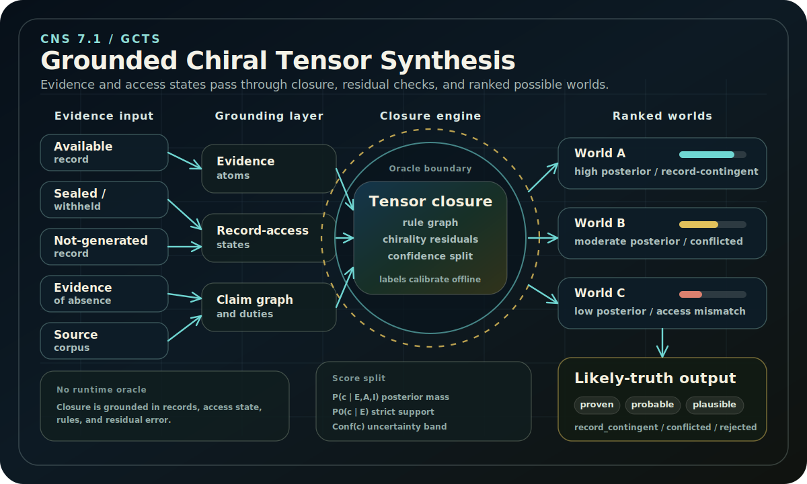

This is the current research hub for **CNS 7.1 / GCTS: Grounded
Chiral Tensor Synthesis**.

<figure class="gcts-feature-figure">
  
  <figcaption>GCTS treats record access, absence, contradiction, and residual error as structured inputs to likely-truth ranking.</figcaption>
</figure>

GCTS changes the center of gravity from "synthesize conflicting narratives" to
**rank likely truth under limited, contradictory, and adversarial evidence**. It
ranks truth through structured possible worlds, evidence, access conditions, and
calibrated uncertainty.

The core move:

> CNS should build a distribution over structured possible worlds, quantify the
> mismatch between language, logic, evidence, and access states, and emit
> ranked, confidence-calibrated likely-truth hypotheses with explicit evidence,
> record dependencies, and uncertainty.

## What Changed From CNS 2.0

The earlier CNS 2.0 work introduced Structured Narrative Objects, chirality,
evidential entanglement, critic pipelines, and generative synthesis. GCTS keeps
the useful intuition that productive disagreement has structure, but replaces
several loose parts with stricter machinery:

| CNS 2.0 emphasis | GCTS upgrade |
| --- | --- |
| Structured Narrative Objects | Evidence atoms, claims, access states, and possible worlds |
| Critic score | Separate strict proof, posterior probability, and confidence |
| Chiral pair synthesis | Chirality plus contradiction residuals across graph, tensor, and access layers |
| LLM-centered synthesis | LLMs extract and render; structured evidence ranks truth |
| Evidence overlap | Access-aware missingness, source control, and record-generation duty |
| Truth-like trust score | Likely-truth ranking with oracle-boundary controls |

## Design Commitments

1. **Likely truth is the target.** Claims are ranked by calibrated posterior
   mass across possible worlds, not by direct LLM confidence.
2. **Strict proof is separate.** A strict claim requires zero-temperature
   closure, resolvable evidence, and a proof trace.
3. **Access states are first-class.** Missing, unavailable, sealed, withheld,
   destroyed, and not-generated records are distinct epistemic states.
4. **No runtime oracle.** Labels and expert judgments may calibrate the system
   offline, but runtime ranking must come from evidence, access states, rules,
   and calibrated model parameters.
5. **Multiverse views are first-class.** The output is a ranked set of possible
   worlds before any single answer is selected.
6. **Every claim gets a status.** The report distinguishes `proven`,
   `probable`, `plausible`, `record_contingent`, `conflicted`, `unsupported`,
   and `rejected`.

## Reading Path

1. [Theory](theory/) for the formal objects, chirality, worlds, and confidence
   decomposition.
2. [Architecture](architecture/) for the runtime pipeline.
3. [Oracle Boundary](oracle-boundary/) for which inputs are allowed to influence
   runtime truth ranking.
4. [Experiments](experiments/) for the falsifiable test plan.
5. [MVP Build](mvp-build/) for the implementation path.
6. [Adversarial Evidence](adversarial-evidence/) for access modeling and
   missing-record discipline.
7. [Glossary](glossary/) for canonical terms.

## Source Status

This section is adapted from the CNS 7.1 / GCTS research docset generated on
May 13, 2026. It presents a buildable research proposal before a completed
implementation.
