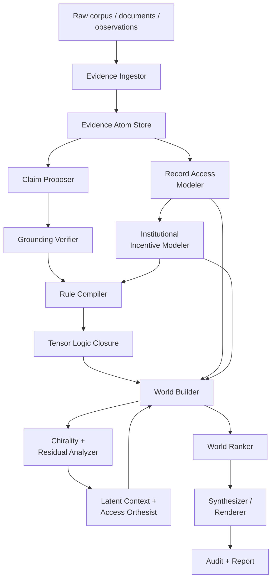

GCTS is an evidence-first pipeline. LLMs may propose extractions or render
reports, but truth ranking is produced by structured evidence, access modeling,
rule closure, possible-world scoring, and calibrated parameters.

## Where GCTS Differs From Standard Fact Verification

| Standard pipeline | GCTS addition |
| --- | --- |
| Retrieve evidence | Model expected-but-unproduced records |
| Classify support/refute/insufficient evidence | Rank claims across access-aware possible worlds |
| Attach citations | Preserve provenance, access path, and production history |
| Estimate confidence | Separate posterior mass, strict proof support, and confidence |
| Resolve contradiction | Preserve contradiction residuals and competing worlds |
| Treat missing evidence as weak support | Classify absence by duty, observability, control, access state, and production response |
| Use model judgment as answer | Enforce runtime oracle-boundary controls |

## Core Modules

### Evidence Ingestor

Parses the corpus, assigns stable evidence IDs, segments spans, computes source
quality priors, and stores provenance, temporal metadata, and access path.

Output: `EvidenceAtom[]`.

### Record Access Modeler

Identifies records expected by procedure, role, instrumentation, policy, or
ordinary practice. It classifies access states, distinguishes absence of
evidence from evidence of absence, and emits record-contingency notes.

Output: `RecordAccessState[]`.

### Institutional Incentive Modeler

Models actor roles and evidence-control asymmetries. It estimates incentives to
disclose, conceal, delay, narrow, or frame evidence. It adjusts source
reliability and missingness likelihood while leaving claim proof to evidence and
rules.

Output: `InstitutionalIncentiveProfile[]`.

### Claim Proposer

Extracts candidate claims, attaches evidence references, proposes typed
relations, preserves extraction confidence, and marks claims that depend on
unavailable or expected records.

LLMs may be used here, but proposed claims are untrusted until verified.

### Grounding Verifier

Resolves citations, runs claim-evidence entailment, detects invalid references,
rejects unsupported strict promotion, and emits grounding reports.

### Rule Compiler And Tensor Logic Closure

The compiler converts verified claims, relations, and access states into strict
and soft rules. The closure engine computes zero-temperature closure for strict
rules, soft closure for hypotheses, proof traces, and contradiction structure.

### World Builder And Ranker

The world builder enumerates or searches possible worlds with alternative
assumptions, contexts, access states, missingness hypotheses, and
institutional-incentive hypotheses. The ranker computes:

- world posterior mass;
- claim likely-truth rankings;
- strict support mass;
- confidence;
- uncertainty decomposition;
- record-contingency notes.

### Synthesizer / Renderer

The renderer produces top-K worlds and natural-language reports with proof
links, evidence links, access-contingency notes, calibrated hedging, and next
record requirements. It must refuse unsupported strict claims.

## Data Flow

1. Evidence enters as immutable atoms.
2. Expected records and access states are modeled separately from available
   evidence.
3. Claims are proposed and linked to evidence, access states, or record
   contingencies.
4. Verification rejects non-resolving references and low-entailment strict
   links.
5. Rules compile verified claims, relations, and access states into a proof
   substrate.
6. Worlds are generated from alternative assumptions, contexts, access models,
   and missingness hypotheses.
7. Worlds are ranked by evidence support, contradiction energy, parsimony,
   source reliability, source risk, and access coherence.
8. Claims receive posterior mass, strict proof support, confidence, and status.
9. The renderer outputs ranked alternatives and collapses to a single answer
   only when uncertainty is low.

## Audit Artifacts

Every run emits an input corpus manifest, evidence atom manifest,
record-access manifest, institutional-incentive manifest, claim extraction
manifest, grounding report, rule compilation manifest, world distribution
report, proof trace file, access-contingency report, rendered synthesis, and
metrics report.

If any strict gate fails, no strict promoted truth claim is produced. The report
uses statuses such as `unsupported`, `record_contingent`, `conflicted`, or
`insufficient_evidence` and lists missing records, access constraints, and next
collection actions.
