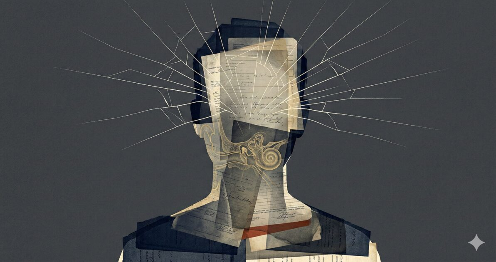

## I. What Is Remembered

> **Account and authorship:** GTCode.com is my own publication. I supply the personal history, presented here in an AI-assisted research review and editorial synthesis. This first-person account draws on my recollections in the first-person letter, plus additional recollections about the graduation party, bruxism, hearing symptoms, and drumming that are not in the letter. The essays are not independent corroboration, and the cited research does not verify the individual events.

> **Companion articles:** [The Shift They Taught Him](/personal-essays/the-shift-they-taught-him/) describes the experience of peer violence and adult non-response. [An Open Letter to [Redacted] Township School District](/personal-essays/open-letter-school-district/) asks for the records needed to examine the school's decisions.

I remember seeing stars as the blows landed.

I recall that in seventh grade, after earlier bullying and a sixth-grade disciplinary encounter, I was coerced into going to a district playground. A peer repeatedly struck my body and head. An older peer arrived, demanded that I fight, and nodded to the assailant when I refused. The beating continued. I recall remaining noncombatant throughout.

I recall that the next morning, a teacher saw my facial bruising and sent me to administration. I received no nursing assessment or medical evaluation. Administration chastised me for having “attended the fight” and returned me to class.

I remember teeth grinding beginning that night or the next. The grinding persisted for more than three decades. My grades declined after the beating, and within a year I moved from honors English into general education.

I recall that later, at a middle-school graduation party on an off-duty police officer's property, a classmate approached with roughly ten peers behind him and punched me in the testicles. I collapsed. The officer watched without intervening.

These are retrospective reports. Research can help assess their clinical significance and the institutional questions they raise. It cannot supply the missing examination, establish a diagnosis decades later, or prove that every subsequent difficulty had the same cause.

## II. Head Injury Required Attention

Repeated blows to the head, visual disturbance during the assault, visible bruising the next day, and no medical evaluation describe a serious injury history regardless of whether later conditions can be traced to it. Those signs warranted medical assessment. Seeing stars is compatible with a possible concussion; it does not establish a separate concussion after each blow. Concussion can occur without loss of consciousness. The CDC's pediatric guideline bases assessment on the injury history, symptoms, and clinical findings, rather than requiring collapse or vomiting.[^cdc-guideline]

There is no contemporaneous neurological examination available here. The account therefore supports concern for possible traumatic brain injury, without establishing its severity, a count of concussions, or permanent structural damage.

The decline in school performance belongs in that assessment. Brain injury, distress, continuing victimization, sleep problems, and other factors could affect learning. The temporal sequence makes those possibilities worth investigating; it does not distinguish among them. The records question is whether the school assessed injury and distress before changing academic placement.

The guideline cited here was published in 2018. It provides current clinical context, not proof of the precise procedures or legal duties in force during 1988–1992. The open letter asks the district to identify those historical procedures.

## III. Bruxism: A Plausible Association

The reported onset of grinding soon after the beating is relevant history. It is not proof that head injury caused the grinding.

Pavlou and colleagues' 2024 article is *Neurobiology of bruxism: The impact of stress (Review)*. It discusses stress and possible neural mechanisms in bruxism.[^pavlou]

Kothari and colleagues studied bruxism in people with **severe acquired brain injury**, including altered states of consciousness. That population differs substantially from an unevaluated childhood assault with possible concussion. The study cannot establish the cause of my bruxism.[^kothari]

Bruxism is also common. A 2024 systematic review and meta-analysis estimated pooled prevalence at approximately 22%, with differences across populations and assessment methods.[^prevalence] That estimate is context, not an individual probability that the beating did or did not cause the condition.

I recall grinding beginning after the assault. Stress or injury could have contributed; the cause remains uncertain. The reported persistence does not identify a specific biological mechanism.

## IV. The Later Hearing Symptoms

I report acoustic trauma around age nineteen or twenty, followed by persistent tinnitus and hyperacusis. My history of professional drumming makes noise exposure an important part of the account.

Noise exposure can cause tinnitus independently of childhood head injury. Hyperacusis can also follow loud noise, although its causes are not fully understood.[^noise][^hyperacusis] The later acoustic exposure is therefore a credible independent explanation for the auditory symptoms. Their severity does not, by itself, establish an earlier hidden vulnerability.

Harris and colleagues' 2024 review describes auditory and vestibular problems after mild traumatic brain injury, including tinnitus and inner-ear concussion. It supports considering head trauma in an auditory history. It does not establish that this childhood beating damaged the cochlea or made a later noise exposure more harmful.[^harris]

A proposed childhood-TBI-to-acoustic-vulnerability sequence remains a **hypothesis**. No hearing assessment from the childhood assault, intervening auditory measurements, or exposure comparison is presented here to test it. Assembling mechanisms from separate studies cannot fill those gaps.

Jaw and neck inputs can influence tinnitus in some patients. Ralli and colleagues review somatosensory tinnitus and report that selected patients with temporomandibular disorders may benefit from treatment directed at those disorders.[^ralli] That makes a jaw contribution worth assessing. It does not show that my bruxism drives my tinnitus, that the two conditions form a permanent feedback loop, or that both originate in the beating.

## V. What Adult Responses Can Teach

In my account, sixth-grade disciplinary attention centered on my cruel response to prolonged bullying. After a retaliatory hallway attack, the school removed me from ordinary classrooms and later retrieved me publicly for psychological intervention. In seventh grade, visible injuries led to questioning about my attendance at the beating, without the medical assessment I needed.

Those decisions, as reported, repeatedly placed the visible burden of adjustment on the targeted child. They could have signaled to peers that further aggression carried little cost. The open letter asks what consequences the aggressors actually faced and what the school did to restore the child's safety and standing. Those answers matter before making claims about what the whole cohort learned.

Smith and Freyd's institutional-betrayal framework examines how institutions on which people depend can compound harm through failures to prevent wrongdoing or respond supportively.[^betrayal] It is a useful framework for these questions. It does not identify the cause of every later symptom or prove that all participants interpreted the school's decisions alike.

Yeager and colleagues studied institutional trust among racial and ethnic minority adolescents, with particular attention to racial bias in school discipline. Their findings support the broader concern that perceived procedural injustice can damage trust in schools. Applying them to this case is an analogy across different circumstances, not direct evidence of my psychological trajectory.[^yeager]

I describe the officer’s non-response after the assault as reinforcing distrust of adults charged with protecting me.

## VI. Population Risk Is Not an Individual Forecast

The Swedish register study by Sariaslan and colleagues linked diagnosed TBI before age twenty-five with adverse adult medical and social outcomes. Comparisons with unaffected siblings reduced some concerns about shared family influences, but the authors also acknowledged limitations of observational data.[^sariaslan] The study supports taking early brain injury seriously. It cannot diagnose me or attribute my later difficulties to an injury that was never medically assessed.

The original ACE study found graded associations between reported childhood adversity and several adult health risks.[^felitti] Its categories do not map neatly onto every form of peer violence or school failure. Without a comparable exposure measure, those associations cannot yield an individual forecast for this account.

Peterson and colleagues estimated a national annual economic burden of $14.1 trillion for ACE-associated health conditions. Most of that estimate monetizes lost healthy life-years; it is not a total of medical bills or government spending.[^peterson] It is a population model, not a valuation of my losses or evidence that a particular symptom was caused by childhood adversity.

My technical expertise, musical work, and consulting practice are also part of the history. They do not refute the harm I report. This account does not establish which factors contributed to my achievements or difficulties.

## VII. The Records Still Matter

Studies based on medical records miss injuries that never receive a diagnosis. That limits how directly their results can be applied to an unevaluated assault. It does not tell us how much worse an untreated injury becomes over decades, or establish that I belong to the most severely harmed group.

The absence of a record produced today also does not establish that a record was never made. Never-created, lost, destroyed, and withheld records are different possibilities. The open letter asks the district to distinguish them and identify the relevant retention rules and searches.

The central account is serious without a complete biological explanation: I report prolonged childhood bullying, discipline focused on my reaction, a coerced beating, visible injuries without medical evaluation, and later violence in front of an adult who failed to help.

The body's symptoms deserve assessment. The institutions' decisions deserve answers. Neither obligation depends on proving an unbroken causal chain from childhood violence to every adult difficulty.

## Source Note

The personal chronology follows the companion open letter and uses school grades to date the events. Personal recollections, research findings, and hypotheses are identified separately. Agreement among generated analyses is not independent corroboration.

**Verification scope:** Citation titles, authors, and the claims used here were checked against accessible source text, metadata, and abstracts. Where full text was blocked, metadata and abstracts were verified instead; this does not constitute a full-text review of every paper. The October 1 spot-check used Felitti’s PubMed abstract, Harris’s indexed abstract and metadata, Smith and Freyd’s accepted author manuscript, and Sariaslan’s publisher full text, including its limitations. These sources provide general research context, not verification of my personal history.

## References

[^cdc-guideline]: Lumba-Brown, A., Yeates, K. O., Sarmiento, K., et al. (2018). Centers for Disease Control and Prevention guideline on the diagnosis and management of mild traumatic brain injury among children. *JAMA Pediatrics, 172*(11), e182853. [Full text](https://pmc.ncbi.nlm.nih.gov/articles/PMC7006878/). [doi:10.1001/jamapediatrics.2018.2853](https://doi.org/10.1001/jamapediatrics.2018.2853).

[^pavlou]: Pavlou, I. A., Spandidos, D. A., Zoumpourlis, V., & Papakosta, V. K. (2024). Neurobiology of bruxism: The impact of stress (Review). *Biomedical Reports, 20*(4), 59. [Publisher's text](https://www.spandidos-publications.com/10.3892/br.2024.1747).

[^kothari]: Kothari, S. F., Devendran, A., Sørensen, A. B., Nielsen, J. F., Svensson, P., & Kothari, M. (2024). Occurrence, presence and severity of bruxism and its association with altered state of consciousness in individuals with severe acquired brain injury. *Journal of Oral Rehabilitation, 51*(1), 143–149. [doi:10.1111/joor.13540](https://doi.org/10.1111/joor.13540).

[^prevalence]: Zieliński, G., Pająk, A., & Wójcicki, M. (2024). Global prevalence of sleep bruxism and awake bruxism in pediatric and adult populations: A systematic review and meta-analysis. *Journal of Clinical Medicine, 13*(14), 4259. [Full text](https://pmc.ncbi.nlm.nih.gov/articles/PMC11278015/). [PubMed record](https://pubmed.ncbi.nlm.nih.gov/39064299/). [doi:10.3390/jcm13144259](https://doi.org/10.3390/jcm13144259).

[^noise]: National Institute on Deafness and Other Communication Disorders. *Noise-Induced Hearing Loss*. [Official information](https://www.nidcd.nih.gov/health/noise-induced-hearing-loss).

[^hyperacusis]: NHS. *Noise sensitivity (hyperacusis)*. [Official information](https://www.nhs.uk/conditions/hyperacusis/).

[^harris]: Harris, M., Nguyen, A., Brown, N. J., Picton, B., Gendreau, J., Bui, N., Sahyouni, R., & Lin, H. W. (2024). Mild traumatic brain injury and the auditory system: An overview of the mechanisms, clinical presentations, and current diagnostic modalities. *Journal of Neurotrauma, 41*(13–14), 1524–1532. [PubMed record](https://pubmed.ncbi.nlm.nih.gov/37742111/). [doi:10.1089/neu.2023.0059](https://doi.org/10.1089/neu.2023.0059).

[^ralli]: Ralli, M., Greco, A., Turchetta, R., Altissimi, G., de Vincentiis, M., & Cianfrone, G. (2017). Somatosensory tinnitus: Current evidence and future perspectives. *Journal of International Medical Research, 45*(3), 933–947. [Full text](https://pmc.ncbi.nlm.nih.gov/articles/PMC5536427/).

[^betrayal]: Smith, C. P., & Freyd, J. J. (2014). Institutional betrayal. *American Psychologist, 69*(6), 575–587. [PubMed record](https://pubmed.ncbi.nlm.nih.gov/25197837/). [doi:10.1037/a0037564](https://doi.org/10.1037/a0037564). [Accepted author manuscript](https://dynamic.uoregon.edu/jjf/articles/sfinpress.pdf).

[^yeager]: Yeager, D. S., Purdie-Vaughns, V., Hooper, S. Y., & Cohen, G. L. (2017). Loss of institutional trust among racial and ethnic minority adolescents: A consequence of procedural injustice and a cause of life-span outcomes. *Child Development, 88*(2), 658–676. [doi:10.1111/cdev.12697](https://doi.org/10.1111/cdev.12697). [Authors' text](https://www.columbia.edu/cu/psychology/vpvaughns/assets/pdfs/Loss%20of%20Institutional%20Trust.pdf).

[^sariaslan]: Sariaslan, A., Sharp, D. J., D'Onofrio, B. M., Larsson, H., & Fazel, S. (2016). Long-term outcomes associated with traumatic brain injury in childhood and adolescence: A nationwide Swedish cohort study of a wide range of medical and social outcomes. *PLOS Medicine, 13*(8), e1002103. [Full text](https://pmc.ncbi.nlm.nih.gov/articles/PMC4995002/).

[^felitti]: Felitti, V. J., Anda, R. F., Nordenberg, D., et al. (1998). Relationship of childhood abuse and household dysfunction to many of the leading causes of death in adults: The adverse childhood experiences (ACE) study. *American Journal of Preventive Medicine, 14*(4), 245–258. [PubMed record](https://pubmed.ncbi.nlm.nih.gov/9635069/).

[^peterson]: Peterson, C., Aslam, M. V., Niolon, P. H., Bacon, S., Bellis, M. A., Mercy, J. A., & Florence, C. (2023). Economic burden of health conditions associated with adverse childhood experiences among US adults. *JAMA Network Open, 6*(12), e2346323. [Full text](https://pmc.ncbi.nlm.nih.gov/articles/PMC10701608/).
